| Index                        | Index                                                    |
| ---------------------------- | -------------------------------------------------------- |
| 53. [CSS Intro](#53)         | 63. [Grouping Selectors](#63)                            |
| 54. [Workspace Setup](#54)   | 64. [ID Selectors](#64)                                  |
| 55. [Text Editor Setup](#55) | 65. [Class Selectors](#65)                               |
| 56. [Video Resources](#56)   | 66. [ID and Class Selector Summary](#66)                 |
| 57. [Inline CSS](#57)        | 67. [DIV and SPAN Elements](#67)                         |
| 58. [Internal CSS](#58)      | 68. [Inheritance in CSS](#68)                            |
| 59. [External CSS](#59)      | 69. [Inheritance - More Info](#69)                       |
| 60. [Power Struggle](#60)    | 70. [Last Rule, Specificity and Universal Selector](#70) |
| 61. [Basic CSS Syntax](#61)  | 71. [Combine Selectors - Descendant Selector](#71)       |
| 62. [Element Selectors](#62) |

---

<br>

### 53. CSS Intro<a id="53"></a>

| Technology    | Description     |
| ------------- | --------------- |
| `Language`    | html, css       |
| `Framework`   | -               |
| `Library`     | -               |
| `Text editor` | Vs code         |
| `Browser`     | chrome, firefox |

---

<br>

### 54. Workspace Setup<a id="54"></a>

> **_Business Objective: Layout_**


| Technology    | Description     |
| ------------- | --------------- |
| `Language`    | html, css       |
| `Framework`   | -               |
| `Library`     | -               |
| `Text editor` | Vs code         |
| `Browser`     | chrome, firefox |

---

<br>

### 55. Text Editor Setup<a id="55"></a>

> **_Business Objective: Layout_**


| Technology    | Description     |
| ------------- | --------------- |
| `Language`    | html, css       |
| `Framework`   | -               |
| `Library`     | -               |
| `Text editor` | Vs code         |
| `Browser`     | chrome, firefox |

---

<br>

### 56. Video Resources<a id="56"></a>

<br>

### 57. Inline CSS<a id="57"></a>

> **_Business Objective: Layout_**

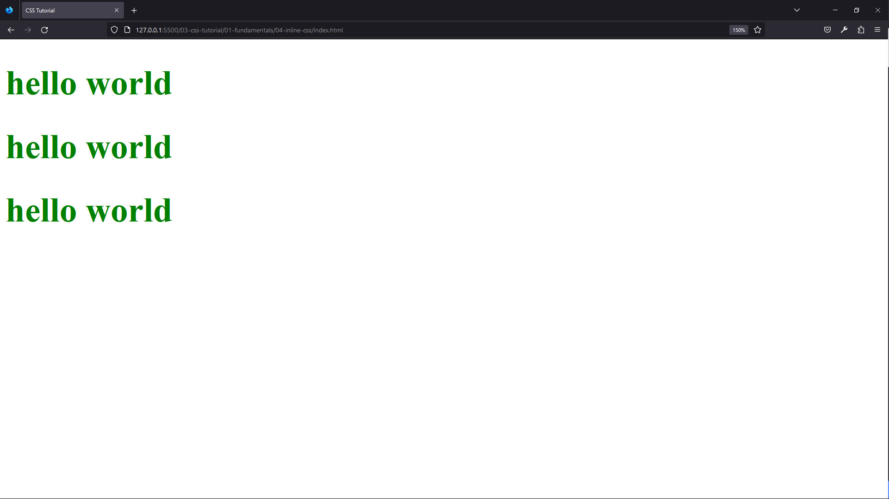

| Technology    | Description     |
| ------------- | --------------- |
| `Language`    | html, css       |
| `Framework`   | -               |
| `Library`     | -               |
| `Text editor` | Vs code         |
| `Browser`     | chrome, firefox |

---

- In index.html

```html
<!DOCTYPE html>
<html lang="en">
  <head>
    <meta charset="UTF-8" />
    <meta name="viewport" content="width=device-width, initial-scale=1.0" />
    <meta http-equiv="X-UA-Compatible" content="ie=edge" />
    <title>CSS Tutorial</title>
    <style></style>
  </head>
  <body>
    <!-- inline css -->
    <h1 style="color: green; font-size: 50px">hello world</h1>
    <h1 style="color: green; font-size: 50px">hello world</h1>
    <h1 style="color: green; font-size: 50px">hello world</h1>
  </body>
</html>
```

<br>

### 58. Internal CSS<a id="58"></a>

> **_Business Objective: Layout_**

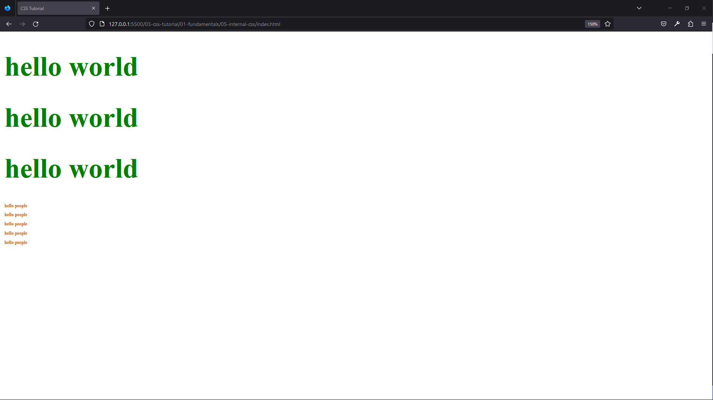

| Technology    | Description     |
| ------------- | --------------- |
| `Language`    | html, css       |
| `Framework`   | -               |
| `Library`     | -               |
| `Text editor` | Vs code         |
| `Browser`     | chrome, firefox |

---

- In index.html

```html
<!DOCTYPE html>
<html lang="en">
  <head>
    <meta charset="UTF-8" />
    <meta name="viewport" content="width=device-width, initial-scale=1.0" />
    <meta http-equiv="X-UA-Compatible" content="ie=edge" />
    <title>CSS Tutorial</title>

    <!-- how to write internal css, indside head-tag -->
    <style>
      h1 {
        color: green;
        font-size: 50px;
      }
      h2 {
        color: chocolate;
        font-size: 8px;
      }
    </style>
  </head>
  <body>
    <h1>hello world</h1>
    <h1>hello world</h1>
    <h1>hello world</h1>
    <h2>hello people</h2>
    <h2>hello people</h2>
    <h2>hello people</h2>
    <h2>hello people</h2>
    <h2>hello people</h2>
  </body>
</html>
```

<br>

### 59. External CSS<a id="59"></a>

> **_Business Objective: Layout_**

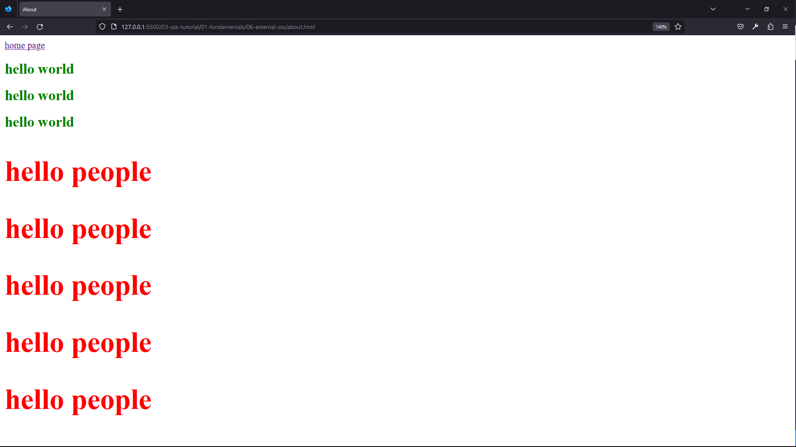

| Technology    | Description     |
| ------------- | --------------- |
| `Language`    | html, css       |
| `Framework`   | -               |
| `Library`     | -               |
| `Text editor` | Vs code         |
| `Browser`     | chrome, firefox |

---

- In index.html

```html
<!DOCTYPE html>
<html lang="en">
  <head>
    <meta charset="UTF-8" />
    <meta name="viewport" content="width=device-width, initial-scale=1.0" />
    <meta http-equiv="X-UA-Compatible" content="ie=edge" />
    <title>CSS Tutorial</title>

    <!-- how to do external css, inside head-tag -->
    <link rel="stylesheet" href="./css/styles.css" />
  </head>
  <body>
    <a href="about.html">about page</a>
    <h1>hello world</h1>
    <h1>hello world</h1>
    <h1>hello world</h1>
    <h2>hello people</h2>
    <h2>hello people</h2>
    <h2>hello people</h2>
    <h2>hello people</h2>
    <h2>hello people</h2>
  </body>
</html>
```

---

- In 06-external-css create about.html file and copy all code from index.html and add hyperlink

```html
<!DOCTYPE html>
<html lang="en">
  <head>
    <meta charset="UTF-8" />
    <meta name="viewport" content="width=device-width, initial-scale=1.0" />
    <meta http-equiv="X-UA-Compatible" content="ie=edge" />
    <title>About</title>
    <link rel="stylesheet" href="./css/styles.css" />
  </head>
  <body>
    <!-- 1️⃣ hyperlink -->
    <a href="index.html">home page</a>
    <h1>hello world</h1>
    <h1>hello world</h1>
    <h1>hello world</h1>
    <h2>hello people</h2>
    <h2>hello people</h2>
    <h2>hello people</h2>
    <h2>hello people</h2>
    <h2>hello people</h2>
  </body>
</html>
```

---

- In 06-external-css create css-folder and in it create styles.css file

```css
h1 {
  color: green;
  font-size: 25px;
}
h2 {
  color: red;
  font-size: 50px;
}
```

<br>

### 60. Power Struggle<a id="60"></a>

> **_Business Objective: Layout_**

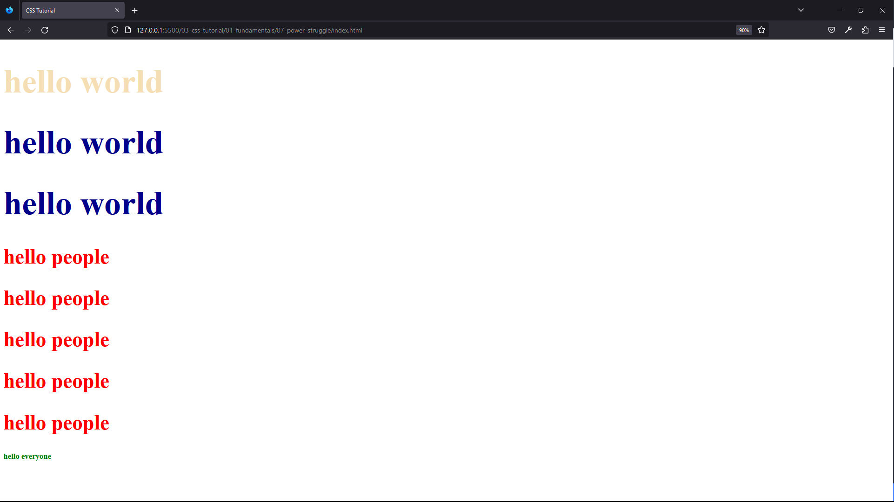

| Technology    | Description     |
| ------------- | --------------- |
| `Language`    | html, css       |
| `Framework`   | -               |
| `Library`     | -               |
| `Text editor` | Vs code         |
| `Browser`     | chrome, firefox |

---

- In index.html

```html
<!DOCTYPE html>
<html lang="en">
  <head>
    <meta charset="UTF-8" />
    <meta name="viewport" content="width=device-width, initial-scale=1.0" />
    <meta http-equiv="X-UA-Compatible" content="ie=edge" />
    <title>CSS Tutorial</title>

    <link rel="stylesheet" href="./styles.css" />

    <style>
      h1 {
        color: darkblue;
        font-size: 80px;
      }
      h3 {
        color: green;
      }
    </style>
  </head>

  <body>
    <h1 style="color: wheat">hello world</h1>
    <h1>hello world</h1>
    <h1>hello world</h1>
    <h2>hello people</h2>
    <h2>hello people</h2>
    <h2>hello people</h2>
    <h2>hello people</h2>
    <h2>hello people</h2>
    <h3>hello everyone</h3>
  </body>
</html>
```

---

- In css/styles.css

```css
h1 {
  color: green;
  font-size: 25px;
}
h2 {
  color: red;
  font-size: 50px;
}
```

<br>

### 61. Basic CSS Syntax<a id="61"></a>

> **_Business Objective: Layout_**

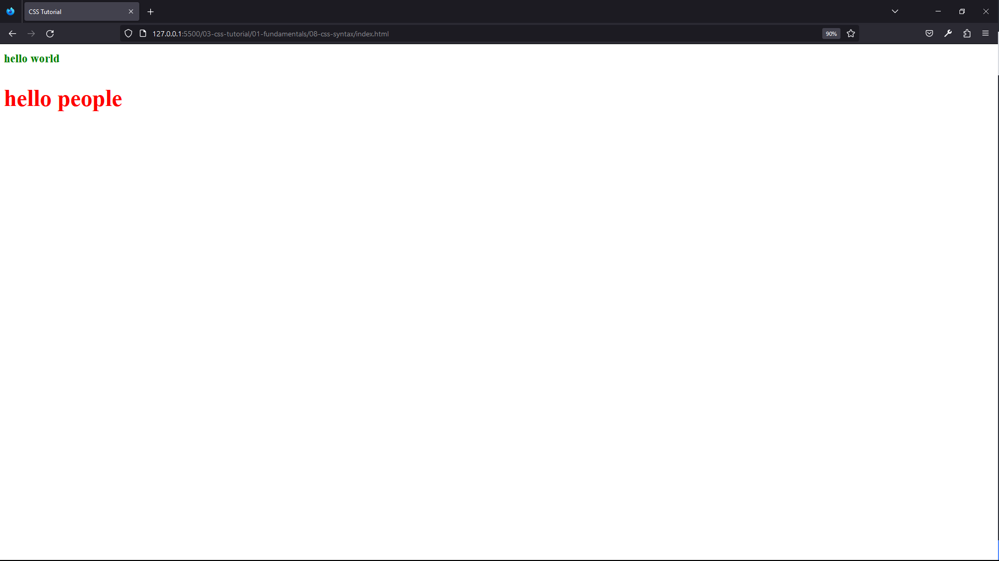

| Technology    | Description     |
| ------------- | --------------- |
| `Language`    | html, css       |
| `Framework`   | -               |
| `Library`     | -               |
| `Text editor` | Vs code         |
| `Browser`     | chrome, firefox |

---

- In index.html

```html
<!DOCTYPE html>
<html lang="en">
  <head>
    <meta charset="UTF-8" />
    <meta name="viewport" content="width=device-width, initial-scale=1.0" />
    <meta http-equiv="X-UA-Compatible" content="ie=edge" />
    <title>CSS Tutorial</title>
    <link rel="stylesheet" href="./styles.css" />
  </head>
  <body>
    <h1>hello world</h1>
    <h2>hello people</h2>
  </body>
</html>
```

---

- In css/styles.css

```css
h1 {
  color: green;
  font-size: 25px;
}
h2 {
  color: red;
  font-size: 50px;
}
/* css rule  */
/* selector: what you want to select the element */
/* declaration block */
/* declaration  */
/* property */
/* value */
```

<br>

### 62. Element Selectors<a id="62"></a>

> **_Business Objective: Layout_**

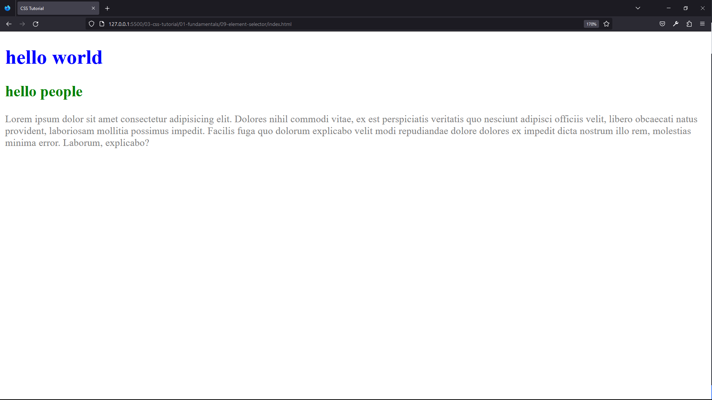

| Technology    | Description     |
| ------------- | --------------- |
| `Language`    | html, css       |
| `Framework`   | -               |
| `Library`     | -               |
| `Text editor` | Vs code         |
| `Browser`     | chrome, firefox |

---

- In index.html

```html
<!DOCTYPE html>
<html lang="en">
  <head>
    <meta charset="UTF-8" />
    <meta name="viewport" content="width=device-width, initial-scale=1.0" />
    <meta http-equiv="X-UA-Compatible" content="ie=edge" />
    <title>CSS Tutorial</title>
    <link rel="stylesheet" href="./styles.css" />
  </head>
  <body>
    <h1>hello world</h1>
    <h2>hello people</h2>
    <p>
      Lorem ipsum dolor sit amet consectetur adipisicing elit. Dolores nihil
      commodi vitae, ex est perspiciatis veritatis quo nesciunt adipisci
      officiis velit, libero obcaecati natus provident, laboriosam mollitia
      possimus impedit. Facilis fuga quo dolorum explicabo velit modi
      repudiandae dolore dolores ex impedit dicta nostrum illo rem, molestias
      minima error. Laborum, explicabo?
    </p>
  </body>
</html>
```

---

- In css/styles.css

```css
/* element selector */
h1 {
  color: blue;
}

h2 {
  color: green;
}

p {
  color: grey;
}
```

<br>

### 63. Grouping Selectors<a id="63"></a>

> **_Business Objective: Layout_**

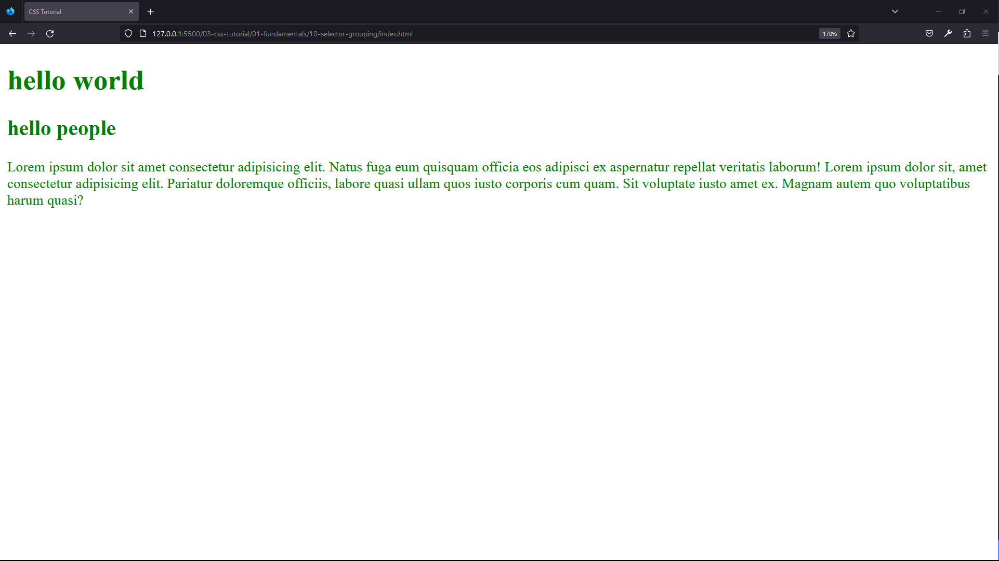

| Technology    | Description     |
| ------------- | --------------- |
| `Language`    | html, css       |
| `Framework`   | -               |
| `Library`     | -               |
| `Text editor` | Vs code         |
| `Browser`     | chrome, firefox |

---

- In index.html

```html
<!DOCTYPE html>
<html lang="en">
  <head>
    <meta charset="UTF-8" />
    <meta name="viewport" content="width=device-width, initial-scale=1.0" />
    <meta http-equiv="X-UA-Compatible" content="ie=edge" />
    <title>CSS Tutorial</title>
    <link rel="stylesheet" href="./styles.css" />
  </head>
  <body>
    <h1>hello world</h1>
    <h2>hello people</h2>
    <p>
      Lorem ipsum dolor sit amet consectetur adipisicing elit. Natus fuga eum
      quisquam officia eos adipisci ex aspernatur repellat veritatis laborum!
      Lorem ipsum dolor sit, amet consectetur adipisicing elit. Pariatur
      doloremque officiis, labore quasi ullam quos iusto corporis cum quam. Sit
      voluptate iusto amet ex. Magnam autem quo voluptatibus harum quasi?
    </p>
  </body>
</html>
```

---

- In css/styles.css

```css
/* grouping selectors */

h1,
h2,
p {
  color: green;
}
```

<br>

### 64. ID Selectors<a id="64"></a>

> **_Business Objective: Layout_**

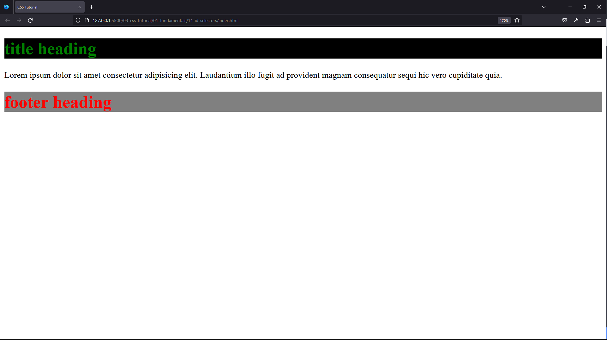

| Technology    | Description     |
| ------------- | --------------- |
| `Language`    | html, css       |
| `Framework`   | -               |
| `Library`     | -               |
| `Text editor` | Vs code         |
| `Browser`     | chrome, firefox |

---

- In index.html

```html
<!DOCTYPE html>
<html lang="en">
  <head>
    <meta charset="UTF-8" />
    <meta name="viewport" content="width=device-width, initial-scale=1.0" />
    <meta http-equiv="X-UA-Compatible" content="ie=edge" />
    <title>CSS Tutorial</title>
    <link rel="stylesheet" href="./styles.css" />
  </head>
  <body>
    <h1 id="title">title heading</h1>
    <p>
      Lorem ipsum dolor sit amet consectetur adipisicing elit. Laudantium illo
      fugit ad provident magnam consequatur sequi hic vero cupiditate quia.
    </p>
    <h1 id="subheading">footer heading</h1>
  </body>
</html>
```

---

- In css/styles.css

```css
/* id SELECTORS */

#title {
  color: green;
  background: black;
}
#subheading {
  color: red;
  background: grey;
}
```

<br>

### 65. Class Selectors<a id="65"></a>

> **_Business Objective: Layout_**

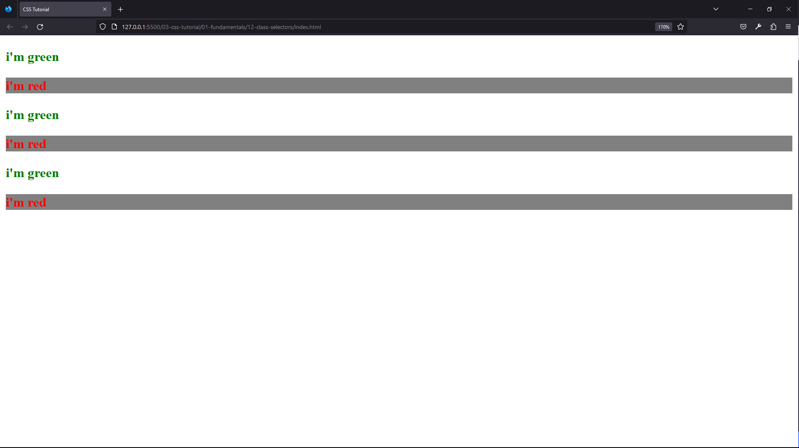

| Technology    | Description     |
| ------------- | --------------- |
| `Language`    | html, css       |
| `Framework`   | -               |
| `Library`     | -               |
| `Text editor` | Vs code         |
| `Browser`     | chrome, firefox |

---

- In index.html

```html
<!DOCTYPE html>
<html lang="en">
  <head>
    <meta charset="UTF-8" />
    <meta name="viewport" content="width=device-width, initial-scale=1.0" />
    <meta http-equiv="X-UA-Compatible" content="ie=edge" />
    <title>CSS Tutorial</title>
    <link rel="stylesheet" href="./styles.css" />
  </head>
  <body>
    <h3 class="green">i'm green</h3>
    <h3 class="red">i'm red</h3>
    <h3 class="green">i'm green</h3>
    <h3 class="red">i'm red</h3>
    <h3 class="green">i'm green</h3>
    <h3 class="red">i'm red</h3>
  </body>
</html>
```

---

- In css/styles.css

```css
/* CLASS SELECTORS */

.green {
  color: green;
}
.red {
  color: red;
  background: grey;
}
```

<br>

### 66. ID and Class Selector Summary<a id="66"></a>

> **_Business Objective: Layout_**

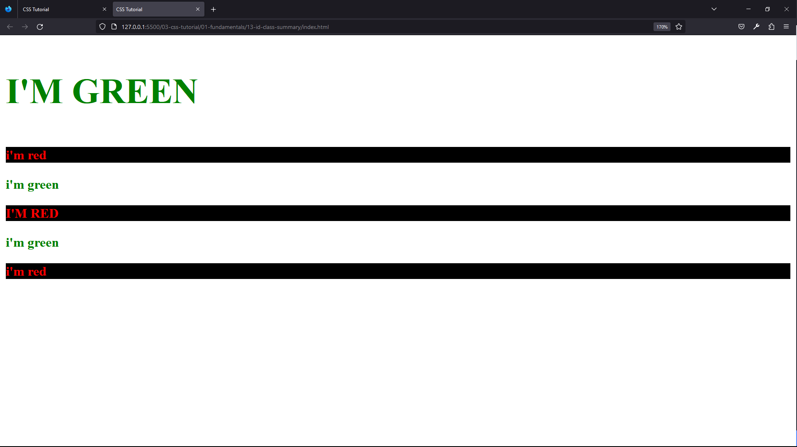

| Technology    | Description     |
| ------------- | --------------- |
| `Language`    | html, css       |
| `Framework`   | -               |
| `Library`     | -               |
| `Text editor` | Vs code         |
| `Browser`     | chrome, firefox |

---

- In index.html

```html
<!DOCTYPE html>
<html lang="en">
  <head>
    <meta charset="UTF-8" />
    <meta name="viewport" content="width=device-width, initial-scale=1.0" />
    <meta http-equiv="X-UA-Compatible" content="ie=edge" />
    <title>CSS Tutorial</title>
    <link rel="stylesheet" href="./styles.css" />
  </head>
  <body>
    <h3 id="title" class="green uppercase">i'm green</h3>
    <h3 class="red">i'm red</h3>
    <h3 class="green">i'm green</h3>
    <h3 class="red uppercase">i'm red</h3>
    <h3 class="green">i'm green</h3>
    <h3 class="red">i'm red</h3>
  </body>
</html>
```

---

- In css/styles.css

```css
/* class & id SELECTORS */

.green {
  color: green;
}

.red {
  color: red;
  background: black;
}

#title {
  font-size: 50px;
}

.uppercase {
  text-transform: uppercase;
}
```

<br>

### 67. DIV and SPAN Elements<a id="67"></a>

> **_Business Objective: Layout_**

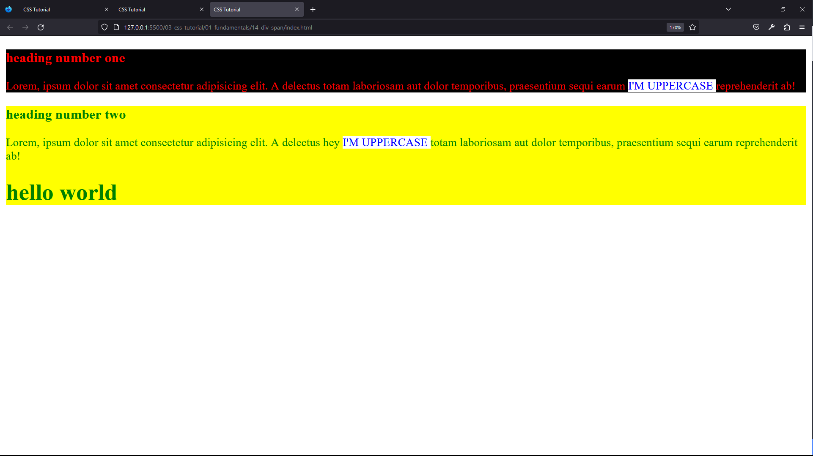

| Technology    | Description     |
| ------------- | --------------- |
| `Language`    | html, css       |
| `Framework`   | -               |
| `Library`     | -               |
| `Text editor` | Vs code         |
| `Browser`     | chrome, firefox |

---

- In index.html

```html
<!DOCTYPE html>
<html lang="en">
  <head>
    <meta charset="UTF-8" />
    <meta name="viewport" content="width=device-width, initial-scale=1.0" />
    <meta http-equiv="X-UA-Compatible" content="ie=edge" />
    <title>CSS Tutorial</title>
    <link rel="stylesheet" href="./styles.css" />
  </head>
  <body>
    <div class="red">
      <h3>heading number one</h3>
      <p>
        Lorem, ipsum dolor sit amet consectetur adipisicing elit. A delectus
        totam laboriosam aut dolor temporibus, praesentium sequi earum
        <!-- how to use span to group inline content -->
        <span class="text"> i'm uppercase </span>
        reprehenderit ab!
      </p>
    </div>

    <div class="green">
      <h3>heading number two</h3>
      <p>
        Lorem, ipsum dolor sit amet consectetur adipisicing elit. A delectus hey
        <span class="text"> i'm uppercase </span>
        totam laboriosam aut dolor temporibus, praesentium sequi earum
        reprehenderit ab!
      </p>
      <h1>hello world</h1>
    </div>
  </body>
</html>
```

---

- In css/styles

```css
/* DIV AND SPAN - used for grouping */
/* DIV - used to group multiple elements */
/* SPAN - used to group inline content */

.green {
  color: green;
  background: yellow;
}
.red {
  color: red;
  background: black;
}

span {
  text-transform: uppercase;
}
.text {
  background: white;
  color: blue;
}
```

<br>

### 68. Inheritance in CSS<a id="68"></a>

> **_Business Objective: Layout_**


| Technology    | Description     |
| ------------- | --------------- |
| `Language`    | html, css       |
| `Framework`   | -               |
| `Library`     | -               |
| `Text editor` | Vs code         |
| `Browser`     | chrome, firefox |

---

- In index.html

```html
<!DOCTYPE html>
<html lang="en">
  <head>
    <meta charset="UTF-8" />
    <meta name="viewport" content="width=device-width, initial-scale=1.0" />
    <meta http-equiv="X-UA-Compatible" content="ie=edge" />
    <title>CSS Tutorial</title>
    <link rel="stylesheet" href="./styles.css" />
  </head>
  <body>
    <div>
      <p>
        Lorem, ipsum dolor sit amet consectetur adipisicing elit. Excepturi,
        nam.
      </p>
      <p class="special">
        Lorem, ipsum dolor sit amet consectetur adipisicing elit. Excepturi,
        nam.
      </p>
    </div>
    <p>
      Lorem, ipsum dolor sit amet consectetur adipisicing elit. Excepturi, nam.
    </p>
    <p>
      Lorem, ipsum dolor sit amet consectetur adipisicing elit. Excepturi, nam.
    </p>
    <p class="special">
      Lorem, ipsum dolor sit amet consectetur adipisicing elit. Excepturi, nam.
    </p>
    <h2>i'm heading</h2>
  </body>
</html>
```

---

- In css/styles

```css
/* INHERITANCE */
/* Children inherit styles from the parent, unless have their own styles  */
/* note- not all properties are inherit, like border */
body {
  color: red;
}

.special {
  color: green;
}

h2 {
  color: blue;
}

div {
  color: greenyellow;
}
```

<br>

### 69. Inheritance - More Info<a id="69"></a>

> **_Business Objective: Layout_**

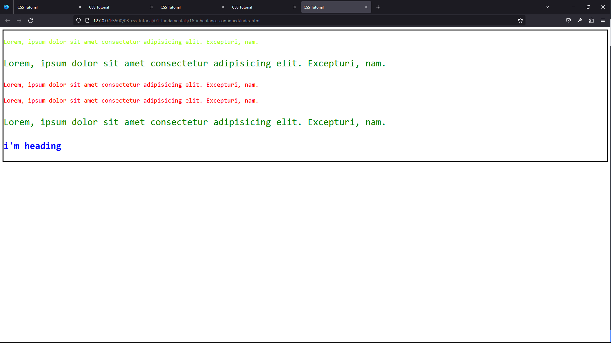

| Technology    | Description     |
| ------------- | --------------- |
| `Language`    | html, css       |
| `Framework`   | -               |
| `Library`     | -               |
| `Text editor` | Vs code         |
| `Browser`     | chrome, firefox |

---

- In index.html

```css
<!DOCTYPE html>
<html lang="en">
  <head>
    <meta charset="UTF-8" />
    <meta name="viewport" content="width=device-width, initial-scale=1.0" />
    <meta http-equiv="X-UA-Compatible" content="ie=edge" />
    <title>CSS Tutorial</title>
    <link rel="stylesheet" href="./styles.css" />
  </head>
  <body>
    <div>
      <p>
        Lorem, ipsum dolor sit amet consectetur adipisicing elit. Excepturi,
        nam.
      </p>
      <p class="special">
        Lorem, ipsum dolor sit amet consectetur adipisicing elit. Excepturi,
        nam.
      </p>
    </div>
    <p>
      Lorem, ipsum dolor sit amet consectetur adipisicing elit. Excepturi, nam.
    </p>
    <p>
      Lorem, ipsum dolor sit amet consectetur adipisicing elit. Excepturi, nam.
    </p>
    <p class="special">
      Lorem, ipsum dolor sit amet consectetur adipisicing elit. Excepturi, nam.
    </p>
    <h2>i'm heading</h2>
  </body>
</html>

```

---

- In css/styles

```css
/* INHERITANCE */
/* Children inherit styles from the parent, unless have their own styles  */

body {
  color: red;
  font-family: monospace;
  line-height: 1.5;
  font-size: 20px;
  border: 3px solid black;
}
.special {
  color: green;
  font-size: 30px;
}
h2 {
  color: blue;
}
div {
  color: greenyellow;
}
```

<br>

### 70. Last Rule, Specificity and Universal Selector<a id="70"></a>

> **_Business Objective: Layout_**

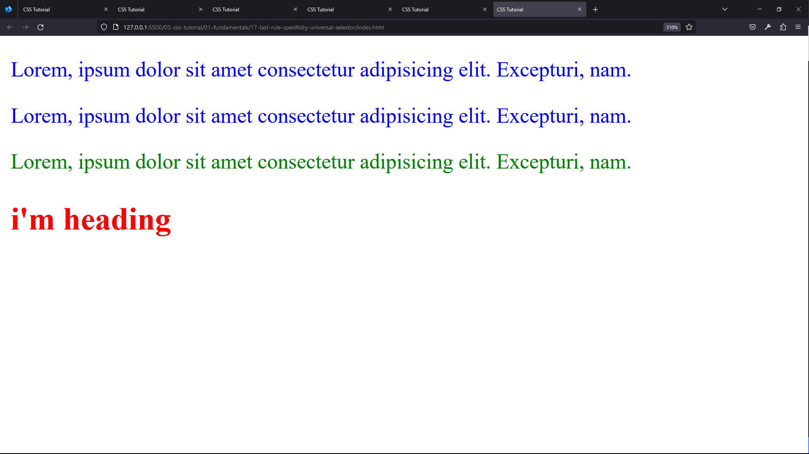

| Technology    | Description     |
| ------------- | --------------- |
| `Language`    | html, css       |
| `Framework`   | -               |
| `Library`     | -               |
| `Text editor` | Vs code         |
| `Browser`     | chrome, firefox |

---

- In index.html

```html
<!DOCTYPE html>
<html lang="en">
  <head>
    <meta charset="UTF-8" />
    <meta name="viewport" content="width=device-width, initial-scale=1.0" />
    <meta http-equiv="X-UA-Compatible" content="ie=edge" />
    <title>CSS Tutorial</title>
    <link rel="stylesheet" href="./styles.css" />
  </head>
  <body>
    <p>
      Lorem, ipsum dolor sit amet consectetur adipisicing elit. Excepturi, nam.
    </p>
    <p>
      Lorem, ipsum dolor sit amet consectetur adipisicing elit. Excepturi, nam.
    </p>
    <p class="special">
      Lorem, ipsum dolor sit amet consectetur adipisicing elit. Excepturi, nam.
    </p>
    <h2 class="heading" id="heading">i'm heading</h2>
  </body>
</html>
```

---

- In css/styles.css

```css
/* Last Rule and Specificity * Universal Selector */
/* Specificity rule: #id, .class, element, *universal selector */
.special {
  color: green;
}

p {
  color: red;
}

p {
  color: blue;
}

#heading {
  color: red;
}
.heading {
  color: green;
}

/* how to use universal selector to reset/override default browser style */
* {
  color: brown;
}
```

<br>

### 71. Combine Selectors - Descendant Selector<a id="71"></a>

> **_Business Objective: Layout_**

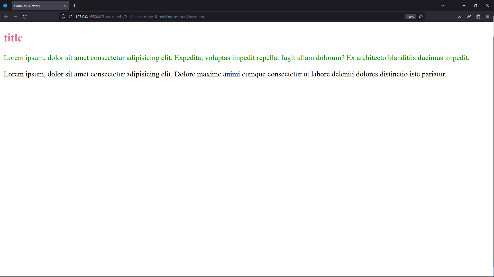

| Technology    | Description     |
| ------------- | --------------- |
| `Language`    | html, css       |
| `Framework`   | -               |
| `Library`     | -               |
| `Text editor` | Vs code         |
| `Browser`     | chrome, firefox |

---

- In index.html

```html
<!DOCTYPE html>
<html lang="en">
  <head>
    <meta charset="UTF-8" />
    <meta name="viewport" content="width=device-width, initial-scale=1.0" />
    <meta http-equiv="X-UA-Compatible" content="ie=edge" />
    <title>Combine Selectors</title>
    <link rel="stylesheet" href="./styles.css" />
  </head>
  <body>
    <div class="container">
      <h2>title</h2>
      <p>
        Lorem ipsum, dolor sit amet consectetur adipisicing elit. Expedita,
        voluptas impedit repellat fugit ullam dolorum? Ex architecto blanditiis
        ducimus impedit.
      </p>
    </div>
    <p>
      Lorem ipsum, dolor sit amet consectetur adipisicing elit. Dolore maxime
      animi cumque consectetur ut labore deleniti dolores distinctio iste
      pariatur.
    </p>
  </body>
</html>
```

---

- In css/styles.css

```css
/* Combine Selectors */

/* .container #text {
  color: orange;
} */

/* go inside the element where .container-class is and select h2-element, change color property to palevoioletred */
.container h2 {
  color: palevioletred;
}
.container p {
  color: green;
}
```

<br>
