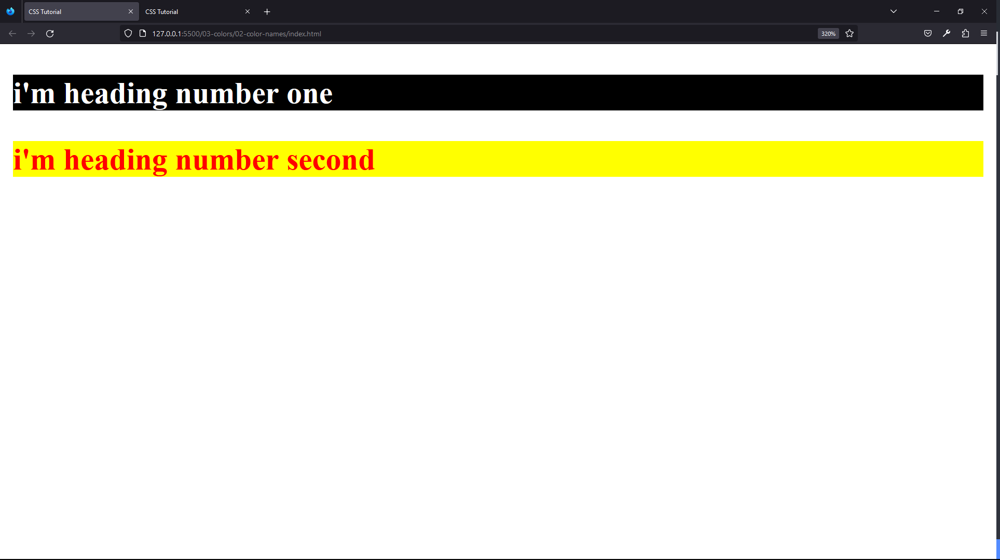
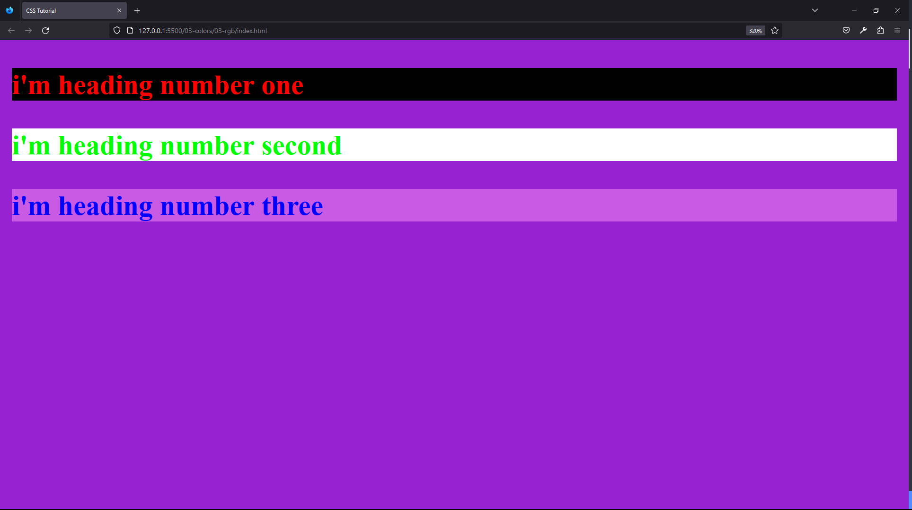
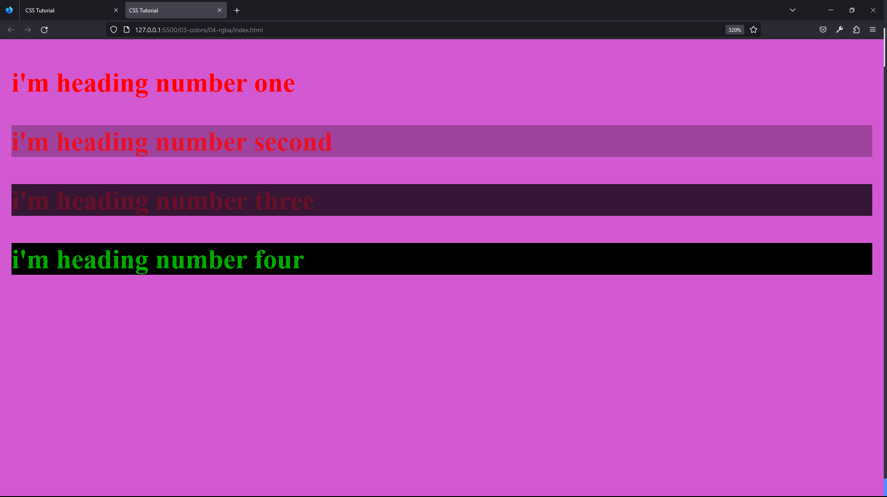
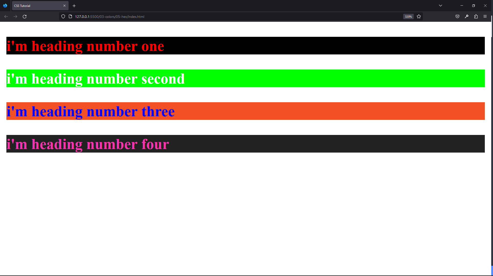

#### 78. [Colors Intro](#78)

#### 79. [Color and Background-color Properties](#79)

#### 80. [Color Names](#80)

#### 81. [RGB](#81)

#### 82. [RGBA](#82)

#### 83. [HEX Values](#83)

#### 84. [VS-Code Color Options](#84)

#### 85. [External Resources](#85)

---

<br>

### 78. Colors Intro<a id="78"></a>

> **_Business Objective: Layout_**


| Technology    | Description     |
| ------------- | --------------- |
| `Language`    | html, css, js   |
| `Framework`   | -               |
| `Library`     | -               |
| `Text editor` | Vs code         |
| `Browser`     | Chrome, firefox |

<br>

### 79. Color and Background-color Properties<a id="79"></a>

> **_Business Objective: Layout_**


| Technology    | Description     |
| ------------- | --------------- |
| `Language`    | html, css, js   |
| `Framework`   | -               |
| `Library`     | -               |
| `Text editor` | Vs code         |
| `Browser`     | Chrome, firefox |

---

- In index.html

```html
<!DOCTYPE html>
<html lang="en">
  <head>
    <meta charset="UTF-8" />
    <meta name="viewport" content="width=device-width, initial-scale=1.0" />
    <meta http-equiv="X-UA-Compatible" content="ie=edge" />
    <title>CSS Tutorial</title>
    <link rel="stylesheet" href="./styles.css" />
  </head>
  <body>
    <h3 id="first">i'm heading number one</h3>
    <h3 id="second">i'm heading numbe second</h3>
  </body>
</html>
```

---

- In styles.css

```css
/* COLOR PROPERTIES */
/* COLOR BACKGROUND-COLOR, shorthand- BACKGROUND */

#first {
  color: white;
  background-color: black;
}

#second {
  color: red;
  background: yellow;
}
```

<br>

### 80. Color Names<a id="80"></a>

> **_Business Objective: Layout_**



| Technology    | Description     |
| ------------- | --------------- |
| `Language`    | html, css, js   |
| `Framework`   | -               |
| `Library`     | -               |
| `Text editor` | Vs code         |
| `Browser`     | Chrome, firefox |

---

- In index.html

```html
<!DOCTYPE html>
<html lang="en">
  <head>
    <meta charset="UTF-8" />
    <meta name="viewport" content="width=device-width, initial-scale=1.0" />
    <meta http-equiv="X-UA-Compatible" content="ie=edge" />
    <title>CSS Tutorial</title>
    <link rel="stylesheet" href="./styles.css" />
  </head>
  <body>
    <h3 id="first">i'm heading number one</h3>
    <h3 id="second">i'm heading number second</h3>
  </body>
</html>
```

---

- In styles.css

```css
/* COLOR NAMES  > 140 */

#first {
  color: white;
  background-color: black;
}
#second {
  color: red;
  background: yellow;
}
```

<br>

### 81. RGB<a id="81"></a>

> **_Business Objective: Layout_**



| Technology    | Description     |
| ------------- | --------------- |
| `Language`    | html, css, js   |
| `Framework`   | -               |
| `Library`     | -               |
| `Text editor` | Vs code         |
| `Browser`     | Chrome, firefox |

---

- In index.html

```html
<!DOCTYPE html>
<html lang="en">
  <head>
    <meta charset="UTF-8" />
    <meta name="viewport" content="width=device-width, initial-scale=1.0" />
    <meta http-equiv="X-UA-Compatible" content="ie=edge" />
    <title>CSS Tutorial</title>
    <link rel="stylesheet" href="./styles.css" />
  </head>
  <body>
    <h3 id="first">i'm heading number one</h3>
    <h3 id="second">i'm heading number second</h3>
    <h3 id="three">i'm heading number three</h3>
  </body>
</html>
```

---

- In styles.css

```css
/* RGB RED GREEN BLUE 0-255 */

#first {
  color: rgb(255, 0, 0);
  background: rgb(0, 0, 0);
}
#second {
  color: rgb(0, 255, 0);
  background: rgb(255, 255, 255);
}
#three {
  color: rgb(0, 0, 255);
  background: rgb(200, 90, 230);
}
body {
  background: rgb(150, 34, 210);
}
```

<br>

### 82. RGBA<a id="82"></a>

> **_Business Objective: Layout_**



| Technology    | Description     |
| ------------- | --------------- |
| `Language`    | html, css, js   |
| `Framework`   | -               |
| `Library`     | -               |
| `Text editor` | Vs code         |
| `Browser`     | Chrome, firefox |

---

- In index.html

```html
<!DOCTYPE html>
<html lang="en">
  <head>
    <meta charset="UTF-8" />
    <meta name="viewport" content="width=device-width, initial-scale=1.0" />
    <meta http-equiv="X-UA-Compatible" content="ie=edge" />
    <title>CSS Tutorial</title>
    <link rel="stylesheet" href="./styles.css" />
  </head>
  <body>
    <h3 id="first">i'm heading number one</h3>
    <h3 id="second">i'm heading number second</h3>
    <h3 id="three">i'm heading number three</h3>
    <h3 id="four">i'm heading number four</h3>
  </body>
</html>
```

---

- In styles.css

```css
/* RGBA A-opacity/transparency 0-1 */
/* rgba() use case: image overlay, modal  */

#first {
  color: rgba(255, 0, 0, 1);
  background: rgba(0, 0, 0, 0);
}
#second {
  color: rgba(255, 0, 0, 0.75);
  background: rgba(0, 0, 0, 0.25);
}
#three {
  color: rgba(255, 0, 0, 0.25);
  background: rgba(0, 0, 0, 0.75);
}
#four {
  /* color: rgba(255, 0, 0, 0); */
  color: rgba(0, 255, 0, 0.67);
  background: rgba(0, 0, 0, 1);
}
body {
  background: rgb(210, 89, 210);
}
```

<br>

### 83. HEX Values<a id="83"></a>

> **_Business Objective: Layout_**



| Technology    | Description     |
| ------------- | --------------- |
| `Language`    | html, css, js   |
| `Framework`   | -               |
| `Library`     | -               |
| `Text editor` | Vs code         |
| `Browser`     | Chrome, firefox |

---

- In index.html

```html
<!DOCTYPE html>
<html lang="en">
  <head>
    <meta charset="UTF-8" />
    <meta name="viewport" content="width=device-width, initial-scale=1.0" />
    <meta http-equiv="X-UA-Compatible" content="ie=edge" />
    <title>CSS Tutorial</title>
    <link rel="stylesheet" href="./styles.css" />
  </head>
  <body>
    <h3 id="first">i'm heading number one</h3>
    <h3 id="second">i'm heading number second</h3>
    <h3 id="three">i'm heading number three</h3>
    <h3 id="four">i'm heading number four</h3>
  </body>
</html>
```

---

- In styles.css

```css
/* 
HSL
HEX Values #RRGGBB
123456789 A(10) B(11) C(12) D(13) E(14) F(15)
          10    11    12    13    14    15

          #FF0000 - Red
          #00FF00 - Green
*/

#first {
  color: #ff0000;
  background: #000;
}
#second {
  color: #fff;
  background: #00ff00;
}
#three {
  color: #0000ff;
  background: #f15025;
}
#four {
  color: #f234ad;
  background: #222;
}
```

<br>

### 84. VS-Code Color Options<a id="84"></a>

> **_Business Objective: Layout_**


| Technology    | Description     |
| ------------- | --------------- |
| `Language`    | html, css, js   |
| `Framework`   | -               |
| `Library`     | -               |
| `Text editor` | Vs code         |
| `Browser`     | Chrome, firefox |

---

- In index.html

```html

```

---

- In styles.css

```css

```

<br>

### 85. External Resources<a id="85"></a>

> **_Business Objective: Layout_**


| Technology    | Description     |
| ------------- | --------------- |
| `Language`    | html, css, js   |
| `Framework`   | -               |
| `Library`     | -               |
| `Text editor` | Vs code         |
| `Browser`     | Chrome, firefox |

---

- In index.html

```html

```

---

- In styles.css

```css

```

<br>
