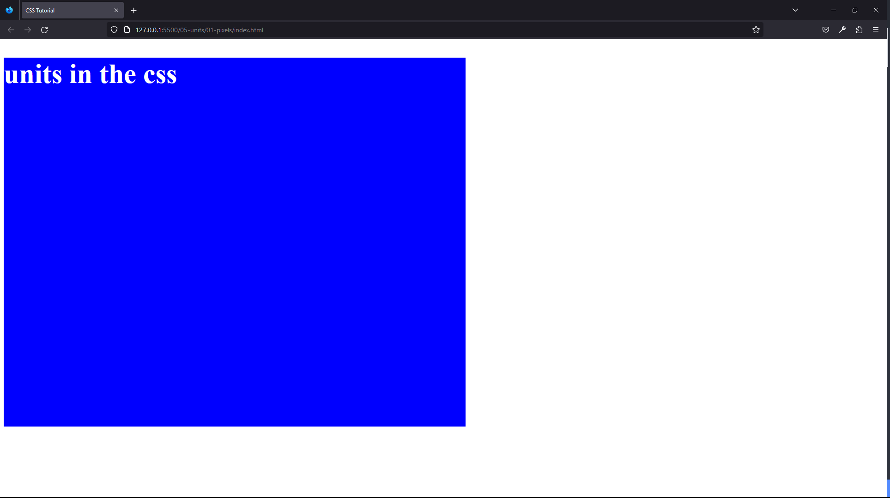
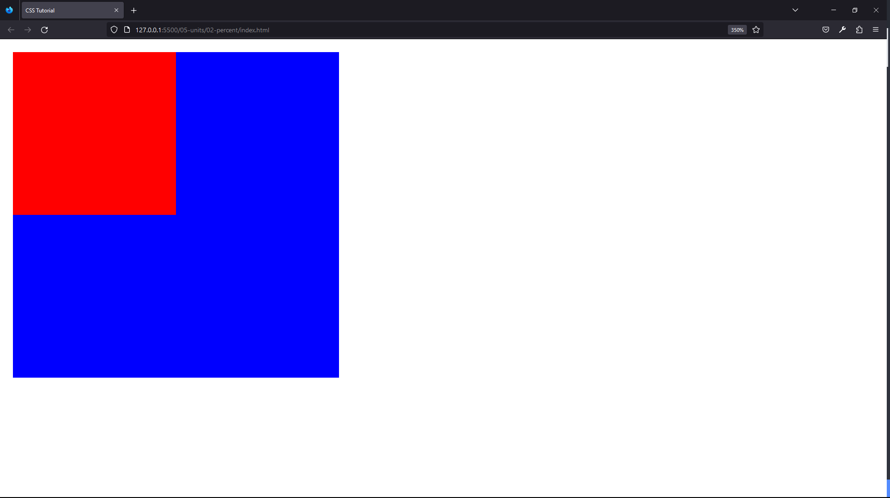
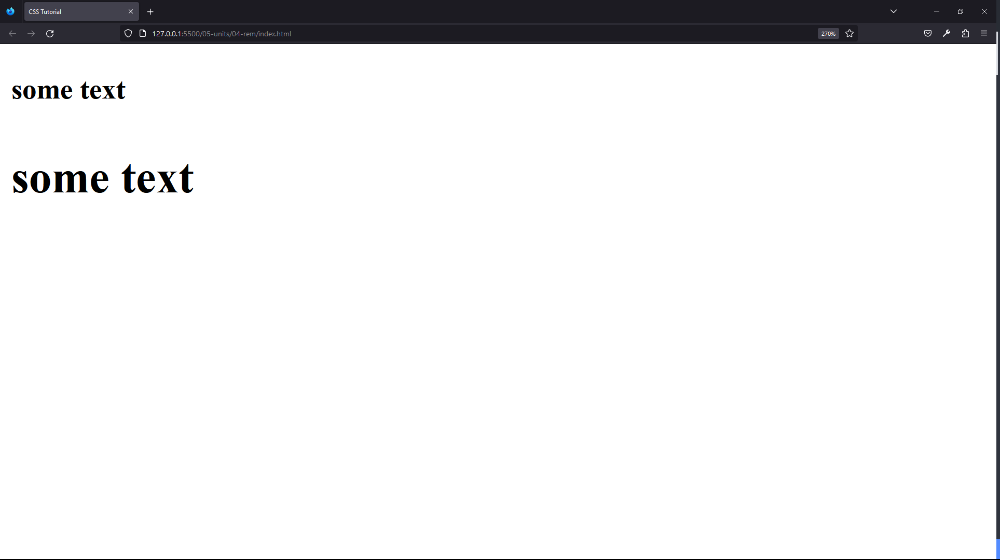
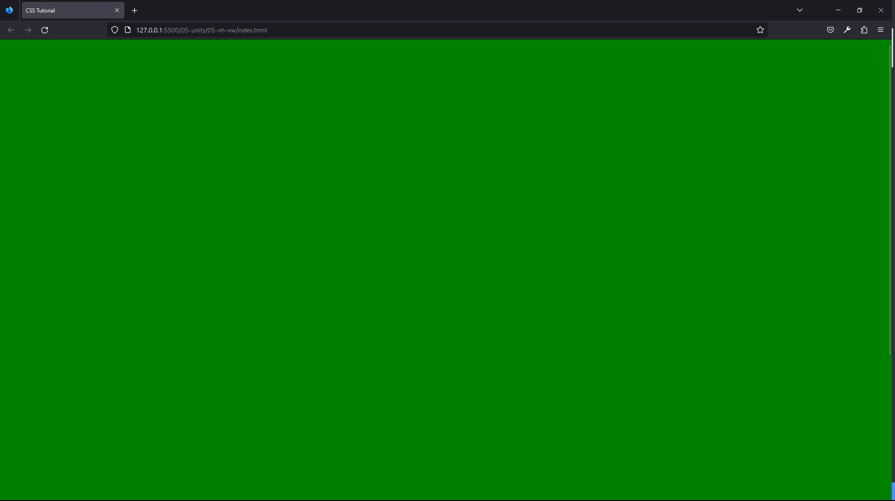
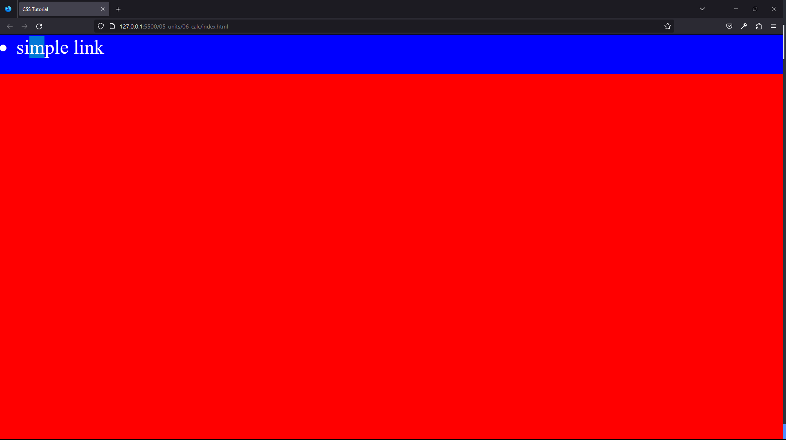
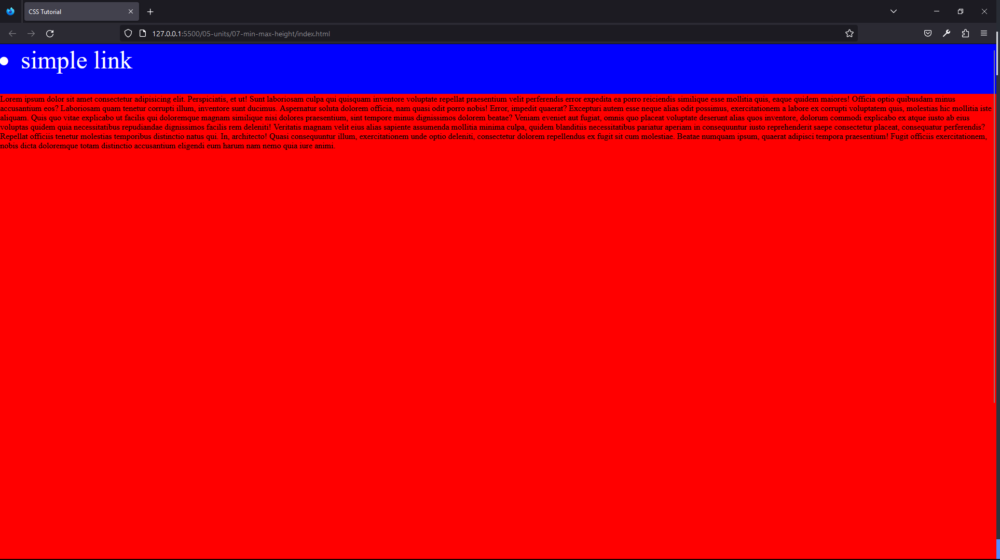

#### 89. [Units Intro](#89)

#### 90. [Pixels, Font-Size, Width, Height](#90)

#### 91. [Percent Units](#91)

#### 92. [Em Units](#92)

#### 93. [Rem Units](#93)

#### 94. [Vh and Vw](#94)

#### 95. [Default Browser Styles and Chrome DevTools](#95)

#### 96. [Calc Function](#96)

#### 97. [Min-height, Max-height](#97)

---

<br>

### 89. Units Intro<a id="89"></a>

> **_Business Objective: Layout_**


| Technology    | Description     |
| ------------- | --------------- |
| `Language`    | html, css, js   |
| `Framework`   | -               |
| `Library`     | -               |
| `Text editor` | Vs code         |
| `Browser`     | Chrome, firefox |

<br>

### 90. Pixels, Font-Size, Width, Height<a id="90"></a>

> **_Business Objective: Layout_**



| Technology    | Description     |
| ------------- | --------------- |
| `Language`    | html, css, js   |
| `Framework`   | -               |
| `Library`     | -               |
| `Text editor` | Vs code         |
| `Browser`     | Chrome, firefox |

---

- In index.html

```html
<!DOCTYPE html>
<html lang="en">
  <head>
    <meta charset="UTF-8" />
    <meta name="viewport" content="width=device-width, initial-scale=1.0" />
    <meta http-equiv="X-UA-Compatible" content="ie=edge" />
    <title>CSS Tutorial</title>
    <link rel="stylesheet" href="./styles.css" />
  </head>
  <body>
    <h1>units in the css</h1>
  </body>
</html>
```

---

- In styles.css

```css
/*  PIXELS - absolute values, one dot on the screen 
FONT-SIZE - size of the font
WIDTH - width of an element 
HEIGHT - height of an element 
*/

h1 {
  font-size: 60px;
  background: blue;
  color: white;
  width: 1000px;
  height: 800px;
}
```

<br>

### 91. Percent Units<a id="91"></a>

> **_Business Objective: Layout_**



| Technology    | Description     |
| ------------- | --------------- |
| `Language`    | html, css, js   |
| `Framework`   | -               |
| `Library`     | -               |
| `Text editor` | Vs code         |
| `Browser`     | Chrome, firefox |

---

- In index.html

```html
<!DOCTYPE html>
<html lang="en">
  <head>
    <meta charset="UTF-8" />
    <meta name="viewport" content="width=device-width, initial-scale=1.0" />
    <meta http-equiv="X-UA-Compatible" content="ie=edge" />
    <title>CSS Tutorial</title>
    <link rel="stylesheet" href="./styles.css" />
  </head>
  <body>
    <div class="outer">
      <div class="inner"></div>
    </div>
  </body>
</html>
```

---

- In styles.css

```css
/* % - percent. RELATIVE UNIT/VALUE. Depends on the parent   */

.outer {
  width: 200px;
  height: 200px;
  background: blue;
}

/* the innner width and height, depend upon parent width & height absolute value */
.inner {
  width: 50%;
  height: 50%;
  background: red;
}
```

<br>

### 92. Em Units<a id="92"></a>

> **_Business Objective: Layout_**


| Technology    | Description     |
| ------------- | --------------- |
| `Language`    | html, css, js   |
| `Framework`   | -               |
| `Library`     | -               |
| `Text editor` | Vs code         |
| `Browser`     | Chrome, firefox |

---

- In index.html

```html
<!DOCTYPE html>
<html lang="en">
  <head>
    <meta charset="UTF-8" />
    <meta name="viewport" content="width=device-width, initial-scale=1.0" />
    <meta http-equiv="X-UA-Compatible" content="ie=edge" />
    <title>CSS Tutorial</title>
    <link rel="stylesheet" href="./styles.css" />
  </head>
  <body>
    <div>
      <h3 class="relative">some text</h3>
    </div>

    <div>
      <h3 class="absolute">some text</h3>
    </div>
  </body>
</html>
```

---

- In styles.css

```css
/* 
em - RELATIVE, depends on parent
1em - 16px default browswer style
1em = base value (16px) * number (1) = 16px
2em = base value (16px) * number (2) = 32px
2em = base value (10px) * number (2) = 20px
*/
div {
  font-size: 10px;
}
.absolute {
  font-size: 32px;
}
.relative {
  font-size: 2em;
}
```

<br>

### 93. Rem Units<a id="93"></a>

> **_Business Objective: Layout_**



| Technology    | Description     |
| ------------- | --------------- |
| `Language`    | html, css, js   |
| `Framework`   | -               |
| `Library`     | -               |
| `Text editor` | Vs code         |
| `Browser`     | Chrome, firefox |

---

- In index.html

```html

```

<!DOCTYPE html>
<html lang="en">
  <head>
    <meta charset="UTF-8" />
    <meta name="viewport" content="width=device-width, initial-scale=1.0" />
    <meta http-equiv="X-UA-Compatible" content="ie=edge" />
    <title>CSS Tutorial</title>
    <link rel="stylesheet" href="./styles.css" />
  </head>
  <body>
    <div>
      <h3 class="relative">some text</h3>
    </div>
    <div>
      <h3 class="absolute">some text</h3>
    </div>
  </body>
</html>

---

- In styles.css

```css
/* 
rem - RELATIVE, depends on root
1rem = base value (16px) * number (1)
*/
html {
  font-size: 10px;
}

div {
  font-size: 5px;
}

.absolute {
  font-size: 32px;
}

.relative {
  font-size: 2rem;
}
```

<br>

### 94. Vh and Vw<a id="94"></a>

> **_Business Objective: Layout_**



| Technology    | Description     |
| ------------- | --------------- |
| `Language`    | html, css, js   |
| `Framework`   | -               |
| `Library`     | -               |
| `Text editor` | Vs code         |
| `Browser`     | Chrome, firefox |

---

- In index.html

```html
<!DOCTYPE html>
<html lang="en">
  <head>
    <meta charset="UTF-8" />
    <meta name="viewport" content="width=device-width, initial-scale=1.0" />
    <meta http-equiv="X-UA-Compatible" content="ie=edge" />
    <title>CSS Tutorial</title>
    <link rel="stylesheet" href="./styles.css" />
  </head>
  <body>
    <div class="hero"></div>

    <div class="about"></div>
  </body>
</html>
```

---

- In styles.css

```css
/* 
VIEWPORT UNITS
vh(view height) - height - percent of the device-screen, 
vw(view width) - width - percent of the device-screen

*/

/* reset browser default style   */
* {
  margin: 0;
  padding: 0;
  box-sizing: border-box;
}

.hero {
  background: green;
  height: 100vh;
  width: 100vw;
}
.about {
  background: blue;
  height: 43vh;
  width: 54vw;
}
```

<br>

### 95. Default Browser Styles and Chrome DevTools<a id="95"></a>

> **_Business Objective: Layout_**


| Technology    | Description     |
| ------------- | --------------- |
| `Language`    | html, css, js   |
| `Framework`   | -               |
| `Library`     | -               |
| `Text editor` | Vs code         |
| `Browser`     | Chrome, firefox |

---

- In index.html

```html

```

---

- In styles.css

```css

```

<br>

### 96. Calc Function<a id="96"></a>

> **_Business Objective: Layout_**



| Technology    | Description     |
| ------------- | --------------- |
| `Language`    | html, css, js   |
| `Framework`   | -               |
| `Library`     | -               |
| `Text editor` | Vs code         |
| `Browser`     | Chrome, firefox |

---

- In index.html

```html
<!DOCTYPE html>
<html lang="en">
  <head>
    <meta charset="UTF-8" />
    <meta name="viewport" content="width=device-width, initial-scale=1.0" />
    <meta http-equiv="X-UA-Compatible" content="ie=edge" />
    <title>CSS Tutorial</title>
    <link rel="stylesheet" href="./styles.css" />
  </head>
  <body>
    <ul class="navbar">
      <li>simple link</li>
    </ul>
    <div class="banner"></div>
  </body>
</html>
```

---

- In styles.css

```css
/* 
CALC ()
PERFORM MATH OPERATIONS + - * /
MIX AND MATCH VALUES
*/

* {
  margin: 0;
}
.navbar {
  background: blue;
  height: 6rem;
  color: white;
  font-size: 3rem;
}
.banner {
  background: red;
  /* how to calculate banner height, we dont need to scroll down and both i.e navbar & banner cover actual screen size */
  height: calc(100vh - 6rem);
}
```

<br>

### 97. Min-height, Max-height<a id="97"></a>

> **_Business Objective: Layout_**



| Technology    | Description     |
| ------------- | --------------- |
| `Language`    | html, css, js   |
| `Framework`   | -               |
| `Library`     | -               |
| `Text editor` | Vs code         |
| `Browser`     | Chrome, firefox |

---

- In index.html

```html
<!DOCTYPE html>
<html lang="en">
  <head>
    <meta charset="UTF-8" />
    <meta name="viewport" content="width=device-width, initial-scale=1.0" />
    <meta http-equiv="X-UA-Compatible" content="ie=edge" />
    <title>CSS Tutorial</title>
    <link rel="stylesheet" href="./styles.css" />
  </head>
  <body>
    <ul class="navbar">
      <li>simple link</li>
    </ul>
    <div class="banner">
      Lorem ipsum dolor sit amet consectetur adipisicing elit. Perspiciatis, et
      ut! Sunt laboriosam culpa qui quisquam inventore voluptate repellat
      praesentium velit perferendis error expedita ea porro reiciendis similique
      esse mollitia quis, eaque quidem maiores! Officia optio quibusdam minus
      accusantium eos? Laboriosam quam tenetur corrupti illum, inventore sunt
      ducimus. Aspernatur soluta dolorem officia, nam quasi odit porro nobis!
      Error, impedit quaerat? Excepturi autem esse neque alias odit possimus,
      exercitationem a labore ex corrupti voluptatem quis, molestias hic
      mollitia iste aliquam. Quis quo vitae explicabo ut facilis qui doloremque
      magnam similique nisi dolores praesentium, sint tempore minus dignissimos
      dolorem beatae? Veniam eveniet aut fugiat, omnis quo placeat voluptate
      deserunt alias quos inventore, dolorum commodi explicabo ex atque iusto ab
      eius voluptas quidem quia necessitatibus repudiandae dignissimos facilis
      rem deleniti! Veritatis magnam velit eius alias sapiente assumenda
      mollitia minima culpa, quidem blanditiis necessitatibus pariatur aperiam
      in consequuntur iusto reprehenderit saepe consectetur placeat, consequatur
      perferendis? Repellat officiis tenetur molestias temporibus distinctio
      natus qui. In, architecto! Quasi consequuntur illum, exercitationem unde
      optio deleniti, consectetur dolorem repellendus ex fugit sit cum
      molestiae. Beatae numquam ipsum, quaerat adipisci tempora praesentium!
      Fugit officiis exercitationem, nobis dicta doloremque totam distinctio
      accusantium eligendi eum harum nam nemo quia iure animi.
    </div>
    <div class="example">
      <p>hello world</p>
      Lorem ipsum dolor, sit amet consectetur adipisicing elit. Nemo quibusdam
      dolor placeat natus molestias accusamus expedita delectus veritatis,
      repellendus corrupti nam nostrum ratione cumque assumenda sint perferendis
      ab explicabo doloremque maxime fugit ipsam. Ipsam ducimus laborum quo?
      Fuga consequuntur non laborum at sint molestias laboriosam, distinctio
      aliquid repellat ipsam omnis, animi eaque error, ad praesentium eveniet
      quisquam iure deserunt reprehenderit alias voluptate sapiente quo labore.
      Eos aperiam, magnam consectetur incidunt quibusdam eveniet? Voluptates cum
      voluptas iure rerum tenetur. A aliquam amet officia, voluptates
      perferendis, modi repellendus fuga expedita distinctio illo vero
      repudiandae maiores consequatur veritatis. Minus illo explicabo
      perferendis eum.
      <p>hello world</p>
    </div>
  </body>
</html>
```

---

- In styles.css

```css
/* 
height:auto;min-height;max-height;overflow
*/
* {
  margin: 0;
}
.navbar {
  background: blue;
  height: 6rem;
  color: white;
  font-size: 3rem;
}
.banner {
  background: red;
  /* height: calc(100vh - 6rem); */
  min-height: calc(100vh - 6rem);
  max-height: 90vh;
  overflow: hidden;
  overflow: scroll;
}
.example {
  background: green;
  width: 10rem;
  height: 25rem;

  /* How to hide content i.e text if it overflow from container */
  overflow: hidden;
  /* How to make content in div scrollable */
  overflow: scroll;
}
```

<br>
