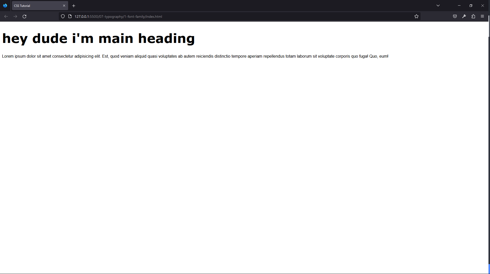
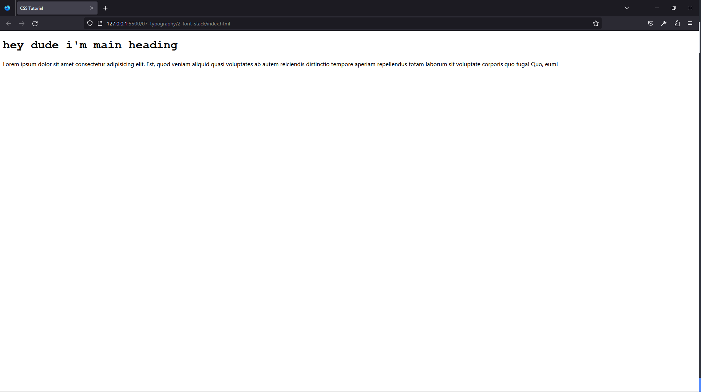
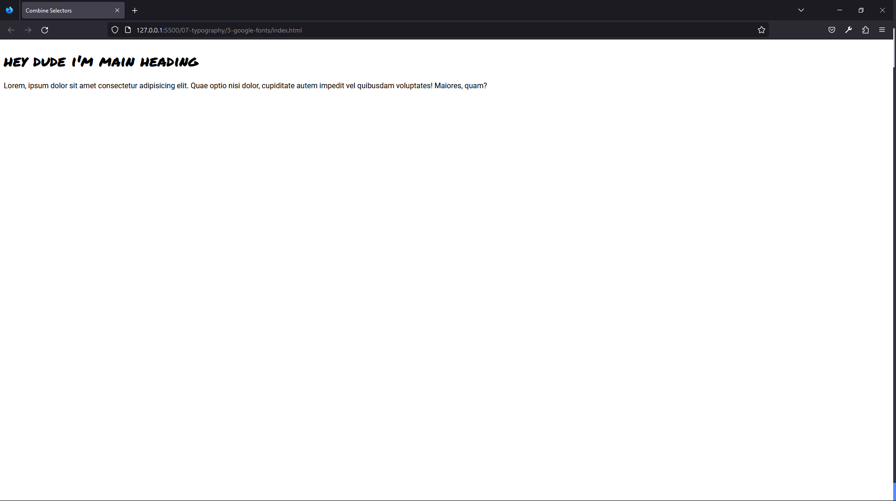
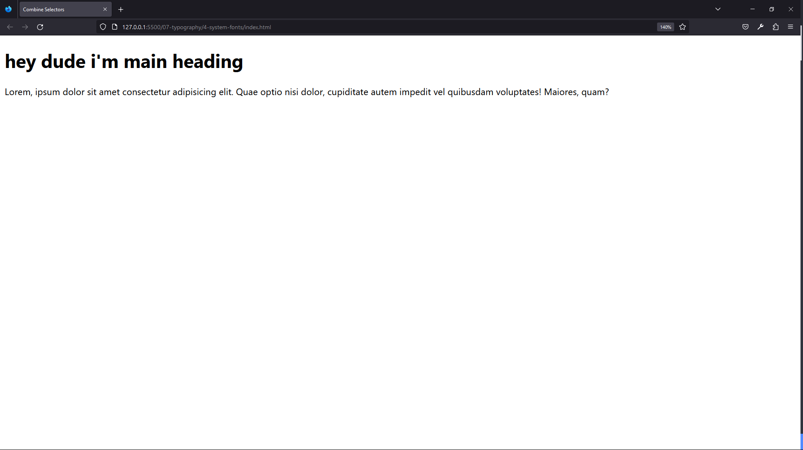
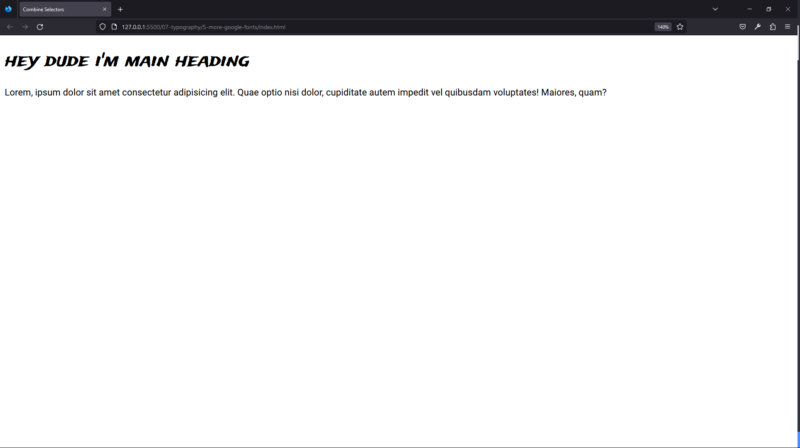
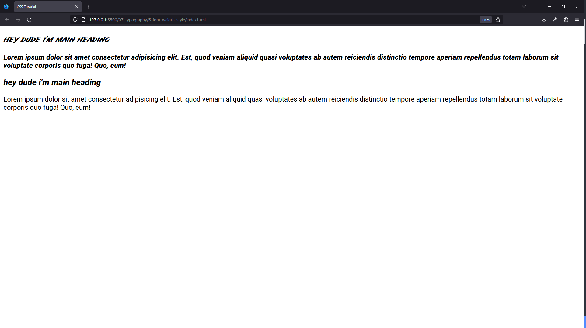
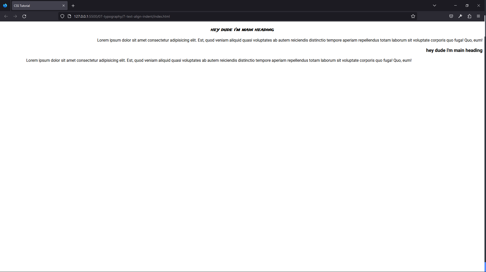

#### 101. [Typography Intro](#101)

#### 102. [Font-family](#102)

#### 103. [Font-Stack Generic Fonts](#103)

#### 104. [Google Fonts](#104)

#### 105. [System Fonts](#105)

#### 106. [More Google Fonts](#106)

#### 107. [Font-weight Font-style](#107)

#### 108. [Text-align Text-indent](#108)

#### 109. [More Text Properties](#109)

---

<br>

### 101. Typography Intro<a id="101"></a>

> **_Business Objective: Layout_**


| Technology    | Description     |
| ------------- | --------------- |
| `Language`    | html, css, js   |
| `Framework`   | -               |
| `Library`     | -               |
| `Text editor` | Vs code         |
| `Browser`     | Chrome, firefox |

<br>

### 102. Font-family<a id="102"></a>

> **_Business Objective: Layout_**



| Technology    | Description     |
| ------------- | --------------- |
| `Language`    | html, css, js   |
| `Framework`   | -               |
| `Library`     | -               |
| `Text editor` | Vs code         |
| `Browser`     | Chrome, firefox |

---

- In index.html

```html
<!DOCTYPE html>
<html lang="en">
  <head>
    <meta charset="UTF-8" />
    <meta name="viewport" content="width=device-width, initial-scale=1.0" />
    <meta http-equiv="X-UA-Compatible" content="ie=edge" />
    <title>CSS Tutorial</title>
    <link rel="stylesheet" href="./styles.css" />
  </head>
  <body>
    <h1>hey dude i'm main heading</h1>
    <p>
      Lorem ipsum dolor sit amet consectetur adipisicing elit. Est, quod veniam
      aliquid quasi voluptates ab autem reiciendis distinctio tempore aperiam
      repellendus totam laborum sit voluptate corporis quo fuga! Quo, eum!
    </p>
  </body>
</html>
```

---

- In styles.css

```css
/* 
font-size - size of the fonts
font-family - describes the font of the element
*/

body {
  font-family: Helvetica;
}
h1 {
  font-family: Verdana;
  font-size: 50px;
}
```

<br>

### 103. Font-Stack Generic Fonts<a id="103"></a>

> **_Business Objective: Layout_**



| Technology    | Description     |
| ------------- | --------------- |
| `Language`    | html, css, js   |
| `Framework`   | -               |
| `Library`     | -               |
| `Text editor` | Vs code         |
| `Browser`     | Chrome, firefox |

---

- In index.html

```html
<!DOCTYPE html>
<html lang="en">
  <head>
    <meta charset="UTF-8" />
    <meta name="viewport" content="width=device-width, initial-scale=1.0" />
    <meta http-equiv="X-UA-Compatible" content="ie=edge" />
    <title>CSS Tutorial</title>
    <link rel="stylesheet" href="./styles.css" />
  </head>
  <body>
    <h1>hey dude i'm main heading</h1>
    <p>
      Lorem ipsum dolor sit amet consectetur adipisicing elit. Est, quod veniam
      aliquid quasi voluptates ab autem reiciendis distinctio tempore aperiam
      repellendus totam laborum sit voluptate corporis quo fuga! Quo, eum!
    </p>
  </body>
</html>
```

---

- In styles.css

```css
/* 
font-stack generic-family
serif, sans-serif, cursive, fantasy, monospace
*/

body {
  font-family: "Segoe UI", Tahoma, Geneva, Verdana, sans-serif;
}
h1 {
  font-family: "Courier New", Courier, monospace;
}
```

<br>

### 104. Google Fonts<a id="104"></a>

> **_Business Objective: Layout_**



| Technology    | Description     |
| ------------- | --------------- |
| `Language`    | html, css, js   |
| `Framework`   | -               |
| `Library`     | -               |
| `Text editor` | Vs code         |
| `Browser`     | Chrome, firefox |

---

- In index.html

```html
<!DOCTYPE html>
<html lang="en">
  <head>
    <meta charset="UTF-8" />
    <meta name="viewport" content="width=device-width, initial-scale=1.0" />
    <meta http-equiv="X-UA-Compatible" content="ie=edge" />
    <title>Combine Selectors</title>
    <!-- google fonts -->
    <link rel="preconnect" href="https://fonts.googleapis.com" />
    <link rel="preconnect" href="https://fonts.gstatic.com" crossorigin />
    <link
      href="https://fonts.googleapis.com/css2?family=Permanent+Marker&family=Roboto:wght@400;700&display=swap"
      rel="stylesheet"
    />
    <!-- styles -->
    <link rel="stylesheet" href="./styles.css" />
  </head>
  <body>
    <h1>hey dude i'm main heading</h1>
    <p>
      Lorem, ipsum dolor sit amet consectetur adipisicing elit. Quae optio nisi
      dolor, cupiditate autem impedit vel quibusdam voluptates! Maiores, quam?
    </p>
  </body>
</html>
```

---

- In styles.css

```css
/* google fonts */
@import url("https://fonts.googleapis.com/css2?family=Permanent+Marker&family=Roboto:wght@400;700&display=swap");

/* 
Google Fonts

generic - serif, sans-serif, cursive, fantasy, monospace
} */

body {
  font-family: "Roboto", sans-serif;
}

h1 {
  font-family: "Permanent Marker", cursive;
}
```

<br>

### 105. System Fonts<a id="105"></a>

> **_Business Objective: Layout_**


| Technology    | Description     |
| ------------- | --------------- |
| `Language`    | html, css, js   |
| `Framework`   | -               |
| `Library`     | -               |
| `Text editor` | Vs code         |
| `Browser`     | Chrome, firefox |

---

- In index.html

```html
<!DOCTYPE html>
<html lang="en">
  <head>
    <meta charset="UTF-8" />
    <meta name="viewport" content="width=device-width, initial-scale=1.0" />
    <meta http-equiv="X-UA-Compatible" content="ie=edge" />
    <title>Combine Selectors</title>

    <!-- styles -->
    <link rel="stylesheet" href="./styles.css" />
  </head>
  <body>
    <h1>hey dude i'm main heading</h1>
    <p>
      Lorem, ipsum dolor sit amet consectetur adipisicing elit. Quae optio nisi
      dolor, cupiditate autem impedit vel quibusdam voluptates! Maiores, quam?
    </p>
  </body>
</html>
```

---

- In styles.css

```css
/* 
System Fonts

} */

body {
  font-family: -apple-system, BlinkMacSystemFont, "Segoe UI", Roboto, Oxygen,
    Ubuntu, Cantarell, "Open Sans", "Helvetica Neue", sans-serif;
}
```

<br>

### 106. More Google Fonts<a id="106"></a>

> **_Business Objective: Layout_**



| Technology    | Description     |
| ------------- | --------------- |
| `Language`    | html, css, js   |
| `Framework`   | -               |
| `Library`     | -               |
| `Text editor` | Vs code         |
| `Browser`     | Chrome, firefox |

---

- In index.html

```html
<!DOCTYPE html>
<html lang="en">
  <head>
    <meta charset="UTF-8" />
    <meta name="viewport" content="width=device-width, initial-scale=1.0" />
    <meta http-equiv="X-UA-Compatible" content="ie=edge" />
    <title>Combine Selectors</title>

    <!-- styles -->
    <link rel="stylesheet" href="./styles.css" />
  </head>
  <body>
    <h1>hey dude i'm main heading</h1>
    <p>
      Lorem, ipsum dolor sit amet consectetur adipisicing elit. Quae optio nisi
      dolor, cupiditate autem impedit vel quibusdam voluptates! Maiores, quam?
    </p>
  </body>
</html>
```

---

- In styles.css

```css
/* google fonts */
@import url("https://fonts.googleapis.com/css2?family=Roboto:ital,wght@0,400;0,700;1,500&family=Trade+Winds&display=swap");

body {
  font-family: "Roboto", sans-serif;
}

h1 {
  font-family: "Trade Winds", cursive;
}
```

<br>

### 107. Font-weight Font-style<a id="107"></a>

> **_Business Objective: Layout_**



| Technology    | Description     |
| ------------- | --------------- |
| `Language`    | html, css, js   |
| `Framework`   | -               |
| `Library`     | -               |
| `Text editor` | Vs code         |
| `Browser`     | Chrome, firefox |

---

- In index.html

```html
<!DOCTYPE html>
<html lang="en">
  <head>
    <meta charset="UTF-8" />
    <meta name="viewport" content="width=device-width, initial-scale=1.0" />
    <meta http-equiv="X-UA-Compatible" content="ie=edge" />
    <title>CSS Tutorial</title>
    <!-- google fonts -->
    <!-- <link
      href="https://fonts.googleapis.com/css?family=Roboto:400,500i,700|Trade+Winds&display=swap"
      rel="stylesheet"
    /> -->
    <!-- styles -->
    <link rel="stylesheet" href="./styles.css" />
  </head>
  <body>
    <h3 class="main-heading">hey dude i'm main heading</h1>
    <p class="one">
      Lorem ipsum dolor sit amet consectetur adipisicing elit. Est, quod veniam
      aliquid quasi voluptates ab autem reiciendis distinctio tempore aperiam
      repellendus totam laborum sit voluptate corporis quo fuga! Quo, eum!
    </p>
    <h3 class="sub-heading">hey dude i'm main heading</h1>
    <p class="two">
      Lorem ipsum dolor sit amet consectetur adipisicing elit. Est, quod veniam
      aliquid quasi voluptates ab autem reiciendis distinctio tempore aperiam
      repellendus totam laborum sit voluptate corporis quo fuga! Quo, eum!
    </p>
  </body>
</html>

```

---

- In styles.css

```css
/* 
text-align, text-indent
*/
@import url("https://fonts.googleapis.com/css?family=Roboto:400,500i,700|Trade+Winds&display=swap");
body {
  font-family: "Roboto", sans-serif;
  font-style: italic;
}
.main-heading {
  font-family: "Trade Winds", cursive;
}
.sub-heading {
  /* font-style: italic; */
}
.one {
  font-weight: bold;
}
.two {
  /* font-weight: lighter;
  font-style: italic;
  font-style: oblique; */
  font-style: normal;
}
```

<br>

### 108. Text-align Text-indent<a id="108"></a>

> **_Business Objective: Layout_**



| Technology    | Description     |
| ------------- | --------------- |
| `Language`    | html, css, js   |
| `Framework`   | -               |
| `Library`     | -               |
| `Text editor` | Vs code         |
| `Browser`     | Chrome, firefox |

---

- In index.html

```html
<!DOCTYPE html>
<html lang="en">
  <head>
    <meta charset="UTF-8" />
    <meta name="viewport" content="width=device-width, initial-scale=1.0" />
    <meta http-equiv="X-UA-Compatible" content="ie=edge" />
    <title>CSS Tutorial</title>
    <!-- google fonts -->
    <!-- <link
      href="https://fonts.googleapis.com/css?family=Roboto:400,500i,700|Trade+Winds&display=swap"
      rel="stylesheet"
    /> -->
    <!-- styles -->
    <link rel="stylesheet" href="./styles.css" />
  </head>
  <body>
    <h3 class="main-heading">hey dude i'm main heading</h1>
    <p class="one">
      Lorem ipsum dolor sit amet consectetur adipisicing elit. Est, quod veniam
      aliquid quasi voluptates ab autem reiciendis distinctio tempore aperiam
      repellendus totam laborum sit voluptate corporis quo fuga! Quo, eum!
    </p>
    <h3 class="sub-heading">hey dude i'm main heading</h1>
    <p class="two">
      Lorem ipsum dolor sit amet consectetur adipisicing elit. Est, quod veniam
      aliquid quasi voluptates ab autem reiciendis distinctio tempore aperiam
      repellendus totam laborum sit voluptate corporis quo fuga! Quo, eum!
    </p>
  </body>
</html>

```

---

- In styles.css

```css
/* 
text-align, text-indent
*/
@import url("https://fonts.googleapis.com/css?family=Roboto:400,500i,700|Trade+Winds&display=swap");
body {
  font-family: "Roboto", sans-serif;
  text-align: right;
}
.main-heading {
  font-family: "Trade Winds", cursive;
  text-align: center;
}
.sub-heading {
}
.one {
}
.two {
  text-align: left;
  text-indent: 6rem;
}
```

<br>

### 109. More Text Properties<a id="109"></a>

> **_Business Objective: Layout_**



| Technology    | Description     |
| ------------- | --------------- |
| `Language`    | html, css, js   |
| `Framework`   | -               |
| `Library`     | -               |
| `Text editor` | Vs code         |
| `Browser`     | Chrome, firefox |

---

- In index.html

```html
<!DOCTYPE html>
<html lang="en">
  <head>
    <meta charset="UTF-8" />
    <meta name="viewport" content="width=device-width, initial-scale=1.0" />
    <meta http-equiv="X-UA-Compatible" content="ie=edge" />
    <title>CSS Tutorial</title>
    <!-- google fonts -->
    <!-- <link
      href="https://fonts.googleapis.com/css?family=Roboto:400,500i,700|Trade+Winds&display=swap"
      rel="stylesheet"
    /> -->
    <!-- styles -->
    <link rel="stylesheet" href="./styles.css" />
  </head>
  <body>
    <a href="#">google</a>
    <h1>hello world</h1>
    <p class="one">
      Lorem, ipsum dolor sit amet consectetur adipisicing elit. Ipsa optio
      corrupti quos temporibus tempora facere nobis aspernatur velit quia
      deleniti.
    </p>
    <p class="two">
      Lorem, ipsum dolor sit amet consectetur adipisicing elit. Ipsa optio
      corrupti quos temporibus tempora facere nobis aspernatur velit quia
      deleniti.
    </p>
    <p class="three">
      Lorem, ipsum dolor sit amet consectetur adipisicing elit. Ipsa optio
      corrupti quos temporibus tempora facere nobis aspernatur velit quia
      deleniti.
    </p>
  </body>
</html>
```

---

- In styles.css

```css
/* 
line-height - if number * by font-size
letter-spacing
word-spacing
text-decoration
text-transform
*/
a {
  font-size: 3rem;
  text-decoration: none;
}
body {
  font-size: 20px;
  line-height: 1.5;
  text-transform: uppercase;
  /* 30 */
}
h1 {
  /* text-decoration: underline; */
  /* text-decoration: line-through; */
  text-transform: uppercase;
}
.one {
  letter-spacing: 0.5rem;
  line-height: 2.5;
  text-decoration: overline;
}
.two {
  word-spacing: 10px;
  text-transform: lowercase;
}
.three {
  text-transform: capitalize;
}
```

<br>
