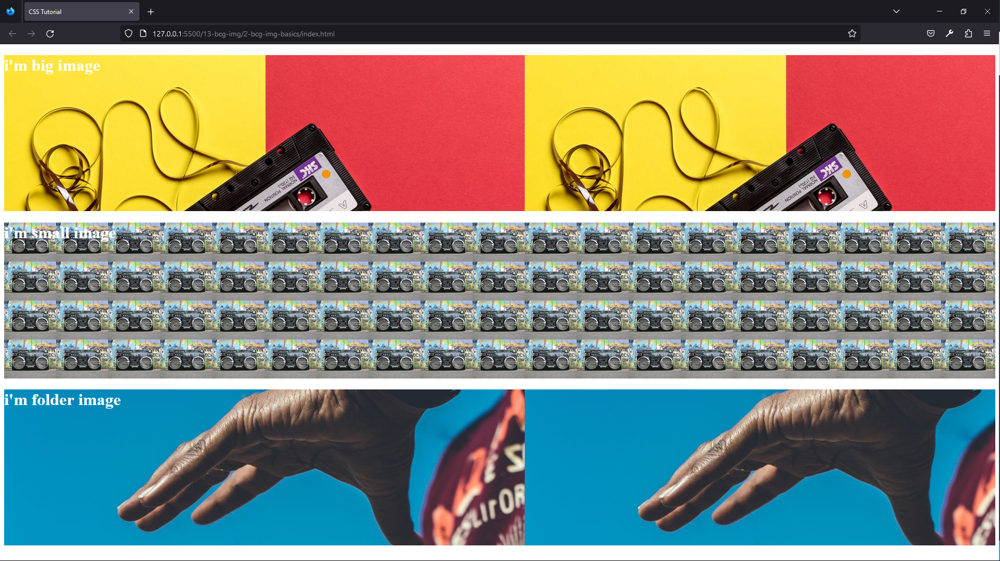
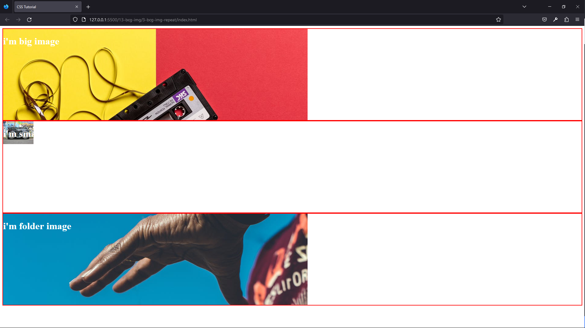
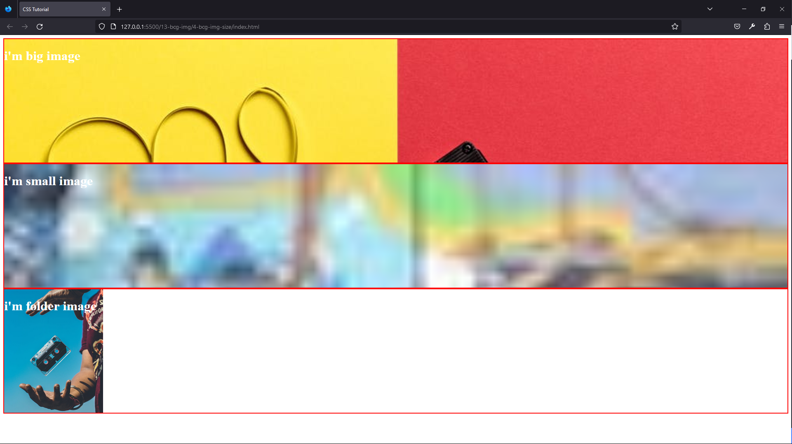
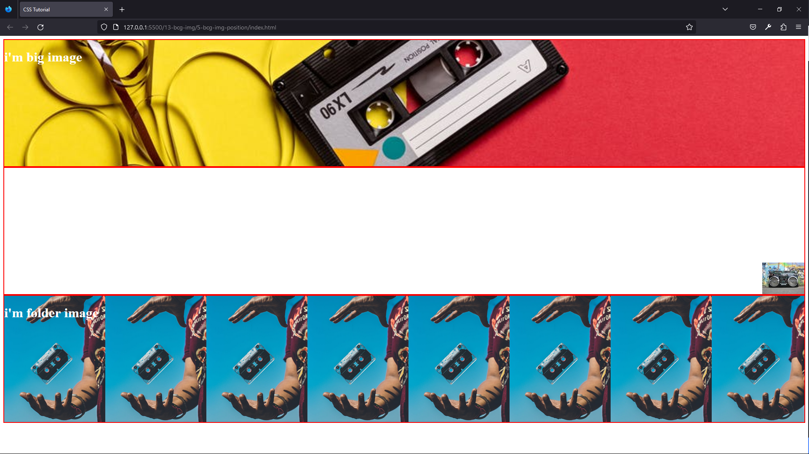
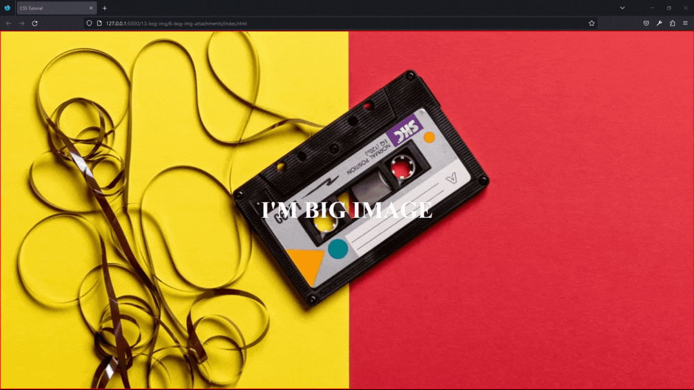
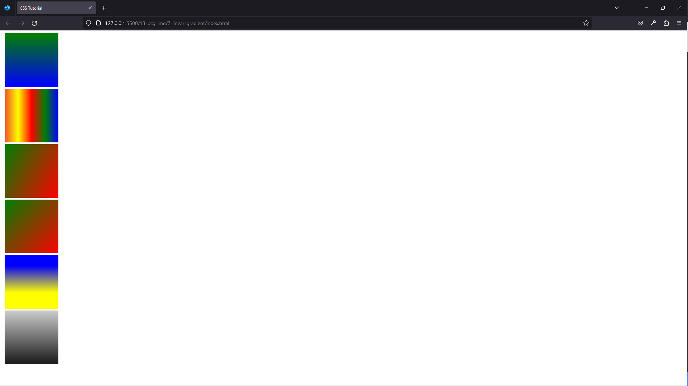

#### 136. [Intro](#136)

#### 137. [Setup](#137)

#### 138. [Background Images Basics](#138)

#### 139. [background-repeat](#139)

#### 140. [background-size](#140)

#### 141. [background-position](#141)

#### 142. [background-attachment](#142)

#### 143. [Linear Gradients](#143)

#### 144. [Background Image Overlay](#144)

#### 145. [Colorzilla](#145)

---

<br>

### 136. Intro<a id="136"></a>

> **_Business Objective: Layout_**


| Technology    | Description     |
| ------------- | --------------- |
| `Language`    | html, css, js   |
| `Framework`   | -               |
| `Library`     | -               |
| `Text editor` | Vs code         |
| `Browser`     | Chrome, firefox |

<br>

### 137. Setup<a id="137"></a>

> **_Business Objective: Layout_**


| Technology    | Description     |
| ------------- | --------------- |
| `Language`    | html, css, js   |
| `Framework`   | -               |
| `Library`     | -               |
| `Text editor` | Vs code         |
| `Browser`     | Chrome, firefox |

---

- In index.html

```html
<!DOCTYPE html>
<html lang="en">
  <head>
    <meta charset="UTF-8" />
    <meta name="viewport" content="width=device-width, initial-scale=1.0" />
    <meta http-equiv="X-UA-Compatible" content="ie=edge" />
    <title>CSS Tutorial</title>

    <!-- styles -->
    <link rel="stylesheet" href="./styles.css" />
  </head>
  <body></body>
</html>
```

---

- In styles.css

```css

```

<br>

### 138. Background Images Basics<a id="138"></a>

> **_Business Objective: Layout_**



| Technology    | Description     |
| ------------- | --------------- |
| `Language`    | html, css, js   |
| `Framework`   | -               |
| `Library`     | -               |
| `Text editor` | Vs code         |
| `Browser`     | Chrome, firefox |

---

- In index.html

```html
<!DOCTYPE html>
<html lang="en">
  <head>
    <meta charset="UTF-8" />
    <meta name="viewport" content="width=device-width, initial-scale=1.0" />
    <meta http-equiv="X-UA-Compatible" content="ie=edge" />
    <title>CSS Tutorial</title>

    <!-- styles -->
    <link rel="stylesheet" href="./styles.css" />
  </head>
  <body>
    <div class="big-img">
      <h1>i'm big image</h1>
    </div>
    <div class="small-img">
      <h1>i'm small image</h1>
    </div>
    <div class="folder-img">
      <h1>i'm folder image</h1>
    </div>
  </body>
</html>
```

---

- In styles.css

```css
div {
  height: 300px;
  color: white;
}

.big-img {
  background: url("./big.jpeg");
}
.small-img {
  background: url("./small.jpeg");
}
.folder-img {
  background: url("./images/folder-img.jpeg");
}
```

<br>

### 139. background-repeat<a id="139"></a>

> **_Business Objective: Layout_**



| Technology    | Description     |
| ------------- | --------------- |
| `Language`    | html, css, js   |
| `Framework`   | -               |
| `Library`     | -               |
| `Text editor` | Vs code         |
| `Browser`     | Chrome, firefox |

---

- In index.html

```html
<!DOCTYPE html>
<html lang="en">
  <head>
    <meta charset="UTF-8" />
    <meta name="viewport" content="width=device-width, initial-scale=1.0" />
    <meta http-equiv="X-UA-Compatible" content="ie=edge" />
    <title>CSS Tutorial</title>

    <!-- styles -->
    <link rel="stylesheet" href="./styles.css" />
  </head>
  <body>
    <div class="big-img">
      <h1>i'm big image</h1>
    </div>
    <div class="small-img">
      <h1>i'm small image</h1>
    </div>
    <div class="folder-img">
      <h1>i'm folder image</h1>
    </div>
  </body>
</html>
```

---

- In styles.css

```css
/* background-repeat */
div {
  height: 300px;
  color: white;
  border: 2px solid red;
}

.big-img {
  background: url("./big.jpeg");
  background-repeat: no-repeat;
}
.small-img {
  background: url("./small.jpeg");
  background-repeat: repeat;
  background-repeat: repeat-x;
  background-repeat: repeat-y;
  background-repeat: space;
  background-repeat: round;
  background-repeat: no-repeat;
}
.folder-img {
  background: url("./images/folder-img.jpeg");
  background-repeat: no-repeat;
}
```

<br>

### 140. background-size<a id="140"></a>

> **_Business Objective: Layout_**



| Technology    | Description     |
| ------------- | --------------- |
| `Language`    | html, css, js   |
| `Framework`   | -               |
| `Library`     | -               |
| `Text editor` | Vs code         |
| `Browser`     | Chrome, firefox |

---

- In index.html

```html
<!DOCTYPE html>
<html lang="en">
  <head>
    <meta charset="UTF-8" />
    <meta name="viewport" content="width=device-width, initial-scale=1.0" />
    <meta http-equiv="X-UA-Compatible" content="ie=edge" />
    <title>CSS Tutorial</title>

    <!-- styles -->
    <link rel="stylesheet" href="./styles.css" />
  </head>
  <body>
    <div class="big-img">
      <h1>i'm big image</h1>
    </div>
    <div class="small-img">
      <h1>i'm small image</h1>
    </div>
    <div class="folder-img">
      <h1>i'm folder image</h1>
    </div>
  </body>
</html>
```

---

- In styles.css

```css
/* background-size
 */
div {
  height: 300px;
  color: white;
  border: 2px solid red;
}

.big-img {
  background: url("./big.jpeg");
  background-repeat: no-repeat;
  background-size: cover;
}
.small-img {
  background: url("./small.jpeg");
  background-repeat: no-repeat;
  background-size: cover;
}
.folder-img {
  background: url("./images/folder-img.jpeg");
  background-repeat: no-repeat;
  background-size: contain;
}
```

<br>

### 141. background-position<a id="141"></a>

> **_Business Objective: Layout_**



| Technology    | Description     |
| ------------- | --------------- |
| `Language`    | html, css, js   |
| `Framework`   | -               |
| `Library`     | -               |
| `Text editor` | Vs code         |
| `Browser`     | Chrome, firefox |

---

- In index.html

```html
<!DOCTYPE html>
<html lang="en">
  <head>
    <meta charset="UTF-8" />
    <meta name="viewport" content="width=device-width, initial-scale=1.0" />
    <meta http-equiv="X-UA-Compatible" content="ie=edge" />
    <title>CSS Tutorial</title>

    <!-- styles -->
    <link rel="stylesheet" href="./styles.css" />
  </head>
  <body>
    <div class="big-img">
      <h1>i'm big image</h1>
    </div>
    <div class="small-img">
      <h1>i'm small image</h1>
    </div>
    <div class="folder-img">
      <h1>i'm folder image</h1>
    </div>
  </body>
</html>
```

---

- In styles.css

```css
/* background-position
 */
div {
  height: 300px;
  color: white;
  border: 2px solid red;
}

.big-img {
  background: url("./big.jpeg");
  background-repeat: no-repeat;
  background-size: cover;
  /* background-position: center; */
  background-position: 20% 50%;
}
.small-img {
  background: url("./small.jpeg");
  background-repeat: no-repeat;
  background-position: center;
  background-position: left;
  background-position: right;
  background-position: bottom;
  background-position: top;
  background-position: 100% 100%;
}
.folder-img {
  background: url("./images/folder-img.jpeg");
  /* background-repeat: no-repeat; */
  background-size: contain;
}
```

<br>

### 142. background-attachment<a id="142"></a>

> **_Business Objective: Layout_**



| Technology    | Description     |
| ------------- | --------------- |
| `Language`    | html, css, js   |
| `Framework`   | -               |
| `Library`     | -               |
| `Text editor` | Vs code         |
| `Browser`     | Chrome, firefox |

---

- In index.html

```html
<!DOCTYPE html>
<html lang="en">
  <head>
    <meta charset="UTF-8" />
    <meta name="viewport" content="width=device-width, initial-scale=1.0" />
    <meta http-equiv="X-UA-Compatible" content="ie=edge" />
    <title>CSS Tutorial</title>

    <!-- styles -->
    <link rel="stylesheet" href="./styles.css" />
  </head>
  <body>
    <div class="big-img">
      <h1>i'm big image</h1>
    </div>
    <div class="small-img">
      <h1>i'm small image</h1>
    </div>
    <div class="folder-img">
      <h1>i'm folder image</h1>
    </div>
  </body>
</html>
```

---

- In styles.css

```css
/* background-attachment
 */
* {
  margin: 0;
  padding: 0;
  box-sizing: border-box;
}
div {
  min-height: 100vh;
  color: white;
  border: 2px solid red;
  display: flex;
  justify-content: center;
  align-items: center;
  font-size: 2rem;
  text-transform: uppercase;
}

.big-img {
  background: url("./big.jpeg");
  background-repeat: no-repeat;
  background-size: cover;
  background-position: center;
  background-attachment: fixed;
}
.small-img {
  background: url("./images/folder-img.jpeg");
  background-repeat: no-repeat;
  background-size: cover;
  background-position: center;
  background-attachment: fixed;
}
.folder-img {
  background: url("./big.jpeg");
  background-repeat: no-repeat;
  background-size: cover;
  background-position: center;
  background-attachment: fixed;
}
```

<br>

### 143. Linear Gradients<a id="143"></a>

> **_Business Objective: Layout_**



| Technology    | Description     |
| ------------- | --------------- |
| `Language`    | html, css, js   |
| `Framework`   | -               |
| `Library`     | -               |
| `Text editor` | Vs code         |
| `Browser`     | Chrome, firefox |

---

- In index.html

```html
<!DOCTYPE html>
<html lang="en">
  <head>
    <meta charset="UTF-8" />
    <meta name="viewport" content="width=device-width, initial-scale=1.0" />
    <meta http-equiv="X-UA-Compatible" content="ie=edge" />
    <title>CSS Tutorial</title>

    <!-- styles -->
    <link rel="stylesheet" href="./styles.css" />
  </head>
  <body>
    <!-- <div class="big-img">
      <h1>i'm big image</h1>
    </div>
    <div class="small-img">
      <h1>i'm small image</h1>
    </div>
    <div class="folder-img">
      <h1>i'm folder image</h1>
    </div> -->
    <div class="one"></div>
    <div class="two"></div>
    <div class="three"></div>
    <div class="four"></div>
    <div class="five"></div>
    <div class="six"></div>
  </body>
</html>
```

---

- In styles.css

```css
div {
  width: 150px;
  height: 150px;
  margin: 5px;
}
.one {
  background: linear-gradient(to top, blue, green);
}
.two {
  background: linear-gradient(to left, blue, green, red, yellow, #f15025);
}
.three {
  background: linear-gradient(300deg, red, green);
}
.four {
  background: linear-gradient(to top left, red, green);
}
.five {
  background: linear-gradient(blue 20%, yellow 70%);
}
.six {
  background: linear-gradient(rgba(0, 0, 0, 0.2), rgba(0, 0, 0, 0.9));
}
/* * {
  margin: 0;f
  padding: 0;
  box-sizing: border-box;
}
div {
  min-height: 100vh;
  color: white;
  border: 2px solid red;
  display: flex;
  justify-content: center;
  align-items: center;
  font-size: 2rem;
  text-transform: uppercase;
}

.big-img {
  background: url("./big.jpeg");
  background-repeat: no-repeat;
  background-size: cover;
  background-position: center;
  background-attachment: fixed;
}
.small-img {
  background: url("./images/folder-img.jpeg");
  background-repeat: no-repeat;
  background-size: cover;
  background-position: center;
  background-attachment: fixed;
}
.folder-img {
  background: url("./big.jpeg");
  background-repeat: no-repeat;
  background-size: cover;
  background-position: center;
  background-attachment: fixed;
} */
```

<br>

### 144. Background Image Overlay<a id="144"></a>

> **_Business Objective: Layout_**


| Technology    | Description     |
| ------------- | --------------- |
| `Language`    | html, css, js   |
| `Framework`   | -               |
| `Library`     | -               |
| `Text editor` | Vs code         |
| `Browser`     | Chrome, firefox |

---

- In index.html

```html
<!DOCTYPE html>
<html lang="en">
  <head>
    <meta charset="UTF-8" />
    <meta name="viewport" content="width=device-width, initial-scale=1.0" />
    <meta http-equiv="X-UA-Compatible" content="ie=edge" />
    <title>CSS Tutorial</title>

    <!-- styles -->
    <link rel="stylesheet" href="./styles.css" />
  </head>
  <body>
    <div class="big-img">
      <h1>i'm big image</h1>
    </div>
    <div class="folder-img">
      <h1>i'm folder image</h1>
    </div>
    <div class="small-img">
      <h1>i'm small image</h1>
    </div>
  </body>
</html>
```

---

- In styles.css

```css
* {
  margin: 0;
  padding: 0;
  box-sizing: border-box;
}
div {
  min-height: 100vh;
  color: white;
  border: 2px solid red;
  display: flex;
  justify-content: center;
  align-items: center;
  font-size: 2rem;
  text-transform: uppercase;
  text-align: center;
}

.big-img {
  background: url("./big.jpeg");
  background-repeat: no-repeat;
  background-size: cover;
  background-position: center;
  /* background-attachment: fixed; */
}
.small-img {
  background: url("./images/folder-img.jpeg") center/cover no-repeat fixed;
}
.folder-img {
  background: linear-gradient(
      to top,
      rgba(0, 0, 0, 0.3),
      rgba(255, 100, 239, 0.5)
    ), url("./big.jpeg") center/cover fixed no-repeat;
}
```

<br>

### 145. Colorzilla<a id="145"></a>

> **_Business Objective: Layout_**


| Technology    | Description     |
| ------------- | --------------- |
| `Language`    | html, css, js   |
| `Framework`   | -               |
| `Library`     | -               |
| `Text editor` | Vs code         |
| `Browser`     | Chrome, firefox |

---

- In index.html

```html
<!DOCTYPE html>
<html lang="en">
  <head>
    <meta charset="UTF-8" />
    <meta name="viewport" content="width=device-width, initial-scale=1.0" />
    <meta http-equiv="X-UA-Compatible" content="ie=edge" />
    <title>CSS Tutorial</title>

    <!-- styles -->
    <link rel="stylesheet" href="./styles.css" />
  </head>
  <body>
    <div class="big-img">
      <h1>i'm big image</h1>
    </div>
    <div class="folder-img">
      <h1>i'm folder image</h1>
    </div>
    <div class="small-img">
      <h1>i'm small image</h1>
    </div>
    <div class="colorzilla"></div>
  </body>
</html>
```

---

- In styles.css

```css
* {
  margin: 0;
  padding: 0;
  box-sizing: border-box;
}
div {
  min-height: 100vh;
  color: white;
  border: 2px solid red;
  display: flex;
  justify-content: center;
  align-items: center;
  font-size: 2rem;
  text-transform: uppercase;
  text-align: center;
}

.big-img {
  background: url("./big.jpeg");
  background-repeat: no-repeat;
  background-size: cover;
  background-position: center;
  /* background-attachment: fixed; */
}
.small-img {
  background: url("./images/folder-img.jpeg") center/cover no-repeat fixed;
}
.folder-img {
  background: linear-gradient(
      to top,
      rgba(0, 0, 0, 0.3),
      rgba(255, 100, 239, 0.5)
    ), url("./big.jpeg") center/cover fixed no-repeat;
}
.colorzilla {
  /* Permalink - use to edit and share this gradient: https://colorzilla.com/gradient-editor/#d19e29+20,b223b2+51,7db9e8+100 */
  background: rgb(209, 158, 41); /* Old browsers */
  background: -moz-linear-gradient(
    -45deg,
    rgba(209, 158, 41, 1) 20%,
    rgba(178, 35, 178, 1) 51%,
    rgba(125, 185, 232, 1) 100%
  ); /* FF3.6-15 */
  background: -webkit-linear-gradient(
    -45deg,
    rgba(209, 158, 41, 1) 20%,
    rgba(178, 35, 178, 1) 51%,
    rgba(125, 185, 232, 1) 100%
  ); /* Chrome10-25,Safari5.1-6 */
  background: linear-gradient(
    135deg,
    rgba(209, 158, 41, 1) 20%,
    rgba(178, 35, 178, 1) 51%,
    rgba(125, 185, 232, 1) 100%
  ); /* W3C, IE10+, FF16+, Chrome26+, Opera12+, Safari7+ */
  filter: progid:DXImageTransform.Microsoft.gradient( startColorstr='#d19e29', endColorstr='#7db9e8',GradientType=1 ); /* IE6-9 fallback on horizontal gradient */
}
```

<br>
