#### 151. [Float, Positions, Media Queries, Z-index Intro](#151)

#### 152. [Float Property](#152)

#### 153. [Float Property Column Layout Example](#153)

#### 154. [Position static](#154)

#### 155. [Position Relative](#155)

#### 156. [Position Absolute](#156)

#### 157. [Position Fixed](#157)

#### 158. [position:sticky](#158)

#### 159. [Media Queries](#159)

#### 160. [Z-index](#160)

#### 161. [::before and ::after Basics](#161)

#### 162. [::before and ::after Example](#162)

#### 163. [Inset Property](#163)

---

<br>

### 151. Float, Positions, Media Queries, Z-index Intro<a id="151"></a>

> **_Business Objective: Layout_**


| Technology    | Description     |
| ------------- | --------------- |
| `Language`    | html, css, js   |
| `Framework`   | -               |
| `Library`     | -               |
| `Text editor` | Vs code         |
| `Browser`     | Chrome, firefox |

---

- In index.html

```html

```

---

- In styles.css

```css

```

<br>

### 152. Float Property<a id="152"></a>

> **_Business Objective: Layout_**

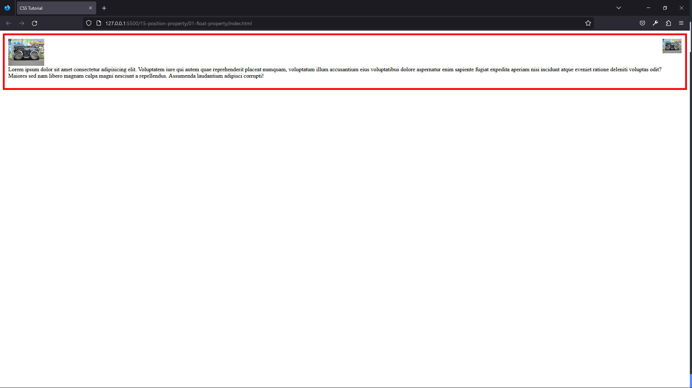

| Technology    | Description     |
| ------------- | --------------- |
| `Language`    | html, css, js   |
| `Framework`   | -               |
| `Library`     | -               |
| `Text editor` | Vs code         |
| `Browser`     | Chrome, firefox |

---

- In index.html

```html
<!DOCTYPE html>
<html lang="en">
  <head>
    <meta charset="UTF-8" />
    <meta name="viewport" content="width=device-width, initial-scale=1.0" />
    <meta http-equiv="X-UA-Compatible" content="ie=edge" />
    <title>CSS Tutorial</title>

    <!-- styles -->
    <link rel="stylesheet" href="./styles.css" />
  </head>
  <body>
    <div class="banner">
      
      
      <p>
        Lorem ipsum dolor sit amet consectetur adipisicing elit. Voluptatem iure
        qui autem quae reprehenderit placeat numquam, voluptatum illum
        accusantium eius voluptatibus dolore aspernatur enim sapiente fugiat
        expedita aperiam nisi incidunt atque eveniet ratione deleniti voluptas
        odit? Maiores sed nam libero magnam culpa magni nesciunt a repellendus.
        Assumenda laudantium adipisci corrupti!
      </p>
    </div>
  </body>
</html>
```

---

- In styles.css

```css
.banner {
  border: 5px solid red;
  padding: 10px;
}
.one {
  float: left;
}
.two {
  float: right;
  height: 40px;
}
p {
  clear: both;
}
```

<br>

### 153. Float Property Column Layout Example<a id="153"></a>

> **_Business Objective: Layout_**

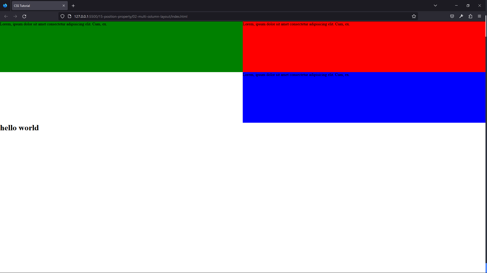

| Technology    | Description     |
| ------------- | --------------- |
| `Language`    | html, css, js   |
| `Framework`   | -               |
| `Library`     | -               |
| `Text editor` | Vs code         |
| `Browser`     | Chrome, firefox |

---

- In index.html

```html
<!DOCTYPE html>
<html lang="en">
  <head>
    <meta charset="UTF-8" />
    <meta name="viewport" content="width=device-width, initial-scale=1.0" />
    <meta http-equiv="X-UA-Compatible" content="ie=edge" />
    <title>CSS Tutorial</title>

    <!-- styles -->
    <link rel="stylesheet" href="./styles.css" />
  </head>
  <body>
    <div class="one">
      <p>Lorem, ipsum dolor sit amet consectetur adipisicing elit. Cum, ex.</p>
    </div>
    <div class="two">
      <p>Lorem, ipsum dolor sit amet consectetur adipisicing elit. Cum, ex.</p>
    </div>
    <div class="three">
      <p>Lorem, ipsum dolor sit amet consectetur adipisicing elit. Cum, ex.</p>
    </div>

    <h1>hello world</h1>
  </body>
</html>
```

---

- In styles.css

```css
* {
  margin: 0;
  padding: 0;
  box-sizing: border-box;
}

div {
  height: 200px;
  width: 50%;
  float: right;
}

.one {
  background: red;
}
.two {
  background: green;
}
.three {
  background: blue;
}
.four {
  background: yellow;
}
h1 {
  clear: both;
}
```

<br>

### 154. Position static<a id="154"></a>

> **_Business Objective: Layout_**

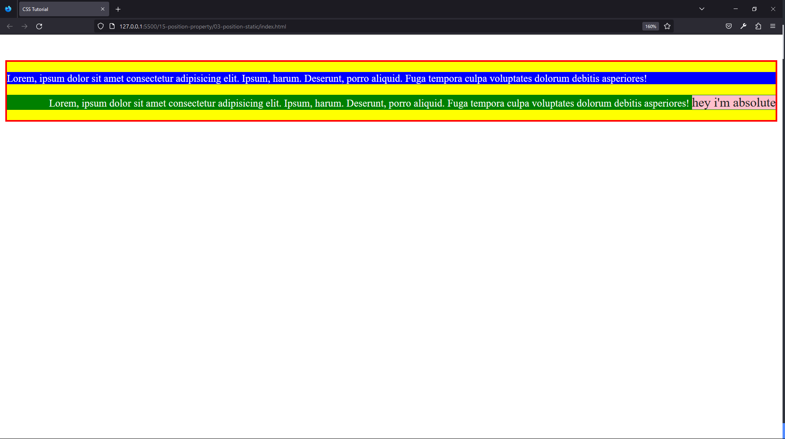

| Technology    | Description     |
| ------------- | --------------- |
| `Language`    | html, css, js   |
| `Framework`   | -               |
| `Library`     | -               |
| `Text editor` | Vs code         |
| `Browser`     | Chrome, firefox |

---

- In index.html

```html
<!DOCTYPE html>
<html lang="en">
  <head>
    <meta charset="UTF-8" />
    <meta name="viewport" content="width=device-width, initial-scale=1.0" />
    <meta http-equiv="X-UA-Compatible" content="ie=edge" />
    <title>CSS Tutorial</title>

    <!-- styles -->
    <link rel="stylesheet" href="./styles.css" />
  </head>
  <body>
    <div>
      <p class="one">
        Lorem, ipsum dolor sit amet consectetur adipisicing elit. Ipsum, harum.
        Deserunt, porro aliquid. Fuga tempora culpa voluptates dolorum debitis
        asperiores!
      </p>
      <p class="two">
        Lorem, ipsum dolor sit amet consectetur adipisicing elit. Ipsum, harum.
        Deserunt, porro aliquid. Fuga tempora culpa voluptates dolorum debitis
        asperiores!
        <span class="special">hey i'm absolute</span>
      </p>
    </div>
  </body>
</html>
```

---

- In styles.css

```css
div {
  border: 3px solid red;
  background: yellow;
  margin-top: 40px;
  text-align: right;
}
.one {
  background: blue;
  color: white;
  text-align: left;
  position: static;
}
.two {
  background: green;
  color: white;
}
.special {
  background: pink;
  font-size: 20px;
  color: #222;
}
```

<br>

### 155. Position Relative<a id="155"></a>

> **_Business Objective: Layout_**

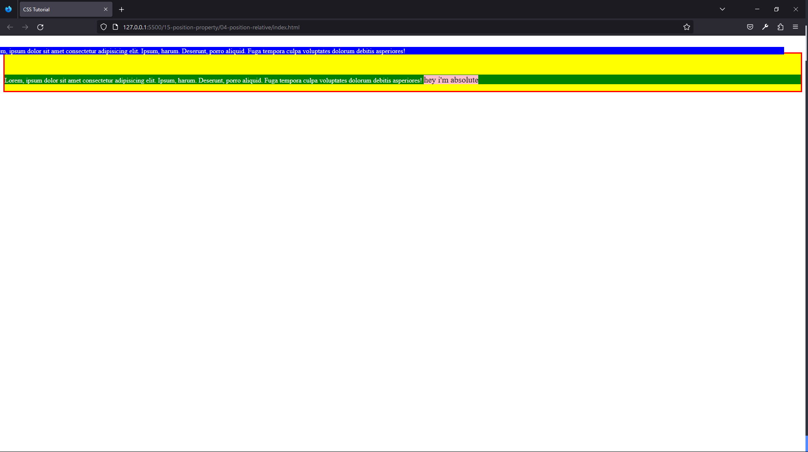

| Technology    | Description     |
| ------------- | --------------- |
| `Language`    | html, css, js   |
| `Framework`   | -               |
| `Library`     | -               |
| `Text editor` | Vs code         |
| `Browser`     | Chrome, firefox |

---

- In index.html

```html
<!DOCTYPE html>
<html lang="en">
  <head>
    <meta charset="UTF-8" />
    <meta name="viewport" content="width=device-width, initial-scale=1.0" />
    <meta http-equiv="X-UA-Compatible" content="ie=edge" />
    <title>CSS Tutorial</title>

    <!-- styles -->
    <link rel="stylesheet" href="./styles.css" />
  </head>
  <body>
    <div>
      <p class="one">
        Lorem, ipsum dolor sit amet consectetur adipisicing elit. Ipsum, harum.
        Deserunt, porro aliquid. Fuga tempora culpa voluptates dolorum debitis
        asperiores!
      </p>
      <p class="two">
        Lorem, ipsum dolor sit amet consectetur adipisicing elit. Ipsum, harum.
        Deserunt, porro aliquid. Fuga tempora culpa voluptates dolorum debitis
        asperiores!
        <span class="special">hey i'm absolute</span>
      </p>
    </div>
  </body>
</html>
```

---

- In styles.css

```css
/* 
position:static - default, always positioned according to the normal flow,
position:relative - position relative to it's normal position.
top⬇️, bottom⬆️, left➡️, right⬅️ from container
*/
div {
  border: 3px solid red;
  background: yellow;
  margin-top: 40px;
}
.one {
  background: blue;
  color: white;

  /* How to set relative position */
  position: relative;
  /* top: 200px; */
  bottom: 2rem;
  /* left: 20%; */
  right: 40px;
}
.two {
  background: green;
  color: white;
}
.special {
  background: pink;
  font-size: 20px;
  color: #222;
}
```

<br>

### 156. Position Absolute<a id="156"></a>

> **_Business Objective: Layout_**

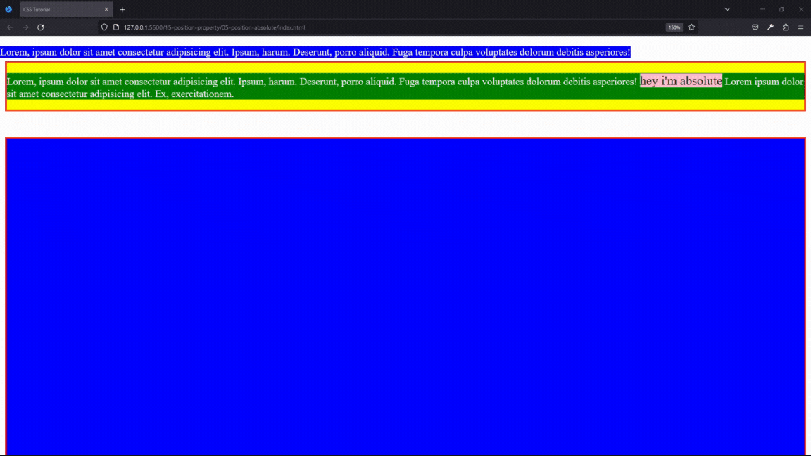

| Technology    | Description     |
| ------------- | --------------- |
| `Language`    | html, css, js   |
| `Framework`   | -               |
| `Library`     | -               |
| `Text editor` | Vs code         |
| `Browser`     | Chrome, firefox |

---

- In index.html

```html
<!DOCTYPE html>
<html lang="en">
  <head>
    <meta charset="UTF-8" />
    <meta name="viewport" content="width=device-width, initial-scale=1.0" />
    <meta http-equiv="X-UA-Compatible" content="ie=edge" />
    <title>CSS Tutorial</title>

    <!-- styles -->
    <link rel="stylesheet" href="./styles.css" />
  </head>
  <body>
    <div>
      <p class="one">
        Lorem, ipsum dolor sit amet consectetur adipisicing elit. Ipsum, harum.
        Deserunt, porro aliquid. Fuga tempora culpa voluptates dolorum debitis
        asperiores!
      </p>
      <p class="two">
        Lorem, ipsum dolor sit amet consectetur adipisicing elit. Ipsum, harum.
        Deserunt, porro aliquid. Fuga tempora culpa voluptates dolorum debitis
        asperiores!
        <span class="special">hey i'm absolute</span> Lorem ipsum dolor sit amet
        consectetur adipisicing elit. Ex, exercitationem.
      </p>
    </div>
    <div class="container"></div>
  </body>
</html>
```

---

- In styles.css

```css
/* 
position:static - default, always positioned according to the normal flow,
position:relative - position relative to it's normal position.
top⬇️, bottom⬆️, left➡️, right⬅️ from container
*/
div {
  border: 3px solid red;
  background: yellow;
  margin-top: 40px;
}
.one {
  background: blue;
  color: white;

  /* How to set relative position */
  position: relative;
  /* top: 200px; */
  bottom: 2rem;
  /* left: 20%; */
  right: 40px;
}
.two {
  background: green;
  color: white;
}
.special {
  background: pink;
  font-size: 20px;
  color: #222;
}
```

<br>

### 157. Position Fixed<a id="157"></a>

> **_Business Objective: Layout_**

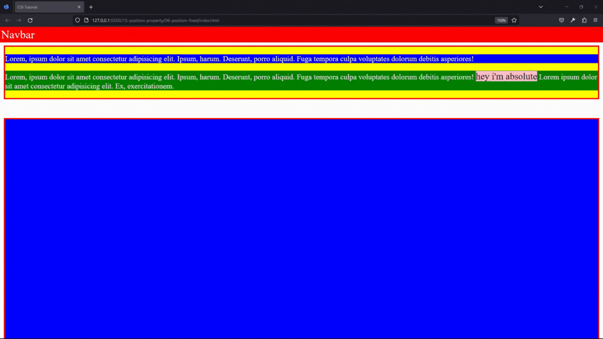

| Technology    | Description     |
| ------------- | --------------- |
| `Language`    | html, css, js   |
| `Framework`   | -               |
| `Library`     | -               |
| `Text editor` | Vs code         |
| `Browser`     | Chrome, firefox |

---

- In index.html

```html
<!DOCTYPE html>
<html lang="en">
  <head>
    <meta charset="UTF-8" />
    <meta name="viewport" content="width=device-width, initial-scale=1.0" />
    <meta http-equiv="X-UA-Compatible" content="ie=edge" />
    <title>CSS Tutorial</title>

    <!-- styles -->
    <link rel="stylesheet" href="./styles.css" />
  </head>
  <body>
    <div class="nav">navbar</div>
    <div>
      <p class="one">
        Lorem, ipsum dolor sit amet consectetur adipisicing elit. Ipsum, harum.
        Deserunt, porro aliquid. Fuga tempora culpa voluptates dolorum debitis
        asperiores!
      </p>
      <p class="two">
        Lorem, ipsum dolor sit amet consectetur adipisicing elit. Ipsum, harum.
        Deserunt, porro aliquid. Fuga tempora culpa voluptates dolorum debitis
        asperiores!
        <span class="special">hey i'm absolute</span> Lorem ipsum dolor sit amet
        consectetur adipisicing elit. Ex, exercitationem.
      </p>
    </div>
    <div class="container"></div>
  </body>
</html>
```

---

- In styles.css

```css
/* 
position:absolute - relative to the parent with position:relative.
postion:fixed - relative to viewport(screen),stays as we are scrolling 
will use other content to fill out the space
*/
.nav {
  background: red;
  color: white;
  font-size: 1.5rem;
  text-transform: capitalize;
  position: fixed;
  margin-top: 0;
  top: 0;
  left: 0;
  width: 100%;
}
div {
  border: 3px solid red;
  background: yellow;
  margin-top: 40px;
}
.one {
  background: blue;
  color: white;
}
.two {
  background: green;
  color: white;
}
.special {
  background: pink;
  font-size: 20px;
  color: #222;
}
.container {
  min-height: 100vh;
  background: blue;
}
```

<br>

### 158. position:sticky<a id="158"></a>

> **_Business Objective: Layout_**

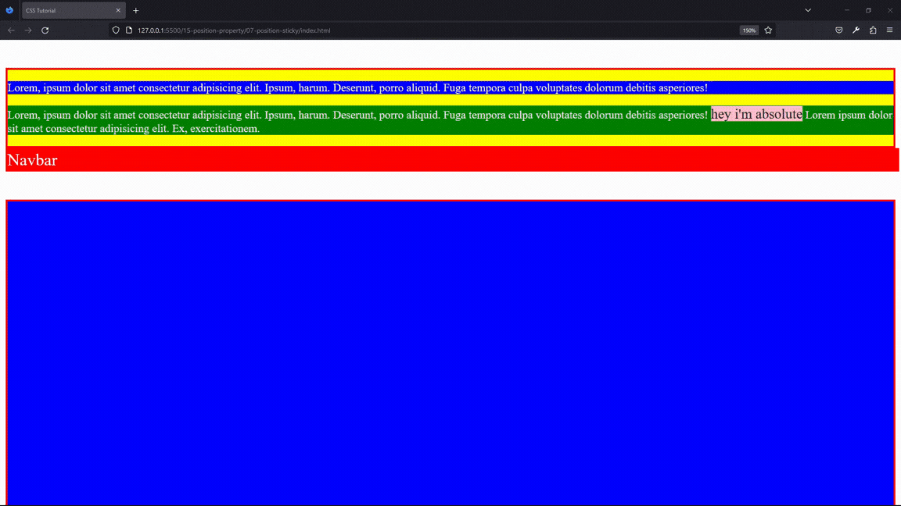

| Technology    | Description     |
| ------------- | --------------- |
| `Language`    | html, css, js   |
| `Framework`   | -               |
| `Library`     | -               |
| `Text editor` | Vs code         |
| `Browser`     | Chrome, firefox |

---

- In index.html

```html
<!DOCTYPE html>
<html lang="en">
  <head>
    <meta charset="UTF-8" />
    <meta name="viewport" content="width=device-width, initial-scale=1.0" />
    <meta http-equiv="X-UA-Compatible" content="ie=edge" />
    <title>CSS Tutorial</title>

    <!-- styles -->
    <link rel="stylesheet" href="./styles.css" />
  </head>
  <body>
    <div>
      <p class="one">
        Lorem, ipsum dolor sit amet consectetur adipisicing elit. Ipsum, harum.
        Deserunt, porro aliquid. Fuga tempora culpa voluptates dolorum debitis
        asperiores!
      </p>
      <p class="two">
        Lorem, ipsum dolor sit amet consectetur adipisicing elit. Ipsum, harum.
        Deserunt, porro aliquid. Fuga tempora culpa voluptates dolorum debitis
        asperiores!
        <span class="special">hey i'm absolute</span> Lorem ipsum dolor sit amet
        consectetur adipisicing elit. Ex, exercitationem.
      </p>
    </div>
    <div class="nav">navbar</div>
    <div class="container"></div>
  </body>
</html>
```

---

- In styles.css

```css
/* 
position:sticky - toggles between relative and fixed
once the position is met in the viewport - then it sticks 
one of the values top,left,bottom,right
*/
.nav {
  background: red;
  color: white;
  font-size: 1.5rem;
  text-transform: capitalize;
  position: sticky;
  margin-top: 0;
  top: 0;

  width: 100%;
}
div {
  border: 3px solid red;
  background: yellow;
  margin-top: 40px;
}
.one {
  background: blue;
  color: white;
}
.two {
  background: green;
  color: white;
}
.special {
  background: pink;
  font-size: 20px;
  color: #222;
}
.container {
  min-height: 300vh;
  background: blue;
}
```

<br>

### 159. Media Queries<a id="159"></a>

> **_Business Objective: Layout_**

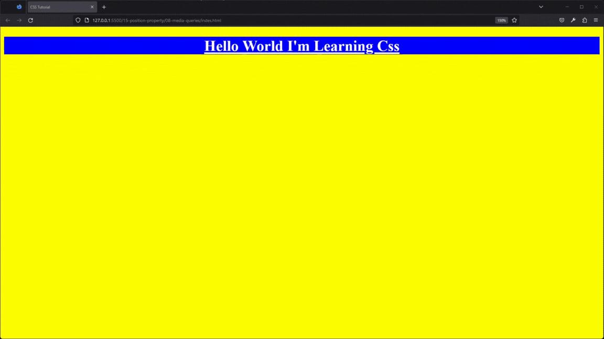

| Technology    | Description     |
| ------------- | --------------- |
| `Language`    | html, css, js   |
| `Framework`   | -               |
| `Library`     | -               |
| `Text editor` | Vs code         |
| `Browser`     | Chrome, firefox |

---

- In index.html

```html
<!DOCTYPE html>
<html lang="en">
  <head>
    <meta charset="UTF-8" />
    <meta name="viewport" content="width=device-width, initial-scale=1.0" />
    <meta http-equiv="X-UA-Compatible" content="ie=edge" />
    <title>CSS Tutorial</title>

    <!-- styles -->
    <link rel="stylesheet" href="./styles.css" />
  </head>
  <body>
    <div class="banner">
      <h1>hello world i'm learning css</h1>
    </div>
  </body>
</html>
```

---

- In styles.css

```css
/* 
Media Queries
Responsive Design
Style Elements on Different Screen Sizes
min-width: --- starting from screen size
max-width: --- up to
Mobile First
*/

body {
  background: yellow;
}
.banner {
  background: blue;
}
h1 {
  color: white;
  text-align: center;
  text-decoration: underline;
  text-transform: capitalize;
}

@media screen and (max-width: 576px) {
  body {
    background: red;
  }
  .banner {
    background: yellow;
  }
  h1 {
    color: black;
    font-size: 60px;
  }
}
@media screen and (max-width: 768px) {
  body {
    background: green;
  }
  .banner {
    margin-top: 60px;
    background: pink;
  }
}
```

<br>

### 160. Z-index<a id="160"></a>

> **_Business Objective: Layout_**

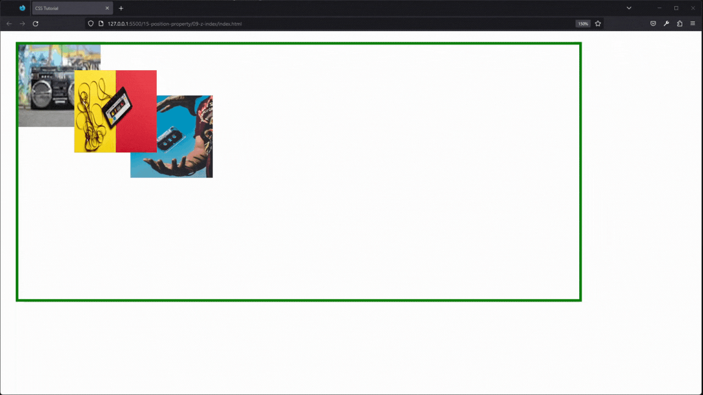

| Technology    | Description     |
| ------------- | --------------- |
| `Language`    | html, css, js   |
| `Framework`   | -               |
| `Library`     | -               |
| `Text editor` | Vs code         |
| `Browser`     | Chrome, firefox |

---

- In index.html

```html
<!DOCTYPE html>
<html lang="en">
  <head>
    <meta charset="UTF-8" />
    <meta name="viewport" content="width=device-width, initial-scale=1.0" />
    <meta http-equiv="X-UA-Compatible" content="ie=edge" />
    <title>CSS Tutorial</title>

    <!-- styles -->
    <link rel="stylesheet" href="./styles.css" />
  </head>
  <body>
    <div class="banner">
      
      
      
    </div>
  </body>
</html>
```

---

- In styles.css

```css
/* 
z-index --- z-axis
0 - default
does not work on position:static;
*/

img {
  width: 150px;
  height: 150px;
  position: absolute;
}
.banner {
  margin: 20px;
  width: 80vw;
  height: 70vh;
  border: 5px solid green;
  position: relative;
}
.one {
  top: 0;
  left: 0;
  z-index: -3;
}
.two {
  top: 10%;
  left: 10%;
  z-index: 2;
}
.three {
  top: 20%;
  left: 20%;
  z-index: 1;
}
```

<br>

### 161. ::before and ::after Basics<a id="161"></a>

> **_Business Objective: Layout_**

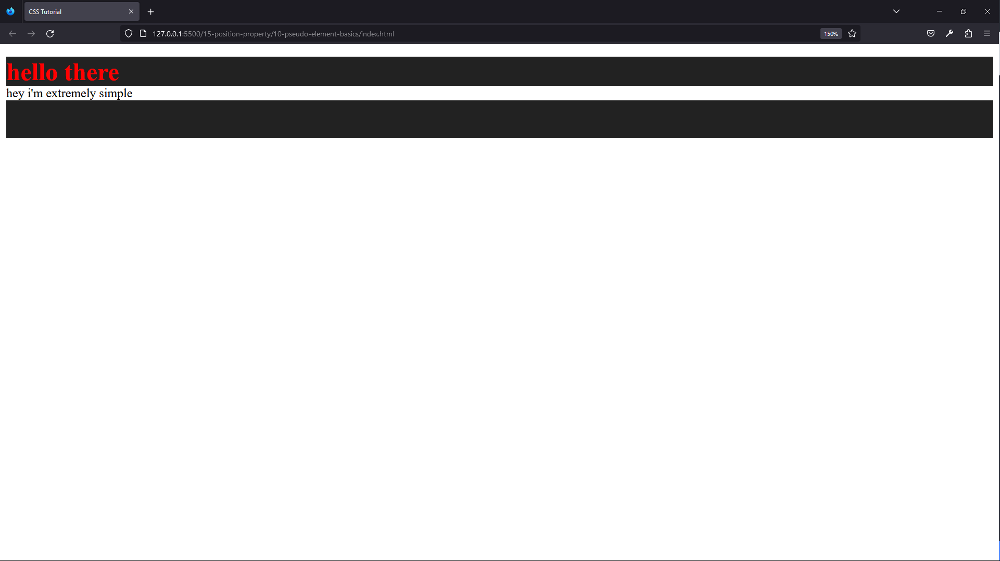

| Technology    | Description     |
| ------------- | --------------- |
| `Language`    | html, css, js   |
| `Framework`   | -               |
| `Library`     | -               |
| `Text editor` | Vs code         |
| `Browser`     | Chrome, firefox |

---

- In index.html

```html
<!DOCTYPE html>
<html lang="en">
  <head>
    <meta charset="UTF-8" />
    <meta name="viewport" content="width=device-width, initial-scale=1.0" />
    <meta http-equiv="X-UA-Compatible" content="ie=edge" />
    <title>CSS Tutorial</title>

    <!-- styles -->
    <link rel="stylesheet" href="./styles.css" />
  </head>
  <body>
    <p>hey i'm extremely simple</p>
  </body>
</html>
```

---

- In styles.css

```css
/* 
::before ::after pseudo-elements creates element and inserts before and after CONTENT
content:'' - required
img --- does not work
*/

p::before {
  content: "hello there";
  display: block;
  background: #222;
  font-weight: bold;
  font-size: 2rem;
  color: red;
}
p::after {
  content: "";
  width: 100%;
  height: 3rem;
  display: block;
  background: #222;
  font-weight: bold;
  font-size: 1rem;
  color: red;
}
```

<br>

### 162. ::before and ::after Example<a id="162"></a>

> **_Business Objective: Layout_**

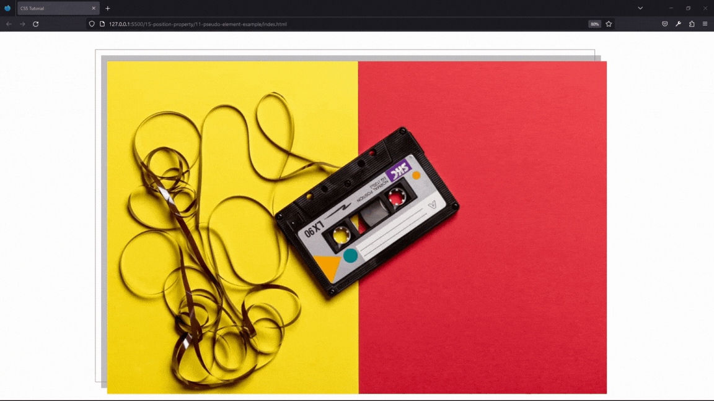

| Technology    | Description     |
| ------------- | --------------- |
| `Language`    | html, css, js   |
| `Framework`   | -               |
| `Library`     | -               |
| `Text editor` | Vs code         |
| `Browser`     | Chrome, firefox |

---

- In index.html

```html
<!DOCTYPE html>
<html lang="en">
  <head>
    <meta charset="UTF-8" />
    <meta name="viewport" content="width=device-width, initial-scale=1.0" />
    <meta http-equiv="X-UA-Compatible" content="ie=edge" />
    <title>CSS Tutorial</title>

    <!-- styles -->
    <link rel="stylesheet" href="./styles.css" />
  </head>
  <body>
    <div>
      
    </div>
  </body>
</html>
```

---

- In styles.css

```css
/* 
::before ::after pseudo-elements creates element and inserts before and after CONTENT
content:'' - required
img --- does not work
*/
div {
  width: 70vw;
  margin: 100px auto;
  position: relative;
}
img {
  width: 100%;
  display: block;
}
div::before {
  content: "";
  border: 2px solid grey;
  width: 100%;
  height: 100%;
  position: absolute;
  box-sizing: border-box;
  top: -40px;
  left: -40px;
  z-index: -2;
  transition: all 0.5s linear;
}
div::after {
  content: "";
  background: rgba(128, 128, 128, 0.5);
  /* background: grey; */
  width: 100%;
  height: 100%;
  position: absolute;
  box-sizing: border-box;
  top: -20px;
  left: -20px;
  z-index: -1;
  transition: all 0.5s linear;
}
div:hover::after,
div:hover::before {
  top: 0;
  left: 0;
}
```

<br>

### 163. Inset Property<a id="163"></a>

> **_Business Objective: Layout_**

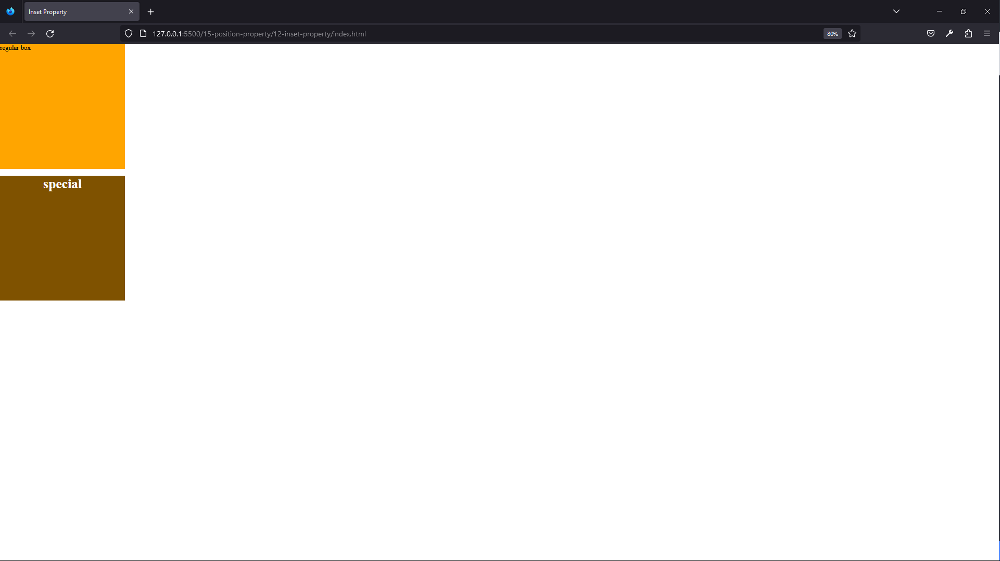

| Technology    | Description     |
| ------------- | --------------- |
| `Language`    | html, css, js   |
| `Framework`   | -               |
| `Library`     | -               |
| `Text editor` | Vs code         |
| `Browser`     | Chrome, firefox |

---

- In index.html

```html
<!DOCTYPE html>
<html lang="en">
  <head>
    <meta charset="UTF-8" />
    <meta name="viewport" content="width=device-width, initial-scale=1.0" />
    <meta http-equiv="X-UA-Compatible" content="ie=edge" />
    <title>Inset Property</title>

    <!-- styles -->
    <link rel="stylesheet" href="./styles.css" />
  </head>
  <body>
    <div class="box">regular box</div>
    <div class="box special">
      <h1>special</h1>
    </div>
  </body>
</html>
```

---

- In styles.css

```css
/* The inset CSS property is a shorthand 
that corresponds to the top, right, bottom,left properties. 
*/

* {
  margin: 0;
}

.box {
  width: 300px;
  height: 300px;
  background: orange;
  margin-bottom: 1rem;
}

.special {
  position: relative;
}

.special h1 {
  position: absolute;
  /* top: 0;
  left: 0;
  right: 0;
  bottom: 0; */
  inset: 0;
  background: rgba(0, 0, 0, 0.5);
  text-align: center;
  color: #fff;
}
```

<br>
