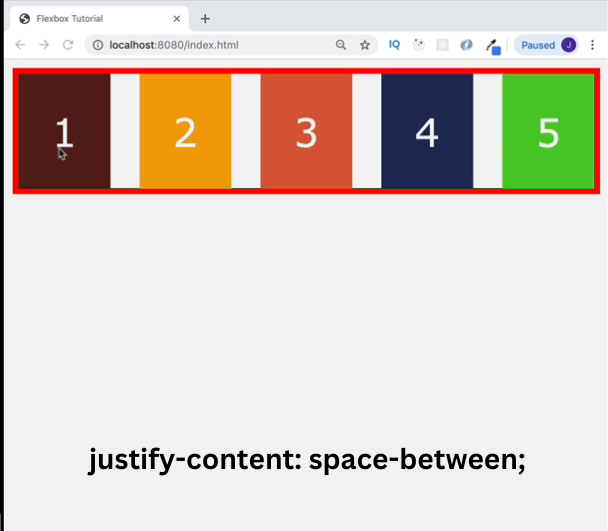
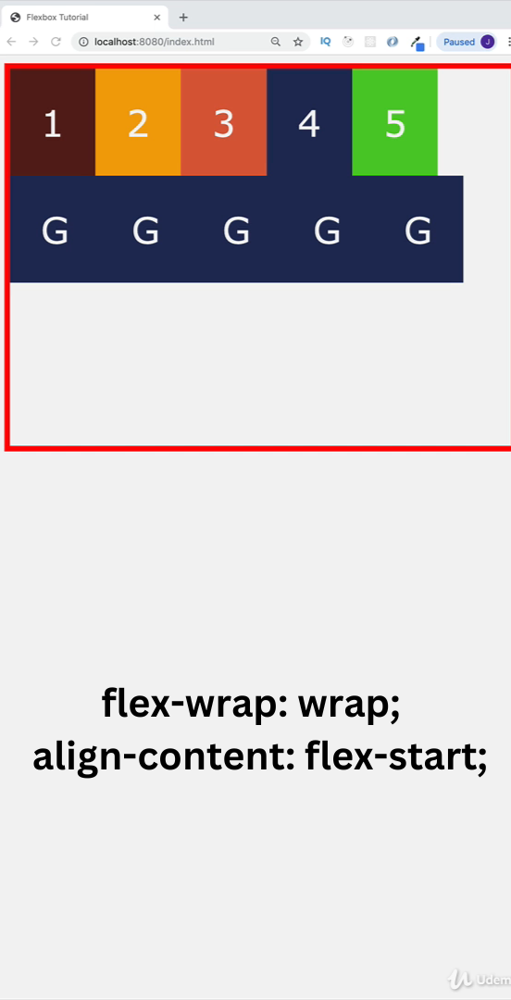
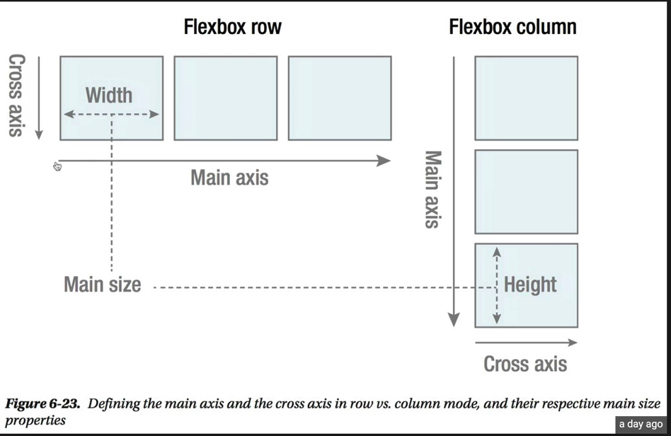

| property                        | property                              |
| ------------------------------- | ------------------------------------- |
| 256. [CSS Flexbox Intro](#256)  | 264. [align-content](#264)            |
| 257. [Setup](#257)              | 265. [Main Axis / Cross Axis](#265)   |
| 258. [Naming Conventions](#258) | 266. [order property](#266)           |
| 259. [flex-direction](#259)     | 267. [align-self](#267)               |
| 260. [flex-wrap](#260)          | 268. [flex-grow](#268)                |
| 261. [justify-content](#261)    | 269. [flex-shrink](#269)              |
| 262. [align-items](#262)        | 270. [flex-basis and flex](#270)      |
| 263. [Hero Project](#263)       | 271. [NEW FLEXBOX FEATURES !!!](#271) |

---

<br>

### 256. CSS Flexbox Intro<a id="256"></a>

> **_Business Objective: Layout_**


---

flexible box

<br>

### 257. Setup<a id="257"></a>

> **_Business Objective: Layout_**


---

In index.html

```html
<!DOCTYPE html>
<html lang="en">
  <head>
    <meta charset="UTF-8" />
    <meta name="viewport" content="width=device-width, initial-scale=1.0" />
    <meta http-equiv="X-UA-Compatible" content="ie=edge" />
    <title>Flex box Tutorial</title>
    <link rel="stylesheet" href="styles.css" />

    <style></style>
  </head>
  <body>
    <!-- flex box sandbox setup -->
    <div class="container">
      <!-- general style-box & specific style-box-1 -->
      <!-- (.box.box-${$})*5 -->
      <div class="box box-1">1</div>
      <div class="box box-2">2</div>
      <div class="box box-3">3</div>
      <div class="box box-4">4</div>
      <div class="box box-5">5</div>
    </div>
  </body>
</html>
```

---

In styles.css

```css
body {
  font-family: Verdana, Geneva, Tahoma, sans-serif;
  background: #f3f3f3;
}

/* To see how flexbox property and children boxes are behaving */
.container {
  border: 5px solid red;
}

/*1. General style setup for all box */
.box {
  padding: 30px;
  text-align: center;
  font-size: 35px;
  color: #f3f3f3;
}

/*2. specific style setup for every single box  */
.box-1 {
  background: #581f18;
}
.box-2 {
  background: #f0a202;
}
.box-3 {
  background: #d95d39;
}
.box-4 {
  background: #202c59;
}
.box-5 {
  background: #51cb20;
}
```

<br>

### 258. Naming Conventions<a id="258"></a>

> **_Business Objective: Layout_**

- Inline block element


<br>

- Block level element


---

In index.html

```html
<!DOCTYPE html>
<html lang="en">
  <head>
    <meta charset="UTF-8" />
    <meta name="viewport" content="width=device-width, initial-scale=1.0" />
    <meta http-equiv="X-UA-Compatible" content="ie=edge" />
    <title>Flexbox Tutorial</title>
    <link rel="stylesheet" href="styles.css" />
    <style>
      /* 📦 Container/Parent property first*/
      .container {
        display: flex;
        /* display: inline-flex; */
      }
    </style>
  </head>
  <body>
    <!--parent = flex-container  -->
    <div class="container">
      <!-- children = flex-items -->
      <div class="box box-1">1</div>
      <div class="box box-2">2</div>
      <div class="box box-3">3</div>
      <div class="box box-4">4</div>
      <div class="box box-5">5</div>
    </div>
  </body>
</html>
```

---

In styles.css

```css
body {
  font-family: Verdana, Geneva, Tahoma, sans-serif;
  background: #f3f3f3;
}
.container {
  border: 5px solid red;
}
.box {
  padding: 30px;
  text-align: center;
  font-size: 35px;
  color: #f3f3f3;
}
.box-1 {
  background: #581f18;
}
.box-2 {
  background: #f0a202;
}
.box-3 {
  background: #d95d39;
}
.box-4 {
  background: #202c59;
}
.box-5 {
  background: #51cb20;
}
```

<br>

### 259. flex-direction<a id="259"></a>

> **_Business Objective: Layout_**


<br>


<br>


<br>


---

In index.html

```html
<!DOCTYPE html>
<html lang="en">
  <head>
    <meta charset="UTF-8" />
    <meta name="viewport" content="width=device-width, initial-scale=1.0" />
    <meta http-equiv="X-UA-Compatible" content="ie=edge" />
    <title>Flexbox Tutorial</title>
    <link rel="stylesheet" href="styles.css" />

    <style>
      /* 📦 Container/Parent property first*/
      /* Property- flex direction */
      /* Value- row (default) row-reverse column column reverse */
      .container {
        display: flex;

        flex-direction: row;
        /* flex-direction: row-reverse; */
        /* flex-direction: column; */
        /* flex-direction: column-reverse; */
      }
    </style>
  </head>
  <body>
    <!--parent = flex-container  -->
    <div class="container">
      <!-- children = flex-items -->
      <div class="box box-1">1</div>
      <div class="box box-2">2</div>
      <div class="box box-3">3</div>
      <div class="box box-4">4</div>
      <div class="box box-5">5</div>
    </div>
  </body>
</html>
```

---

In styles.css

```css
body {
  font-family: Verdana, Geneva, Tahoma, sans-serif;
  background: #f3f3f3;
}
.container {
  border: 5px solid red;
}
.box {
  padding: 30px;
  text-align: center;
  font-size: 35px;
  color: #f3f3f3;
}
.box-1 {
  background: #581f18;
}
.box-2 {
  background: #f0a202;
}
.box-3 {
  background: #d95d39;
}
.box-4 {
  background: #202c59;
}
.box-5 {
  background: #51cb20;
}
```

<br>

### 260. flex-wrap<a id="260"></a>

> **_Business Objective: Layout_**

- content overflow


<br>

- content start takes new line


<br>


<br>

---

In index.html

```html
<!DOCTYPE html>
<html lang="en">
  <head>
    <meta charset="UTF-8" />
    <meta name="viewport" content="width=device-width, initial-scale=1.0" />
    <meta http-equiv="X-UA-Compatible" content="ie=edge" />
    <title>Flexbox Tutorial</title>
    <link rel="stylesheet" href="styles.css" />

    <style>
      /* 📦 Container/Parent property first*/
      /* Property- flex-wrap */
      /* Value- nowrap(default) wrap wrap-reverse */

      .container {
        display: flex;
        /* flex-direction: row ===  default*/

        /* container overflow with item */
        /* flex-wrap: nowrap; */
        flex-wrap: wrap;
        /* flex-wrap: wrap-reverse; */
      }
    </style>
  </head>
  <body>
    <!--parent = flex-container  -->
    <div class="container">
      <!-- children = flex-items -->
      <div class="box box-1">1</div>
      <div class="box box-2">2</div>
      <div class="box box-3">3</div>
      <div class="box box-4">4</div>
      <div class="box box-5">5</div>
      <div class="box generic">G</div>
      <div class="box generic">G</div>
      <div class="box generic">G</div>
      <div class="box generic">G</div>
      <div class="box generic">G</div>
    </div>
  </body>
</html>
```

---

In styles.css

```css
body {
  font-family: Verdana, Geneva, Tahoma, sans-serif;
  background: #f3f3f3;
}
.container {
  border: 5px solid red;
}
.box {
  padding: 30px;
  text-align: center;
  font-size: 35px;
  color: #f3f3f3;
}
.box-1 {
  background: #581f18;
}
.box-2 {
  background: #f0a202;
}
.box-3 {
  background: #d95d39;
}
.box-4 {
  background: #202c59;
}
.box-5 {
  background: #51cb20;
}
.generic {
  background: #202c59;
}
```

<br>

### 261. justify-content<a id="261"></a>

> **_Business Objective: Layout_**


<br>


<br>



<br>


<br>


<br>


## <br>

In index.html

```html
<!DOCTYPE html>
<html lang="en">
  <head>
    <meta charset="UTF-8" />
    <meta name="viewport" content="width=device-width, initial-scale=1.0" />
    <meta http-equiv="X-UA-Compatible" content="ie=edge" />
    <title>Flexbox Tutorial</title>
    <link rel="stylesheet" href="styles.css" />
    <style>
      /* 📦 Container/Parent property first*/
      /* Property- justify-content; horizontal alignment*/
      /* Value- flex-start(default), flex-end, center  */

      /* evenly distributed flex item*/
      /* Value- space-between; first item start last end   */
      /* Value- space-around; side margins  */
      /* Value- space-evenly; even margins  */
      .container {
        display: flex;
        flex-wrap: wrap;
        justify-content: flex-start;
        justify-content: flex-end;
        justify-content: space-between;
        justify-content: space-around;
        justify-content: space-evenly;
        justify-content: center;
      }
    </style>
  </head>
  <body>
    <!--parent = flex-container  -->
    <div class="container">
      <!-- children = flex-items -->
      <div class="box box-1">1</div>
      <div class="box box-2">2</div>
      <div class="box box-3">3</div>
      <div class="box box-4">4</div>
      <div class="box box-5">5</div>
      <!-- <div class="box generic">G</div>
      <div class="box generic">G</div>
      <div class="box generic">G</div>
      <div class="box generic">G</div>
      <div class="box generic">G</div> -->
    </div>
  </body>
</html>
```

---

In styles.css

```css
body {
  font-family: Verdana, Geneva, Tahoma, sans-serif;
  background: #f3f3f3;
}
.container {
  border: 5px solid red;
}
.box {
  padding: 30px;
  text-align: center;
  font-size: 35px;
  color: #f3f3f3;
}
.box-1 {
  background: #581f18;
}
.box-2 {
  background: #f0a202;
}
.box-3 {
  background: #d95d39;
}
.box-4 {
  background: #202c59;
}
.box-5 {
  background: #51cb20;
}
.generic {
  background: #202c59;
}
```

<br>

### 262. align-items<a id="262"></a>

> **_Business Objective: Layout_**


<br>


<br>


<br>


<br>


<br>

In index.html

```html
<!DOCTYPE html>
<html lang="en">
  <head>
    <meta charset="UTF-8" />
    <meta name="viewport" content="width=device-width, initial-scale=1.0" />
    <meta http-equiv="X-UA-Compatible" content="ie=edge" />
    <title>Flexbox Tutorial</title>
    <link rel="stylesheet" href="styles.css" />

    <style>
      /* 📦 Container/Parent property first*/
      /* Property- align-items; vertical alignment*/
      /* Value- stretch (default), flex-start, flex-end, center, baseline */
      .container {
        height: 300px;
        height: 40vh;
        display: flex;
        align-items: stretch;
        /* align-items: flex-start; */
        /* align-items: flex-end; */
        align-items: center;
        /* align-items: baseline; */
      }
    </style>
  </head>

  <body>
    <!--parent = flex-container  -->
    <div class="container">
      <!-- children = flex-items -->
      <div class="box box-1">1</div>
      <div class="box box-2">2</div>
      <div class="box box-3">3</div>
      <div class="box box-4">4</div>
      <div class="box box-5">5</div>
      <!-- <div class="box generic">G</div>
      <div class="box generic">G</div>
      <div class="box generic">G</div>
      <div class="box generic">G</div>
      <div class="box generic">G</div> -->
    </div>
  </body>
</html>
```

---

In styles.css

```css
body {
  font-family: Verdana, Geneva, Tahoma, sans-serif;
  background: #f3f3f3;
}
.container {
  border: 5px solid red;
}
.box {
  padding: 30px;
  text-align: center;
  font-size: 35px;
  color: #f3f3f3;
}
.box-1 {
  background: #581f18;
  font-size: 65px;
}
.box-2 {
  background: #f0a202;
}
.box-3 {
  background: #d95d39;
}
.box-4 {
  background: #202c59;
}
.box-5 {
  background: #51cb20;
}
.generic {
  background: #202c59;
}
```

- NOTE: We have provided **HEIGHT** to parent container, so we can set property

<br>

### 263. Hero Project<a id="263"></a>

> **_Business Objective: Layout_**


---

- Download any image from internet and save it in 06-hero-example

In index.html

```html
<!DOCTYPE html>
<html lang="en">
  <head>
    <meta charset="UTF-8" />
    <meta name="viewport" content="width=device-width, initial-scale=1.0" />
    <meta http-equiv="X-UA-Compatible" content="ie=edge" />
    <title>Flexbox Tutorial</title>
    <link rel="stylesheet" href="styles.css" />
    <style>
      /* 📦 Container/Parent property first*/
      .container {
        height: 300px;
        height: 40vh;
        display: flex;
      }
    </style>
  </head>
  <body>
    <!--parent = flex-container  -->
    <div class="container">
      <!-- children = flex-items -->
      <div class="box box-1">1</div>
      <div class="box box-2">2</div>
      <div class="box box-3">3</div>
      <div class="box box-4">4</div>
      <div class="box box-5">5</div>
      <!-- <div class="box generic">G</div>
      <div class="box generic">G</div>
      <div class="box generic">G</div>
      <div class="box generic">G</div>
      <div class="box generic">G</div> -->
    </div>
    <a href="banner.html">banner html</a>
  </body>
</html>
```

---

In banner.html

```html
<!DOCTYPE html>
<html lang="en">
  <head>
    <meta charset="UTF-8" />
    <meta name="viewport" content="width=device-width, initial-scale=1.0" />
    <meta http-equiv="X-UA-Compatible" content="ie=edge" />
    <title>Banner Example</title>
    <style>
      /* reset window margin */
      * {
        margin: 0;
      }

      .hero {
        /* height for all device */
        min-height: 100vh;
        background: url("hero-bcg.jpeg");
        background-position: center;
        background-size: cover;
        background-repeat: no-repeat;
        /* To get parallax effect */
        background-attachment: fixed;

        display: flex;
        /* horizontal alignment, X */
        justify-content: center;
        /* vertical alignment, Y */
        align-items: center;
      }

      h1 {
        text-transform: uppercase;
        font-size: 60px;
        color: red;
      }

      .banner {
        min-height: 100vh;
        background: blue;
      }
    </style>
  </head>
  <body>
    <!-- hero is the Parent container -->
    <header class="hero">
      <h1>page title</h1>
    </header>

    <div class="banner"></div>

    <a href="index.html">back home</a>
  </body>
</html>
```

---

In styles.css

```css
body {
  font-family: Verdana, Geneva, Tahoma, sans-serif;
  background: #f3f3f3;
}
.container {
  border: 5px solid red;
}
.box {
  padding: 30px;
  text-align: center;
  font-size: 35px;
  color: #f3f3f3;
}
.box-1 {
  background: #581f18;
  font-size: 65px;
}
.box-2 {
  background: #f0a202;
}
.box-3 {
  background: #d95d39;
}
.box-4 {
  background: #202c59;
}
.box-5 {
  background: #51cb20;
}
.generic {
  background: #202c59;
}
```

<br>

### 264. align-content<a id="264"></a>

> **_Business Objective: Layout_**


<br>



<br>


## <br>


## <br>


## <br>


## <br>

In index.html

```html
<!DOCTYPE html>
<html lang="en">
  <head>
    <meta charset="UTF-8" />
    <meta name="viewport" content="width=device-width, initial-scale=1.0" />
    <meta http-equiv="X-UA-Compatible" content="ie=edge" />
    <title>Flexbox Tutorial</title>
    <link rel="stylesheet" href="styles.css" />
    <!-- align-content -->
    <!-- stretch(default) flex-end flex-start space-around space-between center  -->
    <style>
      /* 📦 Container/Parent property first*/
      .container {
        height: 300px;
        height: 50vh;
        display: flex;
        flex-wrap: wrap;
        align-content: stretch;
        align-content: flex-end;
        align-content: flex-start;
        align-content: center;
        align-content: space-around;
        align-content: space-between;
      }
    </style>
  </head>
  <body>
    <!--parent = flex-container  -->
    <div class="container">
      <!-- children = flex-items -->
      <div class="box box-1">1</div>
      <div class="box box-2">2</div>
      <div class="box box-3">3</div>
      <div class="box box-4">4</div>
      <div class="box box-5">5</div>
      <div class="box generic">G</div>
      <div class="box generic">G</div>
      <div class="box generic">G</div>
      <div class="box generic">G</div>
      <div class="box generic">G</div>
    </div>
  </body>
</html>
```

---

In styles.css

```css
body {
  font-family: Verdana, Geneva, Tahoma, sans-serif;
  background: #f3f3f3;
}
.container {
  border: 5px solid red;
}
.box {
  padding: 30px;
  text-align: center;
  font-size: 35px;
  color: #f3f3f3;
}
.box-1 {
  background: #581f18;
}
.box-2 {
  background: #f0a202;
}
.box-3 {
  background: #d95d39;
}
.box-4 {
  background: #202c59;
}
.box-5 {
  background: #51cb20;
}
.generic {
  background: #202c59;
}
```

<br>

### 265. Main Axis / Cross Axis<a id="265"></a>

> **_Business Objective: Layout_**



<br>


---

In index.html

```html
<!DOCTYPE html>
<html lang="en">
  <head>
    <meta charset="UTF-8" />
    <meta name="viewport" content="width=device-width, initial-scale=1.0" />
    <meta http-equiv="X-UA-Compatible" content="ie=edge" />
    <title>Flexbox Tutorial</title>
    <link rel="stylesheet" href="styles.css" />
    <!-- MAIN AXIS / CROSS AXIS -->

    <style>
      /* 📦 Container/Parent property first*/
      .container {
        height: 300px;
        height: 50vh;
        display: flex;
        justify-content: center;
        align-items: center;
      }
      .container-1 {
        height: 800px;
        border: 5px solid blue;
        display: flex;
        flex-direction: column;
        align-items: center;
        justify-content: center;
      }
    </style>
  </head>
  <body>
    <!--parent = flex-container  -->
    <div class="container">
      <!-- children = flex-items -->
      <div class="box box-1">1</div>
      <div class="box box-2">2</div>
      <div class="box box-3">3</div>
      <div class="box box-4">4</div>
      <div class="box box-5">5</div>
      <!-- <div class="box generic">G</div>
      <div class="box generic">G</div>
      <div class="box generic">G</div>
      <div class="box generic">G</div>
      <div class="box generic">G</div> -->
    </div>
    <div class="container-1">
      <div class="box box-1">1</div>
      <div class="box box-2">2</div>
      <div class="box box-3">3</div>
      <div class="box box-4">4</div>
      <div class="box box-5">5</div>
    </div>
  </body>
</html>
```

---

In styles.css

```css
body {
  font-family: Verdana, Geneva, Tahoma, sans-serif;
  background: #f3f3f3;
}
.container {
  border: 5px solid red;
}
.box {
  padding: 30px;
  text-align: center;
  font-size: 35px;
  color: #f3f3f3;
}
.box-1 {
  background: #581f18;
}
.box-2 {
  background: #f0a202;
}
.box-3 {
  background: #d95d39;
}
.box-4 {
  background: #202c59;
}
.box-5 {
  background: #51cb20;
}
.generic {
  background: #202c59;
}
```

<br>

### 266. order property<a id="266"></a>

> **_Business Objective: Layout_**


---

In index.html

```html
<!DOCTYPE html>
<html lang="en">
  <head>
    <meta charset="UTF-8" />
    <meta name="viewport" content="width=device-width, initial-scale=1.0" />
    <meta http-equiv="X-UA-Compatible" content="ie=edge" />
    <title>Flexbox Tutorial</title>
    <link rel="stylesheet" href="styles.css" />

    <!-- order ===  all children have order:0 by default-->

    <style>
      .container {
        display: flex;
        flex-direction: column;
      }

      /* target individually */
      .box-1 {
        order: 2;
      }

      .box-2 {
        order: 1;
      }

      .box-5 {
        order: -1;
      }
    </style>
  </head>
  <body>
    <!--parent = flex-container  -->
    <div class="container">
      <!-- children = flex-items -->
      <div class="box box-1">1</div>
      <div class="box box-2">2</div>
      <div class="box box-3">3</div>
      <div class="box box-4">4</div>
      <div class="box box-5">5</div>
      <!-- <div class="box generic">G</div>
      <div class="box generic">G</div>
      <div class="box generic">G</div>
      <div class="box generic">G</div>
      <div class="box generic">G</div> -->
    </div>
  </body>
</html>
```

---

In styles.css

```css
body {
  font-family: Verdana, Geneva, Tahoma, sans-serif;
  background: #f3f3f3;
}
.container {
  border: 5px solid red;
}
.box {
  padding: 30px;
  text-align: center;
  font-size: 35px;
  color: #f3f3f3;
}
.box-1 {
  background: #581f18;
}
.box-2 {
  background: #f0a202;
}
.box-3 {
  background: #d95d39;
}
.box-4 {
  background: #202c59;
}
.box-5 {
  background: #51cb20;
}
.generic {
  background: #202c59;
}
```

<br>

### 267. align-self<a id="267"></a>

> **_Business Objective: Layout_**


---

In index.html

```html
<!DOCTYPE html>
<html lang="en">
  <head>
    <meta charset="UTF-8" />
    <meta name="viewport" content="width=device-width, initial-scale=1.0" />
    <meta http-equiv="X-UA-Compatible" content="ie=edge" />
    <title>Flexbox Tutorial</title>
    <link rel="stylesheet" href="styles.css" />

    <!-- align-self -->

    <style>
      .container {
        display: flex;
        height: 500px;
        align-items: flex-end;
      }

      /* target individually */
      .box-5 {
        align-self: flex-start;
      }
      .box-3 {
        align-self: stretch;
      }
      .box-1 {
        align-self: center;
      }
    </style>
  </head>
  <body>
    <!--parent = flex-container  -->
    <div class="container">
      <!-- children = flex-items -->
      <div class="box box-1">1</div>
      <div class="box box-2">2</div>
      <div class="box box-3">3</div>
      <div class="box box-4">4</div>
      <div class="box box-5">5</div>
      <!-- <div class="box generic">G</div>
      <div class="box generic">G</div>
      <div class="box generic">G</div>
      <div class="box generic">G</div>
      <div class="box generic">G</div> -->
    </div>
  </body>
</html>
```

---

In styles.css

```css
body {
  font-family: Verdana, Geneva, Tahoma, sans-serif;
  background: #f3f3f3;
}
.container {
  border: 5px solid red;
}
.box {
  padding: 30px;
  text-align: center;
  font-size: 35px;
  color: #f3f3f3;
}
.box-1 {
  background: #581f18;
}
.box-2 {
  background: #f0a202;
}
.box-3 {
  background: #d95d39;
}
.box-4 {
  background: #202c59;
}
.box-5 {
  background: #51cb20;
}
.generic {
  background: #202c59;
}
```

<br>

### 268. flex-grow<a id="268"></a>

> **_Business Objective: Layout_**


---

In index.html

```html
<!DOCTYPE html>
<html lang="en">
  <head>
    <meta charset="UTF-8" />
    <meta name="viewport" content="width=device-width, initial-scale=1.0" />
    <meta http-equiv="X-UA-Compatible" content="ie=edge" />
    <title>Flexbox Tutorial</title>
    <link rel="stylesheet" href="styles.css" />

    <!-- flex-grow all children have flex-grow:0 -->

    <style>
      .container {
        display: flex;
      }
      /* for all children */
      /* .box {
        flex-grow: 1;
      } */

      /* target individually */
      .box-1 {
        flex-grow: 2;
      }
      .box-2 {
        flex-grow: 1;
      }
    </style>
  </head>
  <body>
    <!--parent = flex-container  -->
    <div class="container">
      <!-- children = flex-items -->
      <div class="box box-1">1</div>
      <div class="box box-2">2</div>
      <div class="box box-3">3</div>
      <div class="box box-4">4</div>
      <div class="box box-5">5</div>
      <!-- <div class="box generic">G</div>
      <div class="box generic">G</div>
      <div class="box generic">G</div>
      <div class="box generic">G</div>
      <div class="box generic">G</div> -->
    </div>
  </body>
</html>
```

---

In styles.css

```css
body {
  font-family: Verdana, Geneva, Tahoma, sans-serif;
  background: #f3f3f3;
}
.container {
  border: 5px solid red;
}
.box {
  padding: 30px;
  text-align: center;
  font-size: 35px;
  color: #f3f3f3;
}
.box-1 {
  background: #581f18;
}
.box-2 {
  background: #f0a202;
}
.box-3 {
  background: #d95d39;
}
.box-4 {
  background: #202c59;
}
.box-5 {
  background: #51cb20;
}
.generic {
  background: #202c59;
}
```

<br>

### 269. flex-shrink<a id="269"></a>

> **_Business Objective: Layout_**


---

In index.html

```html
<!DOCTYPE html>
<html lang="en">
  <head>
    <meta charset="UTF-8" />
    <meta name="viewport" content="width=device-width, initial-scale=1.0" />
    <meta http-equiv="X-UA-Compatible" content="ie=edge" />
    <title>Flexbox Tutorial</title>
    <link rel="stylesheet" href="styles.css" />

    <!-- flex-shrink all children have flex-shrink:1  -->

    <style>
      .container {
        display: flex;
        flex-wrap: wrap;
      }
      .box-2 {
        width: 300px;
        flex-shrink: 0;
      }
    </style>
  </head>
  <body>
    <!--parent = flex-container  -->
    <div class="container">
      <!-- children = flex-items -->
      <div class="box box-1">1</div>
      <div class="box box-2">2</div>
      <div class="box box-3">3</div>
      <div class="box box-4">4</div>
      <div class="box box-5">5</div>
      <!-- <div class="box generic">G</div>
      <div class="box generic">G</div>
      <div class="box generic">G</div>
      <div class="box generic">G</div>
      <div class="box generic">G</div> -->
    </div>
  </body>
</html>
```

---

In styles.css

```css
body {
  font-family: Verdana, Geneva, Tahoma, sans-serif;
  background: #f3f3f3;
}
.container {
  border: 5px solid red;
}
.box {
  padding: 30px;
  text-align: center;
  font-size: 35px;
  color: #f3f3f3;
}
.box-1 {
  background: #581f18;
}
.box-2 {
  background: #f0a202;
}
.box-3 {
  background: #d95d39;
}
.box-4 {
  background: #202c59;
}
.box-5 {
  background: #51cb20;
}
.generic {
  background: #202c59;
}
```

<br>

### 270. flex-basis and flex<a id="270"></a>

> **_Business Objective: Layout_**


---

In index.html

```html
<!DOCTYPE html>
<html lang="en">
  <head>
    <meta charset="UTF-8" />
    <meta name="viewport" content="width=device-width, initial-scale=1.0" />
    <meta http-equiv="X-UA-Compatible" content="ie=edge" />
    <title>Flexbox Tutorial</title>
    <link rel="stylesheet" href="styles.css" />

    <!-- flex-basis base value and flex shortcut -->

    <style>
      .container {
        display: flex;
        flex-wrap: wrap;
        justify-content: space-around;
      }
      .box {
        flex: 0 0 calc(25% - 1rem);
      }
    </style>
  </head>
  <body>
    <!--parent = flex-container  -->
    <div class="container">
      <!-- children = flex-items -->
      <div class="box box-1">1</div>
      <div class="box box-2">2</div>
      <div class="box box-3">3</div>
      <div class="box box-4">4</div>
      <!-- <div class="box generic">G</div>
      <div class="box generic">G</div>
      <div class="box generic">G</div>
      <div class="box generic">G</div>
      <div class="box generic">G</div> -->
    </div>
  </body>
</html>
```

---

In styles.css

```css
* {
  box-sizing: border-box;
}
body {
  font-family: Verdana, Geneva, Tahoma, sans-serif;
  background: #f3f3f3;
}
.container {
  border: 5px solid red;
}
.box {
  padding: 30px 0;
  text-align: center;
  font-size: 35px;
  color: #f3f3f3;
}
.box-1 {
  background: #581f18;
}
.box-2 {
  background: #f0a202;
}
.box-3 {
  background: #d95d39;
}
.box-4 {
  background: #202c59;
}
.box-5 {
  background: #51cb20;
}
.generic {
  background: #202c59;
}
```

<br>

### 271. NEW FLEXBOX FEATURES !!!<a id="271"></a>

> **_Business Objective: Layout_**


---

In index.html

```html
<!DOCTYPE html>
<html lang="en">
  <head>
    <meta charset="UTF-8" />
    <meta http-equiv="X-UA-Compatible" content="IE=edge" />
    <meta name="viewport" content="width=device-width, initial-scale=1.0" />

    <title>Document</title>

    <!-- normalize css -->
    <link rel="stylesheet" href="./normalize.css" />

    <!-- main css  -->
    <link rel="stylesheet" href="./styles.css" />
  </head>
  <body>
    <nav>
      <h2>logo</h2>
      <ul class="nav-links">
        <li>
          <a href="#home" class="nav-link">home</a>
        </li>
        <li>
          <a href="#about" class="nav-link">about</a>
        </li>
        <li>
          <a href="#contact" class="nav-link">contact</a>
        </li>
      </ul>
    </nav>
    <div class="container">
      <div class="box box-1"></div>
      <div class="box box-2"></div>
      <div class="box box-3"></div>
      <div class="box box-4"></div>
    </div>
  </body>
</html>
```

---

In styles.css

```css
@import url("https://fonts.googleapis.com/css?family=Montserrat:400|Inconsolata:400");
*,
::after,
::before {
  box-sizing: border-box;
}
:root {
  /* COLORS  */
  /* primary */
  --primary-0: #f0efff;
  --primary-50: #d8d6ff;
  --primary-100: #c1beff;
  --primary-200: #aaa5ff;
  --primary-300: #938dff;
  --primary-400: #7b74ff;
  /* main */
  --primary-500: #645cff;
  --primary-600: #554ed9;
  --primary-700: #4640b3;
  --primary-800: #37338c;
  --primary-900: #282566;
  --primary-1000: #191740;
  --primary-1100: #0a0919;
  /* grey */
  --grey-0: #fafbfc;
  --grey-50: #f2f4f8;
  --grey-100: #eaedf3;
  --grey-200: #e2e7ef;
  --grey-300: #dbe0ea;
  --grey-400: #d3dae6;
  --grey-500: #cbd3e1;
  --grey-600: #adb3bf;
  --grey-700: #8e949e;
  --grey-800: #70747c;
  --grey-900: #51545a;
  --grey-1000: #333538;
  --grey-1100: #141516;

  /* rest */
  --black: #222;
  --white: #fff;
  --red-light: #f8d7da;
  --red-dark: #842029;
  --green-light: #d1e7dd;
  --green-dark: #0f5132;

  /* typography */
  --headingFont: "Inconsolata", monospace;
  --bodyFont: "Montserrat", sans-serif;
  --smallText: 0.7em;
  /* rest */
  --backgroundColor: var(--grey-50);
  --textColor: var(--grey-1000);
  --borderRadius: 0.25rem;
  --letterSpacing: 1px;
  --transition: 0.3s ease-in-out all;
  --max-width: 1120px;
  --fixed-width: 600px;
  /* box shadows */
  --shadow-1: 0 1px 3px 0 rgba(0, 0, 0, 0.1), 0 1px 2px 0 rgba(0, 0, 0, 0.06);
  --shadow-2: 0 4px 6px -1px rgba(0, 0, 0, 0.1), 0 2px 4px -1px rgba(0, 0, 0, 0.06);
  --shadow-3: 0 10px 15px -3px rgba(0, 0, 0, 0.1), 0 4px 6px -2px rgba(0, 0, 0, 0.05);
  --shadow-4: 0 20px 25px -5px rgba(0, 0, 0, 0.1), 0 10px 10px -5px rgba(0, 0, 0, 0.04);
}

body {
  background: var(--backgroundColor);
  color: var(--textColor);
  font-family: var(--bodyFont);
  font-weight: 400;
  line-height: 1.75;
}

p {
  margin-bottom: 1.5rem;
  max-width: 40em;
}

h1,
h2,
h3,
h4,
h5 {
  margin: 0;
  margin-bottom: 1.38rem;
  font-family: var(--headingFont);
  font-weight: 400;
  line-height: 1.3;
  text-transform: capitalize;
  letter-spacing: var(--letterSpacing);
}

h1 {
  font-size: 3.052rem;
}

h2 {
  font-size: 2.441rem;
}

h3 {
  font-size: 1.953rem;
}

h4 {
  font-size: 1.563rem;
}

h5 {
  font-size: 1.25rem;
}

small,
.text_small {
  font-size: var(--smallText);
}

ul {
  padding: 0;
  list-style-type: none;
}
a {
  text-decoration: none;
}
/*************
     Buttons 
*************/
button,
.btn {
  cursor: pointer;
  appearance: none;
  color: var(--white);
  background: var(--primary-500);
  border: none;
  border-radius: var(--borderRadius);
  letter-spacing: var(--letterSpacing);
  padding: 0.375rem 0.75rem;
  box-shadow: var(--shadow-1);
  transition: var(--transition);
  text-transform: capitalize;
}
button:hover,
.btn:hover {
  color: var(--white);
  background: var(--primary-700);
  box-shadow: var(--shadow-2);
}
button.small {
  padding: 0.25rem 0.5rem;
  font-size: var(--smallText);
}
button.hipster {
  color: var(--primary-500);
  background: var(--primary-50);
  box-shadow: var(--shadow-1);
}
button.hipster:hover {
  background: var(--primary-100);
  box-shadow: var(--shadow-2);
}
button.block {
  width: 100%;
}
h2 {
  margin-bottom: 0;
  color: var(--primary-500);
  text-transform: uppercase;
}
/************* Nav *************/

nav {
  height: 5rem;
  padding: 0 2rem;
  background: #fff;
  display: flex;
  align-items: center;
  justify-content: space-between;
}
.nav-links {
  display: flex;
  gap: 0 0.5rem;
}
.nav-link {
  text-transform: capitalize;
  color: #222;
  font-size: 1.25rem;
  /* margin-left: 0.5rem; */
}

.container {
  border: 5px solid #7b886b;
  margin: 3rem;
}
.box {
  width: 125px;
  height: 125px;
}
.box-1 {
  background: #acbed8;
}
.box-2 {
  background: #fed18c;
}
.box-3 {
  background: #714955;
}
.box-4 {
  background: #fe654f;
}

.container {
  display: flex;
  flex-wrap: wrap;
  gap: 1rem 2rem;
}
```

<br>
