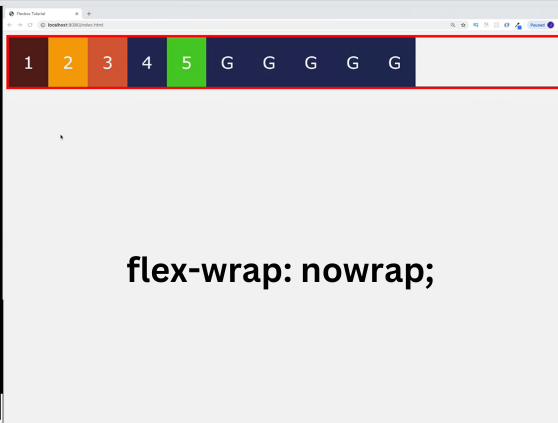

| Index                           | Index                                 |
| ------------------------------- | ------------------------------------- |
| 256. [CSS Flexbox Intro](#256)  | 264. [align-content](#264)            |
| 257. [Setup](#257)              | 265. [Main Axis / Cross Axis](#265)   |
| 258. [Naming Conventions](#258) | 266. [order property](#266)           |
| 259. [flex-direction](#259)     | 267. [align-self](#267)               |
| 260. [flex-wrap](#260)          | 268. [flex-grow](#268)                |
| 261. [justify-content](#261)    | 269. [flex-shrink](#269)              |
| 262. [align-items](#262)        | 270. [flex-basis and flex](#270)      |
| 263. [Hero Project](#263)       | 271. [NEW FLEXBOX FEATURES !!!](#271) |

---

<br>

### 256. CSS Flexbox Intro<a id="256"></a>

> **_Business Objective: Layout_**


---

flexible box

<br>

### 257. Setup<a id="257"></a>

> **_Business Objective: Layout_**


---

In index.html

```html
<!DOCTYPE html>
<html lang="en">
  <head>
    <meta charset="UTF-8" />
    <meta name="viewport" content="width=device-width, initial-scale=1.0" />
    <meta http-equiv="X-UA-Compatible" content="ie=edge" />
    <title>Flex box Tutorial</title>
    <link rel="stylesheet" href="styles.css" />

    <style></style>
  </head>
  <body>
    <!-- flex box sandbox setup -->
    <div class="container">
      <!-- general style-box & specific style-box-1 -->
      <!-- (.box.box-${$})*5 -->
      <div class="box box-1">1</div>
      <div class="box box-2">2</div>
      <div class="box box-3">3</div>
      <div class="box box-4">4</div>
      <div class="box box-5">5</div>
    </div>
  </body>
</html>
```

---

In styles.css

```css
body {
  font-family: Verdana, Geneva, Tahoma, sans-serif;
  background: #f3f3f3;
}

/* To see how flexbox property and children boxes are behaving */
.container {
  border: 5px solid red;
}

/*1. General style setup for all box */
.box {
  padding: 30px;
  text-align: center;
  font-size: 35px;
  color: #f3f3f3;
}

/*2. specific style setup for every single box  */
.box-1 {
  background: #581f18;
}
.box-2 {
  background: #f0a202;
}
.box-3 {
  background: #d95d39;
}
.box-4 {
  background: #202c59;
}
.box-5 {
  background: #51cb20;
}
```

<br>

### 258. Naming Conventions<a id="258"></a>

> **_Business Objective: Layout_**

- Inline block element


<br>

- Block level element


---

In index.html

```html
<!DOCTYPE html>
<html lang="en">
  <head>
    <meta charset="UTF-8" />
    <meta name="viewport" content="width=device-width, initial-scale=1.0" />
    <meta http-equiv="X-UA-Compatible" content="ie=edge" />
    <title>Flexbox Tutorial</title>
    <link rel="stylesheet" href="styles.css" />
    <style>
      /* 📦 Container/Parent property first*/
      .container {
        display: flex;
        /* display: inline-flex; */
      }
    </style>
  </head>
  <body>
    <!--parent = flex-container  -->
    <div class="container">
      <!-- children = flex-items -->
      <div class="box box-1">1</div>
      <div class="box box-2">2</div>
      <div class="box box-3">3</div>
      <div class="box box-4">4</div>
      <div class="box box-5">5</div>
    </div>
  </body>
</html>
```

---

In styles.css

```css
body {
  font-family: Verdana, Geneva, Tahoma, sans-serif;
  background: #f3f3f3;
}
.container {
  border: 5px solid red;
}
.box {
  padding: 30px;
  text-align: center;
  font-size: 35px;
  color: #f3f3f3;
}
.box-1 {
  background: #581f18;
}
.box-2 {
  background: #f0a202;
}
.box-3 {
  background: #d95d39;
}
.box-4 {
  background: #202c59;
}
.box-5 {
  background: #51cb20;
}
```

<br>

### 259. flex-direction<a id="259"></a>

> **_Business Objective: Layout_**


<br>


<br>


<br>


---

In index.html

```html
<!DOCTYPE html>
<html lang="en">
  <head>
    <meta charset="UTF-8" />
    <meta name="viewport" content="width=device-width, initial-scale=1.0" />
    <meta http-equiv="X-UA-Compatible" content="ie=edge" />
    <title>Flexbox Tutorial</title>
    <link rel="stylesheet" href="styles.css" />

    <style>
      /* 📦 Container/Parent property first*/
      /* Property- flex direction */
      /* Value- row (default) row-reverse column column reverse */
      .container {
        display: flex;

        flex-direction: row;
        /* flex-direction: row-reverse; */
        /* flex-direction: column; */
        /* flex-direction: column-reverse; */
      }
    </style>
  </head>
  <body>
    <!--parent = flex-container  -->
    <div class="container">
      <!-- children = flex-items -->
      <div class="box box-1">1</div>
      <div class="box box-2">2</div>
      <div class="box box-3">3</div>
      <div class="box box-4">4</div>
      <div class="box box-5">5</div>
    </div>
  </body>
</html>
```

---

In styles.css

```css
body {
  font-family: Verdana, Geneva, Tahoma, sans-serif;
  background: #f3f3f3;
}
.container {
  border: 5px solid red;
}
.box {
  padding: 30px;
  text-align: center;
  font-size: 35px;
  color: #f3f3f3;
}
.box-1 {
  background: #581f18;
}
.box-2 {
  background: #f0a202;
}
.box-3 {
  background: #d95d39;
}
.box-4 {
  background: #202c59;
}
.box-5 {
  background: #51cb20;
}
```

<br>

### 260. flex-wrap<a id="260"></a>

> **_Business Objective: Layout_**

- content overflow



<br>

- content start takes new line


<br>


<br>

---

In index.html

```html
<!DOCTYPE html>
<html lang="en">
  <head>
    <meta charset="UTF-8" />
    <meta name="viewport" content="width=device-width, initial-scale=1.0" />
    <meta http-equiv="X-UA-Compatible" content="ie=edge" />
    <title>Flexbox Tutorial</title>
    <link rel="stylesheet" href="styles.css" />

    <style>
      /* 📦 Container/Parent property first*/
      /* Property- flex-wrap */
      /* Value- nowrap(default) wrap wrap-reverse */

      .container {
        display: flex;
        /* flex-direction: row ===  default*/

        /* container overflow with item */
        /* flex-wrap: nowrap; */
        flex-wrap: wrap;
        /* flex-wrap: wrap-reverse; */
      }
    </style>
  </head>
  <body>
    <!--parent = flex-container  -->
    <div class="container">
      <!-- children = flex-items -->
      <div class="box box-1">1</div>
      <div class="box box-2">2</div>
      <div class="box box-3">3</div>
      <div class="box box-4">4</div>
      <div class="box box-5">5</div>
      <div class="box generic">G</div>
      <div class="box generic">G</div>
      <div class="box generic">G</div>
      <div class="box generic">G</div>
      <div class="box generic">G</div>
    </div>
  </body>
</html>
```

---

In styles.css

```css
body {
  font-family: Verdana, Geneva, Tahoma, sans-serif;
  background: #f3f3f3;
}
.container {
  border: 5px solid red;
}
.box {
  padding: 30px;
  text-align: center;
  font-size: 35px;
  color: #f3f3f3;
}
.box-1 {
  background: #581f18;
}
.box-2 {
  background: #f0a202;
}
.box-3 {
  background: #d95d39;
}
.box-4 {
  background: #202c59;
}
.box-5 {
  background: #51cb20;
}
.generic {
  background: #202c59;
}
```

<br>

### 261. justify-content<a id="261"></a>

> **_Business Objective: Layout_**


<br>


<br>


<br>


<br>


<br>


## <br>

In index.html

```html
<!DOCTYPE html>
<html lang="en">
  <head>
    <meta charset="UTF-8" />
    <meta name="viewport" content="width=device-width, initial-scale=1.0" />
    <meta http-equiv="X-UA-Compatible" content="ie=edge" />
    <title>Flexbox Tutorial</title>
    <link rel="stylesheet" href="styles.css" />
    <style>
      /* 📦 Container/Parent property first*/
      /* Property- justify-content; horizontal alignment*/
      /* Value- flex-start(default), flex-end, center  */

      /* evenly distributed flex item*/
      /* Value- space-between; first item start last end   */
      /* Value- space-around; side margins  */
      /* Value- space-evenly; even margins  */
      .container {
        display: flex;
        flex-wrap: wrap;
        justify-content: flex-start;
        justify-content: flex-end;
        justify-content: space-between;
        justify-content: space-around;
        justify-content: space-evenly;
        justify-content: center;
      }
    </style>
  </head>
  <body>
    <!--parent = flex-container  -->
    <div class="container">
      <!-- children = flex-items -->
      <div class="box box-1">1</div>
      <div class="box box-2">2</div>
      <div class="box box-3">3</div>
      <div class="box box-4">4</div>
      <div class="box box-5">5</div>
      <!-- <div class="box generic">G</div>
      <div class="box generic">G</div>
      <div class="box generic">G</div>
      <div class="box generic">G</div>
      <div class="box generic">G</div> -->
    </div>
  </body>
</html>
```

---

In styles.css

```css
body {
  font-family: Verdana, Geneva, Tahoma, sans-serif;
  background: #f3f3f3;
}
.container {
  border: 5px solid red;
}
.box {
  padding: 30px;
  text-align: center;
  font-size: 35px;
  color: #f3f3f3;
}
.box-1 {
  background: #581f18;
}
.box-2 {
  background: #f0a202;
}
.box-3 {
  background: #d95d39;
}
.box-4 {
  background: #202c59;
}
.box-5 {
  background: #51cb20;
}
.generic {
  background: #202c59;
}
```

<br>

### 262. align-items<a id="262"></a>

> **_Business Objective: Layout_**


<br>


<br>


<br>


<br>


<br>

In index.html

```html
<!DOCTYPE html>
<html lang="en">
  <head>
    <meta charset="UTF-8" />
    <meta name="viewport" content="width=device-width, initial-scale=1.0" />
    <meta http-equiv="X-UA-Compatible" content="ie=edge" />
    <title>Flexbox Tutorial</title>
    <link rel="stylesheet" href="styles.css" />

    <style>
      /* 📦 Container/Parent property first*/
      /* Property- align-items; vertical alignment*/
      /* Value- stretch (default), flex-start, flex-end, center, baseline */
      .container {
        height: 300px;
        height: 40vh;
        display: flex;
        align-items: stretch;
        /* align-items: flex-start; */
        /* align-items: flex-end; */
        align-items: center;
        /* align-items: baseline; */
      }
    </style>
  </head>

  <body>
    <!--parent = flex-container  -->
    <div class="container">
      <!-- children = flex-items -->
      <div class="box box-1">1</div>
      <div class="box box-2">2</div>
      <div class="box box-3">3</div>
      <div class="box box-4">4</div>
      <div class="box box-5">5</div>
      <!-- <div class="box generic">G</div>
      <div class="box generic">G</div>
      <div class="box generic">G</div>
      <div class="box generic">G</div>
      <div class="box generic">G</div> -->
    </div>
  </body>
</html>
```

---

In styles.css

```css
body {
  font-family: Verdana, Geneva, Tahoma, sans-serif;
  background: #f3f3f3;
}
.container {
  border: 5px solid red;
}
.box {
  padding: 30px;
  text-align: center;
  font-size: 35px;
  color: #f3f3f3;
}
.box-1 {
  background: #581f18;
  font-size: 65px;
}
.box-2 {
  background: #f0a202;
}
.box-3 {
  background: #d95d39;
}
.box-4 {
  background: #202c59;
}
.box-5 {
  background: #51cb20;
}
.generic {
  background: #202c59;
}
```

- NOTE: We have provided **HEIGHT** to parent container, so we can set property

<br>

### 263. Hero Project<a id="263"></a>

> **_Business Objective: Layout_**

<video src="notes/parallax.mp4" controls title="Title" width="600" height="300"></video>

---

- Download any image from internet and save it in 06-hero-example

In index.html

```html
<!DOCTYPE html>
<html lang="en">
  <head>
    <meta charset="UTF-8" />
    <meta name="viewport" content="width=device-width, initial-scale=1.0" />
    <meta http-equiv="X-UA-Compatible" content="ie=edge" />
    <title>Flexbox Tutorial</title>
    <link rel="stylesheet" href="styles.css" />
    <style>
      .container {
        height: 300px;
        height: 40vh;
        display: flex;
      }
    </style>
  </head>
  <body>
    <!--parent = flex-container  -->
    <div class="container">
      <!-- children = flex-items -->
      <div class="box box-1">1</div>
      <div class="box box-2">2</div>
      <div class="box box-3">3</div>
      <div class="box box-4">4</div>
      <div class="box box-5">5</div>
      <!-- <div class="box generic">G</div>
      <div class="box generic">G</div>
      <div class="box generic">G</div>
      <div class="box generic">G</div>
      <div class="box generic">G</div> -->
    </div>
    <a href="banner.html">banner html</a>
  </body>
</html>
```

---

In banner.html

```html
<!DOCTYPE html>
<html lang="en">
  <head>
    <meta charset="UTF-8" />
    <meta name="viewport" content="width=device-width, initial-scale=1.0" />
    <meta http-equiv="X-UA-Compatible" content="ie=edge" />
    <title>Banner Example</title>
    <style>
      /* reset window margin */
      * {
        margin: 0;
      }

      .hero {
        /* height for all device */
        min-height: 100vh;
        background: url("hero-bcg.jpeg");
        background-position: center;
        background-size: cover;
        background-repeat: no-repeat;
        /* To get parallax effect */
        background-attachment: fixed;

        display: flex;
        /* horizontal alignment, X */
        justify-content: center;
        /* vertical alignment, Y */
        align-items: center;
      }

      h1 {
        text-transform: uppercase;
        font-size: 60px;
        color: red;
      }

      .banner {
        min-height: 100vh;
        background: blue;
      }
    </style>
  </head>
  <body>
    <!-- hero is the Parent container -->
    <header class="hero">
      <h1>page title</h1>
    </header>

    <div class="banner"></div>

    <a href="index.html">back home</a>
  </body>
</html>
```

---

In styles.css

```css
body {
  font-family: Verdana, Geneva, Tahoma, sans-serif;
  background: #f3f3f3;
}
.container {
  border: 5px solid red;
}
.box {
  padding: 30px;
  text-align: center;
  font-size: 35px;
  color: #f3f3f3;
}
.box-1 {
  background: #581f18;
  font-size: 65px;
}
.box-2 {
  background: #f0a202;
}
.box-3 {
  background: #d95d39;
}
.box-4 {
  background: #202c59;
}
.box-5 {
  background: #51cb20;
}
.generic {
  background: #202c59;
}
```

<br>

### 264. align-content<a id="264"></a>

> **_Business Objective: Layout_**


---

In index.html

```html

```

---

In styles.css

```css

```

<br>

### 265. Main Axis / Cross Axis<a id="265"></a>

> **_Business Objective: Layout_**


---

In index.html

```html

```

---

In styles.css

```css

```

<br>

### 266. order property<a id="266"></a>

> **_Business Objective: Layout_**


---

In index.html

```html

```

---

In styles.css

```css

```

<br>

### 267. align-self<a id="267"></a>

> **_Business Objective: Layout_**


---

In index.html

```html

```

---

In styles.css

```css

```

<br>

### 268. flex-grow<a id="268"></a>

> **_Business Objective: Layout_**


---

In index.html

```html

```

---

In styles.css

```css

```

<br>

### 269. flex-shrink<a id="269"></a>

> **_Business Objective: Layout_**


---

In index.html

```html

```

---

In styles.css

```css

```

<br>

### 270. flex-basis and flex<a id="270"></a>

> **_Business Objective: Layout_**


---

In index.html

```html

```

---

In styles.css

```css

```

<br>

### 271. NEW FLEXBOX FEATURES !!!<a id="271"></a>

> **_Business Objective: Layout_**


---

In index.html

```html

```

---

In styles.css

```css

```

<br>
