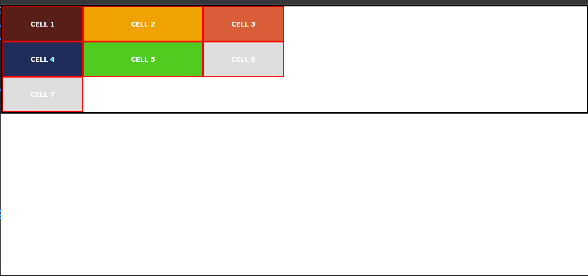
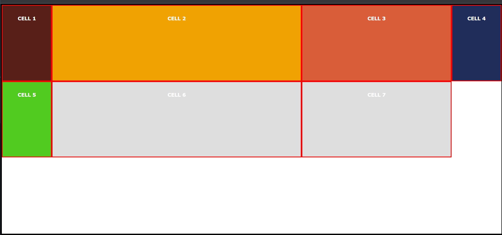
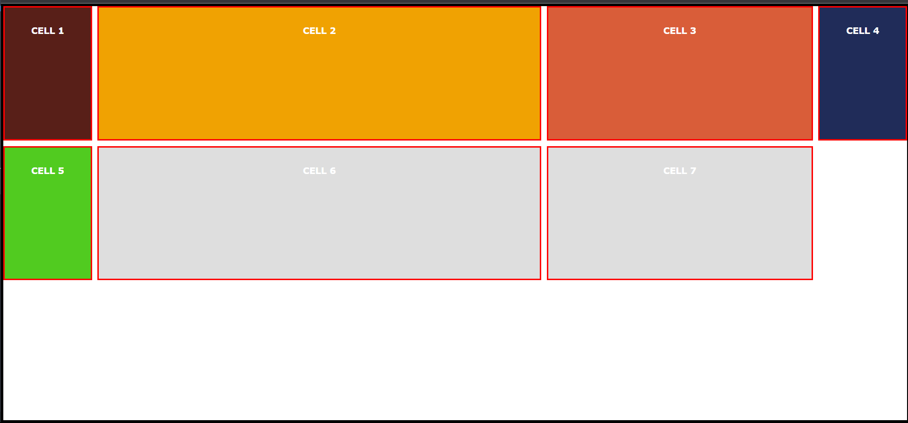
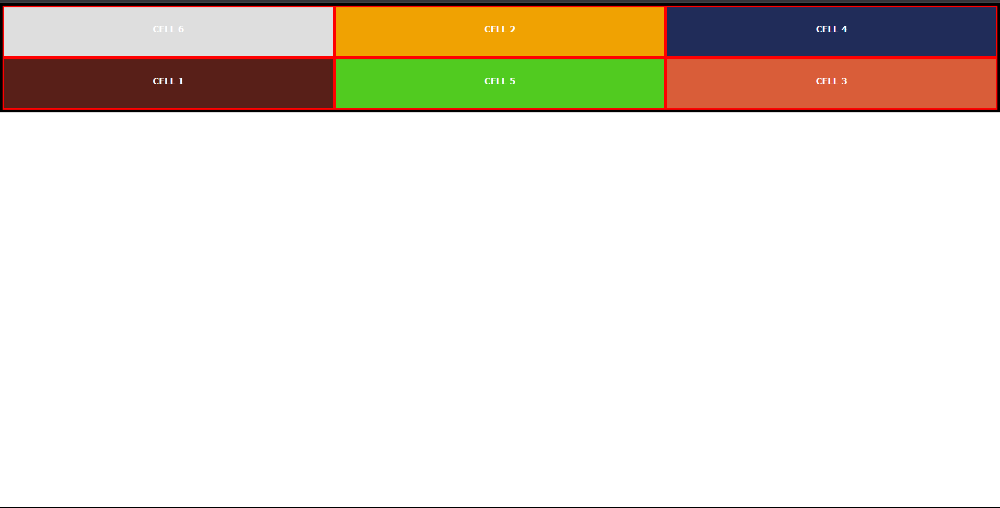

#### 302. [CSS Grid - Intro](#302)

#### 303. [Setup](#303)

#### 304. [Basic Syntax - grid-template-columns](#304)

#### 305. [Implicit Grid](#305)

#### 306. [General CSS Setup](#306)

#### 307. [Units - auto](#307)

#### 308. [grid-template-rows](#308)

#### 309. [fr units](#309)

#### 310. [gap property](#310)

#### 311. [Gap - New Syntax!](#311)

#### 312. [fr vs %](#312)

#### 313. [Firefox Developer Tools](#313)

#### 314. [grid-lines](#314)

#### 315. [Naming Grid Lines](#315)

#### 316. [Grid Template Areas](#316)

#### 317. [Order Property](#317)

#### 318. [Repeat Function](#318)

#### 319. [justify-content](#319)

#### 320. [align-content](#320)

#### 321. [align-items, jusitfy-items, align-self,justify-self](#321)

#### 322. [minmax()](#322)

#### 323. [auto-fit and auto-fill](#323)

<br>

### 302. CSS Grid - Intro<a id="302"></a>

<br>

### 303. Setup<a id="303"></a>

> **_Business Objective: Layout_**


---

- In index.html

```html
<!DOCTYPE html>
<html lang="en">
  <head>
    <meta charset="UTF-8" />
    <meta name="viewport" content="width=device-width, initial-scale=1.0" />
    <meta http-equiv="X-UA-Compatible" content="ie=edge" />
    <title>Grid Tutorial</title>
    <link rel="stylesheet" href="styles.css" />

    <style></style>
  </head>
  <body>
    <div class="container">
      <div class="cell">cell 1</div>
      <div class="cell">cell 2</div>
    </div>
  </body>
</html>
```

---

- In style.css

```js
// reset window by overriding default css
* {
  margin: 0;
  padding: 0;
  box-sizing: border-box;
}

body {
  font-family: Verdana, Geneva, Tahoma, sans-serif;
  color: #222;
}
.container {
  border: 5px solid black;
}
.cell {
  padding: 2rem;
  background: #dedede;
  text-transform: uppercase;
  font-weight: bold;
  text-align: center;
  border: 3px solid red;
  color: #fff;
}


```

<br>

### 304. Basic Syntax - grid-template-columns<a id="304"></a>

> **_Business Objective: Layout_**



---

- In index.html

```html
<!DOCTYPE html>
<html lang="en">
  <head>
    <meta charset="UTF-8" />
    <meta name="viewport" content="width=device-width, initial-scale=1.0" />
    <meta http-equiv="X-UA-Compatible" content="ie=edge" />
    <title>Grid Tutorial</title>
    <link rel="stylesheet" href="styles.css" />

    <style>
      /* How to setup grid layout: Two most imp property*/
      .container {
        display: grid;
        /* What kind of columns I would like, what would be the width/size of the columns and  how many columns I want*/
        grid-template-columns: 200px 300px;
      }
    </style>
  </head>
  <body>
    <!-- - Anytime we need to work with grid we need a parent container and children items -->
    <div class="container">
      <div class="cell">cell 1</div>
      <div class="cell">cell 2</div>
    </div>
  </body>
</html>
```

---

- In styles.css

```css
/* reset window */
* {
  margin: 0;
  padding: 0;
  box-sizing: border-box;
}

body {
  font-family: Verdana, Geneva, Tahoma, sans-serif;
  color: #222;
}
.container {
  border: 5px solid black;
}
.cell {
  padding: 2rem;
  background: #dedede;
  text-transform: uppercase;
  font-weight: bold;
  text-align: center;
  border: 3px solid red;
  color: #fff;
}
.cell-1 {
  background: #581f18;
}
.cell-2 {
  background: #f0a202;
}
.cell-3 {
  background: #d95d39;
}
.cell-4 {
  background: #202c59;
}
.cell-5 {
  background: #51cb20;
}
```

---

- Anytime we need to work with grid we need a parent container and children items
- Two most imp property for setting up grid: display: grid, grid-template-columns: 200px 300px;

<br>

### 305. Implicit Grid<a id="305"></a>

> **_Business Objective: Layout_**


---

- In index.html

```html
<!DOCTYPE html>
<html lang="en">
  <head>
    <meta charset="UTF-8" />
    <meta name="viewport" content="width=device-width, initial-scale=1.0" />
    <meta http-equiv="X-UA-Compatible" content="ie=edge" />
    <title>Grid Tutorial</title>
    <link rel="stylesheet" href="styles.css" />

    <style>
      .container {
        display: grid;
        /* What kind of columns I would like, what would be the width/size of the columns and  how many columns I want*/
        /* 3 column layout */
        grid-template-columns: 200px 300px 200px;
      }
    </style>
  </head>
  <body>
    <!-- color values -->
    <div class="container">
      <div class="cell cell-1">cell 1</div>
      <div class="cell cell-2">cell 2</div>
      <div class="cell cell-3">cell 3</div>
      <div class="cell cell-4">cell 4</div>
      <div class="cell cell-5">cell 5</div>
      <div class="cell">cell 6</div>
      <div class="cell">cell 7</div>
    </div>
  </body>
</html>
```

---

- In styles.css

```css
* {
  margin: 0;
  padding: 0;
  box-sizing: border-box;
}

body {
  font-family: Verdana, Geneva, Tahoma, sans-serif;
  color: #222;
}
.container {
  border: 5px solid black;
}
.cell {
  padding: 2rem;
  background: #dedede;
  text-transform: uppercase;
  font-weight: bold;
  text-align: center;
  border: 3px solid red;
  color: #fff;
}
.cell-1 {
  background: #581f18;
}
.cell-2 {
  background: #f0a202;
}
.cell-3 {
  background: #d95d39;
}
.cell-4 {
  background: #202c59;
}
.cell-5 {
  background: #51cb20;
}
```

<br>

### 306. General CSS Setup<a id="306"></a>

> **_Business Objective: Layout_**


---

- In index.html

```html
<!DOCTYPE html>
<html lang="en">
  <head>
    <meta charset="UTF-8" />
    <meta name="viewport" content="width=device-width, initial-scale=1.0" />
    <meta http-equiv="X-UA-Compatible" content="ie=edge" />
    <title>Grid Tutorial</title>
    <link rel="stylesheet" href="styles.css" />
    <style>
      .container {
        display: grid;
        /* What kind of columns I would like, what would be the width/size of the columns and  how many columns I want*/
        grid-template-columns: 200px 300px 200px;
      }
    </style>
  </head>
  <body>
    <!-- color values -->
    <div class="container">
      <div class="cell cell-1">cell 1</div>
      <div class="cell cell-2">cell 2</div>
      <div class="cell cell-3">cell 3</div>
      <div class="cell cell-4">cell 4</div>
      <div class="cell cell-5">cell 5</div>
      <div class="cell">cell 6</div>
      <div class="cell">cell 7</div>
    </div>
  </body>
</html>
```

---

- In styles.css

```css
* {
  margin: 0;
  padding: 0;
  box-sizing: border-box;
}

body {
  font-family: Verdana, Geneva, Tahoma, sans-serif;
  color: #222;
}
.container {
  border: 5px solid black;
}
.cell {
  padding: 2rem;
  background: #dedede;
  text-transform: uppercase;
  font-weight: bold;
  text-align: center;
  border: 3px solid red;
  color: #fff;
}
.cell-1 {
  background: #581f18;
}
.cell-2 {
  background: #f0a202;
}
.cell-3 {
  background: #d95d39;
}
.cell-4 {
  background: #202c59;
}
.cell-5 {
  background: #51cb20;
}
```

<br>

### 307. Units - auto<a id="307"></a>

> **_Business Objective: Layout_**


---

- In index.html

```html
<!DOCTYPE html>
<html lang="en">
  <head>
    <meta charset="UTF-8" />
    <meta name="viewport" content="width=device-width, initial-scale=1.0" />
    <meta http-equiv="X-UA-Compatible" content="ie=edge" />
    <title>Grid Tutorial</title>
    <link rel="stylesheet" href="styles.css" />
    <style>
      /* units - rows as well */
      /* px rem em % auto fr  */
      .container {
        display: grid;

        /* 5 column layout */
        /* grid-template-columns: 200px 7rem 10em 5 % auto; */

        /* What kind of columns I would like, what would be the width/size of the columns and  how many columns I want*/
        grid-template-columns: 200px 7rem auto;
      }
    </style>
  </head>
  <body>
    <div class="container">
      <div class="cell cell-1">cell 1</div>
      <div class="cell cell-2">cell 2</div>
      <div class="cell cell-3">cell 3</div>
      <div class="cell cell-4">cell 4</div>
      <div class="cell cell-5">cell 5</div>
      <div class="cell">cell 6</div>
      <div class="cell">cell 7</div>
    </div>
  </body>
</html>
```

---

- In styles.css

```css
* {
  margin: 0;
  padding: 0;
  box-sizing: border-box;
}

body {
  font-family: Verdana, Geneva, Tahoma, sans-serif;
  color: #222;
}
.container {
  border: 5px solid black;
}
.cell {
  padding: 2rem;
  background: #dedede;
  text-transform: uppercase;
  font-weight: bold;
  text-align: center;
  border: 3px solid red;
  color: #fff;
}
.cell-1 {
  background: #581f18;
}
.cell-2 {
  background: #f0a202;
}
.cell-3 {
  background: #d95d39;
}
.cell-4 {
  background: #202c59;
}
.cell-5 {
  background: #51cb20;
}
```

<br>

### 308. grid-template-rows<a id="308"></a>

> **_Business Objective: Layout_**


---

- In index.html

```html
<!DOCTYPE html>
<html lang="en">
  <head>
    <meta charset="UTF-8" />
    <meta name="viewport" content="width=device-width, initial-scale=1.0" />
    <meta http-equiv="X-UA-Compatible" content="ie=edge" />
    <title>Grid Tutorial</title>
    <link rel="stylesheet" href="styles.css" />
    <style>
      /* rows */
      .container {
        /* I want this container to be 100% height of the device Screen */
        min-height: 100vh;
        display: grid;

        /* expand column horizontally */
        grid-template-columns: 200px auto 10rem;

        /* What kind of row I would like, what would be the height/size of the row and  how many row I want*/
        /* expand row vertically */
        grid-template-rows: auto 5rem;
      }
    </style>
  </head>
  <body>
    <div class="container">
      <div class="cell cell-1">cell 1</div>
      <div class="cell cell-2">cell 2</div>
      <div class="cell cell-3">cell 3</div>
      <div class="cell cell-4">cell 4</div>
      <div class="cell cell-5">cell 5</div>
      <div class="cell">cell 6</div>
      <div class="cell">cell 7</div>
    </div>
  </body>
</html>
```

---

- In styles.css

```css
* {
  margin: 0;
  padding: 0;
  box-sizing: border-box;
}

body {
  font-family: Verdana, Geneva, Tahoma, sans-serif;
  color: #222;
}
.container {
  border: 5px solid black;
}
.cell {
  padding: 2rem;
  background: #dedede;
  text-transform: uppercase;
  font-weight: bold;
  text-align: center;
  border: 3px solid red;
  color: #fff;
}
.cell-1 {
  background: #581f18;
}
.cell-2 {
  background: #f0a202;
}
.cell-3 {
  background: #d95d39;
}
.cell-4 {
  background: #202c59;
}
.cell-5 {
  background: #51cb20;
}
```

<br>

### 309. fr units<a id="309"></a>

> **_Business Objective: Layout_**



---

- fr are responsive value
- In index.html

```html
<!DOCTYPE html>
<html lang="en">
  <head>
    <meta charset="UTF-8" />
    <meta name="viewport" content="width=device-width, initial-scale=1.0" />
    <meta http-equiv="X-UA-Compatible" content="ie=edge" />
    <title>Grid Tutorial</title>
    <link rel="stylesheet" href="styles.css" />
    <style>
      /* fr units - fraction of available parent container space */
      .container {
        /* set container height 100% of device screen */
        min-height: 100vh;
        display: grid;

        /* How to use fraction unit for available parent container space*/
        /* what space would like to use for column in available parent container space */
        grid-template-columns: 1fr 5fr 3fr 1fr;
        /* what space would like to use for row in available parent container space */
        grid-template-rows: 1fr 1fr 1fr;
      }
    </style>
  </head>
  <body>
    <div class="container">
      <div class="cell cell-1">cell 1</div>
      <div class="cell cell-2">cell 2</div>
      <div class="cell cell-3">cell 3</div>
      <div class="cell cell-4">cell 4</div>
      <div class="cell cell-5">cell 5</div>
      <div class="cell">cell 6</div>
      <div class="cell">cell 7</div>
    </div>
  </body>
</html>
```

---

- In styles.css

```css
* {
  margin: 0;
  padding: 0;
  box-sizing: border-box;
}

body {
  font-family: Verdana, Geneva, Tahoma, sans-serif;
  color: #222;
}
.container {
  border: 5px solid black;
}
.cell {
  padding: 2rem;
  background: #dedede;
  text-transform: uppercase;
  font-weight: bold;
  text-align: center;
  border: 3px solid red;
  color: #fff;
}
.cell-1 {
  background: #581f18;
}
.cell-2 {
  background: #f0a202;
}
.cell-3 {
  background: #d95d39;
}
.cell-4 {
  background: #202c59;
}
.cell-5 {
  background: #51cb20;
}
```

<br>

### 310. gap property<a id="310"></a>

> **_Business Objective: Layout_**


---

- In index.html

```html
<!DOCTYPE html>
<html lang="en">
  <head>
    <meta charset="UTF-8" />
    <meta name="viewport" content="width=device-width, initial-scale=1.0" />
    <meta http-equiv="X-UA-Compatible" content="ie=edge" />
    <title>Grid Tutorial</title>
    <link rel="stylesheet" href="styles.css" />
    <style>
      /* gap */
      .container {
        /* set container height 100% of device screen */
        min-height: 100vh;
        display: grid;
        /* How to use fraction unit for available parent container space*/
        grid-template-columns: 1fr 5fr 3fr 1fr;
        grid-template-rows: 1fr 1fr 1fr;

        /* How to put gat b/w column */
        grid-column-gap: 20px;

        /* How to put gat b/w row */
        grid-row-gap: 20px;

        /* shorthand for column and row in one-line first for column, second for row */
        grid-gap: 50px 100px;

        /* shorthand for column and row in one-line, single value for row  & column */
        /* grid-gap: 50px  */
      }
    </style>
  </head>
  <body>
    <div class="container">
      <div class="cell cell-1">cell 1</div>
      <div class="cell cell-2">cell 2</div>
      <div class="cell cell-3">cell 3</div>
      <div class="cell cell-4">cell 4</div>
      <div class="cell cell-5">cell 5</div>
      <div class="cell">cell 6</div>
      <div class="cell">cell 7</div>
    </div>
  </body>
</html>
```

---

- In styles.css

```css
* {
  margin: 0;
  padding: 0;
  box-sizing: border-box;
}

body {
  font-family: Verdana, Geneva, Tahoma, sans-serif;
  color: #222;
}
.container {
  border: 5px solid black;
}
.cell {
  padding: 2rem;
  background: #dedede;
  text-transform: uppercase;
  font-weight: bold;
  text-align: center;
  border: 3px solid red;
  color: #fff;
}
.cell-1 {
  background: #581f18;
}
.cell-2 {
  background: #f0a202;
}
.cell-3 {
  background: #d95d39;
}
.cell-4 {
  background: #202c59;
}
.cell-5 {
  background: #51cb20;
}
```

<br>

### 311. Gap - New Syntax!<a id="311"></a>

> **_Business Objective: Layout_**



---

- In index.html

```html
<!DOCTYPE html>
<html lang="en">
  <head>
    <meta charset="UTF-8" />
    <meta name="viewport" content="width=device-width, initial-scale=1.0" />
    <meta http-equiv="X-UA-Compatible" content="ie=edge" />
    <title>Grid Tutorial</title>
    <link rel="stylesheet" href="styles.css" />
    <style>
      /* grid-gap - absolete */
      /* gap */
      .container {
        /* set container height 100% of device screen */
        min-height: 100vh;
        display: grid;
        grid-template-columns: 1fr 5fr 3fr 1fr;
        grid-template-rows: 1fr 1fr 1fr;
        /* grid-column-gap: 20px;
        grid-row-gap: 20px;
        grid-gap: 50px 100px; */

        /* New syntax for the same functionality */
        column-gap: 50px;
        row-gap: 50px;
        /* shorthand fist for column, second for row*/
        gap: 100px 25px;
        /* shorthand single value for column & row*/
        gap: 10px;
      }
    </style>
  </head>
  <body>
    <div class="container">
      <div class="cell cell-1">cell 1</div>
      <div class="cell cell-2">cell 2</div>
      <div class="cell cell-3">cell 3</div>
      <div class="cell cell-4">cell 4</div>
      <div class="cell cell-5">cell 5</div>
      <div class="cell">cell 6</div>
      <div class="cell">cell 7</div>
    </div>
  </body>
</html>
```

---

- In styles.css

```css
* {
  margin: 0;
  padding: 0;
  box-sizing: border-box;
}

body {
  font-family: Verdana, Geneva, Tahoma, sans-serif;
  color: #222;
}
.container {
  border: 5px solid black;
}
.cell {
  padding: 2rem;
  background: #dedede;
  text-transform: uppercase;
  font-weight: bold;
  text-align: center;
  border: 3px solid red;
  color: #fff;
}
.cell-1 {
  background: #581f18;
}
.cell-2 {
  background: #f0a202;
}
.cell-3 {
  background: #d95d39;
}
.cell-4 {
  background: #202c59;
}
.cell-5 {
  background: #51cb20;
}
```

<br>

### 312. fr vs %<a id="312"></a>

> **_Business Objective: Layout_**


---

- In index.html

```html
<!DOCTYPE html>
<html lang="en">
  <head>
    <meta charset="UTF-8" />
    <meta name="viewport" content="width=device-width, initial-scale=1.0" />
    <meta http-equiv="X-UA-Compatible" content="ie=edge" />
    <title>Grid Tutorial</title>
    <link rel="stylesheet" href="styles.css" />
    <style>
      /*  */
      .container {
        /* set container height 100% of device screen */
        min-height: 100vh;
        display: grid;
        grid-template-columns: 1fr 1fr;
        grid-template-rows: 1fr 1fr 1fr;
        grid-column-gap: 20px;
        grid-row-gap: 20px;
        grid-gap: 50px 100px;
      }
    </style>
  </head>
  <body>
    <div class="container">
      <div class="cell cell-1">cell 1</div>
      <div class="cell cell-2">cell 2</div>
      <div class="cell cell-3">cell 3</div>
      <div class="cell cell-4">cell 4</div>
      <div class="cell cell-5">cell 5</div>
      <div class="cell">cell 6</div>
      <div class="cell">cell 7</div>
    </div>
  </body>
</html>
```

---

- In styles.css

```css
* {
  margin: 0;
  padding: 0;
  box-sizing: border-box;
}

body {
  font-family: Verdana, Geneva, Tahoma, sans-serif;
  color: #222;
}
.container {
  border: 5px solid black;
}
.cell {
  padding: 2rem;
  background: #dedede;
  text-transform: uppercase;
  font-weight: bold;
  text-align: center;
  border: 3px solid red;
  color: #fff;
}
.cell-1 {
  background: #581f18;
}
.cell-2 {
  background: #f0a202;
}
.cell-3 {
  background: #d95d39;
}
.cell-4 {
  background: #202c59;
}
.cell-5 {
  background: #51cb20;
}
```

<br>

### 313. Firefox Developer Tools<a id="313"></a>

- open site in firefox dev edition
- right click-> inspect element


---

- line number


- In index.html

```html
<!DOCTYPE html>
<html lang="en">
  <head>
    <meta charset="UTF-8" />
    <meta name="viewport" content="width=device-width, initial-scale=1.0" />
    <meta http-equiv="X-UA-Compatible" content="ie=edge" />
    <title>Grid Tutorial</title>
    <link rel="stylesheet" href="styles.css" />
    <style>
      /*  */
      .container {
        /* set container height 100% of device screen */
        min-height: 100vh;
        display: grid;
        grid-template-columns: 1fr 1fr;
        grid-template-rows: 1fr 1fr 1fr;
        grid-column-gap: 20px;
        grid-row-gap: 20px;
        grid-gap: 50px 100px;
      }
    </style>
  </head>
  <body>
    <div class="container">
      <div class="cell cell-1">cell 1</div>
      <div class="cell cell-2">cell 2</div>
      <div class="cell cell-3">cell 3</div>
      <div class="cell cell-4">cell 4</div>
      <div class="cell cell-5">cell 5</div>
      <div class="cell">cell 6</div>
      <div class="cell">cell 7</div>
    </div>
  </body>
</html>
```

---

- In styles.css

```css
* {
  margin: 0;
  padding: 0;
  box-sizing: border-box;
}

body {
  font-family: Verdana, Geneva, Tahoma, sans-serif;
  color: #222;
}
.container {
  border: 5px solid black;
}
.cell {
  padding: 2rem;
  background: #dedede;
  text-transform: uppercase;
  font-weight: bold;
  text-align: center;
  border: 3px solid red;
  color: #fff;
}
.cell-1 {
  background: #581f18;
}
.cell-2 {
  background: #f0a202;
}
.cell-3 {
  background: #d95d39;
}
.cell-4 {
  background: #202c59;
}
.cell-5 {
  background: #51cb20;
}
```

<br>

### 314. grid-lines<a id="314"></a>

> **_Grid Layout diagram_** 


 <br>

> **_Business Objective: Layout_**


Turn ⬇️  ⬇️ ⬇️ ⬇️ ⬇️   ⬇️


---

- In index.html

```html
<!DOCTYPE html>
<html lang="en">
  <head>
    <meta charset="UTF-8" />
    <meta name="viewport" content="width=device-width, initial-scale=1.0" />
    <meta http-equiv="X-UA-Compatible" content="ie=edge" />
    <title>Grid Tutorial</title>
    <link rel="stylesheet" href="styles.css" />
    <style>
      /* grid lines - column lines, row lines  */
      .container {
        /* set margin all around container */
        margin: 7rem;
        min-height: 100vh;
        display: grid;
        grid-template-columns: 100px 100px 100px;
        grid-template-rows: 100px 100px 100px;
        grid-gap: 1rem;
      }

      /* How to use grid line like python UI module */
      /* create: calculator. keyboard, matrix, window 8 Start, any layout */
      .cell-1 {
        /* grid-column-start: 1;
        grid-column-end: 3; */
        /* grid-row-start: 1;
        grid-row-end: 3; */

        /* shorthand: where cell start and where cell end*/
        grid-column: 1/3;
        grid-row: 1/3;
      }

      .cell-4 {
        grid-column: 1/-1;
      }
    </style>
  </head>
  <body>
    <div class="container">
      <div class="cell cell-1">cell 1</div>
      <div class="cell cell-2">cell 2</div>
      <div class="cell cell-3">cell 3</div>
      <div class="cell cell-4">cell 4</div>
      <div class="cell cell-5">cell 5</div>
      <div class="cell">cell 6</div>
      <div class="cell">cell 7</div>
    </div>
  </body>
</html>
```

---

- In styles.css

```css
* {
  margin: 0;
  padding: 0;
  box-sizing: border-box;
}

body {
  font-family: Verdana, Geneva, Tahoma, sans-serif;
  color: #222;
}
.container {
  border: 5px solid black;
}
.cell {
  padding: 2rem;
  background: #dedede;
  text-transform: uppercase;
  font-weight: bold;
  text-align: center;
  border: 3px solid red;
  color: #fff;
}
.cell-1 {
  background: #581f18;
}
.cell-2 {
  background: #f0a202;
}
.cell-3 {
  background: #d95d39;
}
.cell-4 {
  background: #202c59;
}
.cell-5 {
  background: #51cb20;
}
```

<br>

### 315. Naming Grid Lines<a id="315"></a>

> **_Business Objective: Layout_**


---

- In index.html

```html
<!DOCTYPE html>
<html lang="en">
  <head>
    <meta charset="UTF-8" />
    <meta name="viewport" content="width=device-width, initial-scale=1.0" />
    <meta http-equiv="X-UA-Compatible" content="ie=edge" />
    <title>Grid Tutorial</title>
    <link rel="stylesheet" href="styles.css" />
    <style>
      /* naming grid lines  */
      .container {
        margin: 7rem;
        min-height: 100vh;
        display: grid;
        /* how to name grid lines */
        grid-template-columns: [start] 100px [col-1-end] 100px [col-2-end] 100px [end];
        grid-template-rows: [start] 100px [row-1-end] 100px [row-2-end] 100px [end];
        grid-gap: 1rem;
      }
      .cell-1 {
        grid-column: start/col-2-end;
        grid-row: start/row-2-end;
      }
    </style>
  </head>
  <body>
    <div class="container">
      <div class="cell cell-1">cell 1</div>
      <div class="cell cell-2">cell 2</div>
      <div class="cell cell-3">cell 3</div>
      <div class="cell cell-4">cell 4</div>
      <div class="cell cell-5">cell 5</div>
      <div class="cell">cell 6</div>
      <div class="cell">cell 7</div>
    </div>
  </body>
</html>
```

---

- In styles.css

```css
* {
  margin: 0;
  padding: 0;
  box-sizing: border-box;
}

body {
  font-family: Verdana, Geneva, Tahoma, sans-serif;
  color: #222;
}
.container {
  border: 5px solid black;
}
.cell {
  padding: 2rem;
  background: #dedede;
  text-transform: uppercase;
  font-weight: bold;
  text-align: center;
  border: 3px solid red;
  color: #fff;
}
.cell-1 {
  background: #581f18;
}
.cell-2 {
  background: #f0a202;
}
.cell-3 {
  background: #d95d39;
}
.cell-4 {
  background: #202c59;
}
.cell-5 {
  background: #51cb20;
}
```

<br>

### 316. Grid Template Areas<a id="316"></a>

> **_Business Objective: Layout_**


<br>

- Naming Template areas by asking question

1. How many rows & columns we need  
   -3 column -5 rows
1.

<br>


---

- In index.html

```html
<!DOCTYPE html>
<html lang="en">
  <head>
    <meta charset="UTF-8" />
    <meta name="viewport" content="width=device-width, initial-scale=1.0" />
    <meta http-equiv="X-UA-Compatible" content="ie=edge" />
    <title>Grid Tutorial</title>
    <link rel="stylesheet" href="styles.css" />
    <style>
      /* grid template areas  */
      .container {
        display: grid;
        grid-template-columns: 1fr 1fr 1fr;
        grid-template-rows: 100px 100px 100px 100px 100px;
        /* How to setup the area for 3-columns, 5rows */
        grid-template-areas:
          "a a b"
          "a a b"
          "c c b"
          "d d d"
          "e f f";
      }
      .cell-1 {
        grid-area: a;
      }
      .cell-2 {
        grid-area: b;
      }
      .cell-3 {
        grid-area: c;
      }
      .cell-4 {
        grid-area: d;
      }
      .cell-5 {
        grid-area: e;
      }
      .cell-6 {
        grid-area: f;
      }
    </style>
  </head>
  <body>
    <div class="container">
      <div class="cell cell-1">cell 1</div>
      <div class="cell cell-2">cell 2</div>
      <div class="cell cell-3">cell 3</div>
      <div class="cell cell-4">cell 4</div>
      <div class="cell cell-5">cell 5</div>
      <div class="cell cell-6">cell 6</div>
    </div>
  </body>
</html>
```

---

- In styles.css

```css
* {
  margin: 0;
  padding: 0;
  box-sizing: border-box;
}

body {
  font-family: Verdana, Geneva, Tahoma, sans-serif;
  color: #222;
}
.container {
  border: 5px solid black;
}
.cell {
  padding: 2rem;
  background: #dedede;
  text-transform: uppercase;
  font-weight: bold;
  text-align: center;
  border: 3px solid red;
  color: #fff;
}
.cell-1 {
  background: #581f18;
}
.cell-2 {
  background: #f0a202;
}
.cell-3 {
  background: #d95d39;
}
.cell-4 {
  background: #202c59;
}
.cell-5 {
  background: #51cb20;
}
```

---

- The template are remind me of clash of clan
- unity3d TileMap tool for level design
- excel sheet timetable

<br>

### 317. Order Property<a id="317"></a>

> **_Business Objective: Layout_**



---

- In index.html

```html
<!DOCTYPE html>
<html lang="en">
  <head>
    <meta charset="UTF-8" />
    <meta name="viewport" content="width=device-width, initial-scale=1.0" />
    <meta http-equiv="X-UA-Compatible" content="ie=edge" />
    <title>Grid Tutorial</title>
    <link rel="stylesheet" href="styles.css" />
    <style>
      /* order  */
      .container {
        display: grid;
        grid-template-columns: 1fr 1fr 1fr;
        grid-template-rows: 100px 100px;
      }
      .cell-1 {
        order: 2;
      }
      .cell-6 {
        order: -1;
      }
      .cell-5 {
        order: 3;
      }
      .cell-3 {
        order: 4;
      }
    </style>
  </head>
  <body>
    <div class="container">
      <div class="cell cell-1">cell 1</div>
      <div class="cell cell-2">cell 2</div>
      <div class="cell cell-3">cell 3</div>
      <div class="cell cell-4">cell 4</div>
      <div class="cell cell-5">cell 5</div>
      <div class="cell cell-6">cell 6</div>
    </div>
  </body>
</html>
```

---

- In styles.css

```css
* {
  margin: 0;
  padding: 0;
  box-sizing: border-box;
}

body {
  font-family: Verdana, Geneva, Tahoma, sans-serif;
  color: #222;
}
.container {
  border: 5px solid black;
}
.cell {
  padding: 2rem;
  background: #dedede;
  text-transform: uppercase;
  font-weight: bold;
  text-align: center;
  border: 3px solid red;
  color: #fff;
}
.cell-1 {
  background: #581f18;
}
.cell-2 {
  background: #f0a202;
}
.cell-3 {
  background: #d95d39;
}
.cell-4 {
  background: #202c59;
}
.cell-5 {
  background: #51cb20;
}
```

<br>

### 318. Repeat Function<a id="318"></a>

> **_Business Objective: Layout_**


---

- In index.html

```html
<!DOCTYPE html>
<html lang="en">
  <head>
    <meta charset="UTF-8" />
    <meta name="viewport" content="width=device-width, initial-scale=1.0" />
    <meta http-equiv="X-UA-Compatible" content="ie=edge" />
    <title>Grid Tutorial</title>
    <link rel="stylesheet" href="styles.css" />
    <style>
      /* repeat  */
      /* good for creating matrix layout */
      .container {
        display: grid;
        /* 4 column with 1fr value in available container space */
        grid-template-columns: repeat(4, 1fr);
        /* 2 rows with 1fr value in available container space */
        grid-template-rows: repeat(2, 300px);
      }
    </style>
  </head>
  <body>
    <div class="container">
      <div class="cell cell-1">cell 1</div>
      <div class="cell cell-2">cell 2</div>
      <div class="cell cell-3">cell 3</div>
      <div class="cell cell-4">cell 4</div>
      <div class="cell cell-5">cell 5</div>
      <div class="cell cell-6">cell 6</div>
    </div>
  </body>
</html>
```

---

- In styles.css

```css
* {
  margin: 0;
  padding: 0;
  box-sizing: border-box;
}

body {
  font-family: Verdana, Geneva, Tahoma, sans-serif;
  color: #222;
}
.container {
  border: 5px solid black;
}
.cell {
  padding: 2rem;
  background: #dedede;
  text-transform: uppercase;
  font-weight: bold;
  text-align: center;
  border: 3px solid red;
  color: #fff;
}
.cell-1 {
  background: #581f18;
}
.cell-2 {
  background: #f0a202;
}
.cell-3 {
  background: #d95d39;
}
.cell-4 {
  background: #202c59;
}
.cell-5 {
  background: #51cb20;
}
```

- Good for creating matrix layout

<br>

### 319. justify-content<a id="319"></a>

The justify-contents align content/items **horizontally**

> **_Business Objective: Layout_**


<br>


<br>


<br>


<br>


---

- In index.html

```html
<!DOCTYPE html>
<html lang="en">
  <head>
    <meta charset="UTF-8" />
    <meta name="viewport" content="width=device-width, initial-scale=1.0" />
    <meta http-equiv="X-UA-Compatible" content="ie=edge" />
    <title>Grid Tutorial</title>
    <link rel="stylesheet" href="styles.css" />
    <style>
      /* justify-content: flex-start  default */
      .container {
        min-height: 100vh;
        display: grid;
        grid-template-columns: 100px 100px 100px;
        /* justify-content: flex-start; */
        /* justify-content: flex-end; */
        /* justify-content: space-evenly; */
        /* justify-content: space-between; */
        justify-content: space-around;
      }
    </style>
  </head>
  <body>
    <div class="container">
      <div class="cell cell-1">cell 1</div>
      <div class="cell cell-2">cell 2</div>
      <div class="cell cell-3">cell 3</div>
      <div class="cell cell-4">cell 4</div>
      <div class="cell cell-5">cell 5</div>
      <div class="cell cell-6">cell 6</div>
    </div>
  </body>
</html>
```

---

- In styles.css

```css
* {
  margin: 0;
  padding: 0;
  box-sizing: border-box;
}

body {
  font-family: Verdana, Geneva, Tahoma, sans-serif;
  color: #222;
}
.container {
  border: 5px solid black;
}
.cell {
  padding: 2rem;
  background: #dedede;
  text-transform: uppercase;
  font-weight: bold;
  text-align: center;
  border: 3px solid red;
  color: #fff;
}
.cell-1 {
  background: #581f18;
}
.cell-2 {
  background: #f0a202;
}
.cell-3 {
  background: #d95d39;
}
.cell-4 {
  background: #202c59;
}
.cell-5 {
  background: #51cb20;
}
```

<br>

### 320. align-content<a id="320"></a>

The align-content align content/items **Vertically**

> **_Business Objective: Layout_**


<br>


<br>


<br>


<br>


<br>


<br>

---

- In index.html

```html
<!DOCTYPE html>
<html lang="en">
  <head>
    <meta charset="UTF-8" />
    <meta name="viewport" content="width=device-width, initial-scale=1.0" />
    <meta http-equiv="X-UA-Compatible" content="ie=edge" />
    <title>Grid Tutorial</title>
    <link rel="stylesheet" href="styles.css" />
    <style>
      /* align-content stretch-default */
      .container {
        /* NOTE to use align-content property we have to use min-height property too */
        min-height: 100vh;
        display: grid;
        grid-template-columns: 100px 100px 200px;
        /* align-content: center; */
        grid-template-rows: 200px 200px;
        align-content: stretch;
        align-content: flex-start;
        align-content: flex-end;
        align-content: space-around;
        align-content: space-evenly;
      }
    </style>
  </head>
  <body>
    <div class="container">
      <div class="cell cell-1">cell 1</div>
      <div class="cell cell-2">cell 2</div>
      <div class="cell cell-3">cell 3</div>
      <div class="cell cell-4">cell 4</div>
      <div class="cell cell-5">cell 5</div>
      <div class="cell cell-6">cell 6</div>
    </div>
  </body>
</html>
```

---

- In styles.css

```css
* {
  margin: 0;
  padding: 0;
  box-sizing: border-box;
}

body {
  font-family: Verdana, Geneva, Tahoma, sans-serif;
  color: #222;
}
.container {
  border: 5px solid black;
}
.cell {
  padding: 2rem;
  background: #dedede;
  text-transform: uppercase;
  font-weight: bold;
  text-align: center;
  border: 3px solid red;
  color: #fff;
}
.cell-1 {
  background: #581f18;
}
.cell-2 {
  background: #f0a202;
}
.cell-3 {
  background: #d95d39;
}
.cell-4 {
  background: #202c59;
}
.cell-5 {
  background: #51cb20;
}
```

NOTE to use align-content property we have to use min-height property too

<br>

### 321. align-items, jusitfy-items, align-self,justify-self<a id="321"></a>

> **_Business Objective: Layout_**


---

- In index.html

```html
<!DOCTYPE html>
<html lang="en">
  <head>
    <meta charset="UTF-8" />
    <meta name="viewport" content="width=device-width, initial-scale=1.0" />
    <meta http-equiv="X-UA-Compatible" content="ie=edge" />
    <title>Grid Tutorial</title>
    <link rel="stylesheet" href="styles.css" />
    <style>
      /* align-items justify-items --- content within items*/
      /* justify-self align-self --- single item content */
      .container {
        min-height: 100vh;
        display: grid;
        grid-template-columns: repeat(3, 1fr);
        grid-template-rows: repeat(2, 1fr);
        align-items: flex-start;
        justify-items: flex-start;
      }
      .cell-1 {
        justify-self: end;
        align-self: flex-end;
      }
    </style>
  </head>
  <body>
    <div class="container">
      <div class="cell cell-1">cell 1</div>
      <div class="cell cell-2">cell 2</div>
      <div class="cell cell-3">cell 3</div>
      <div class="cell cell-4">cell 4</div>
      <div class="cell cell-5">cell 5</div>
      <div class="cell cell-6">cell 6</div>
    </div>
  </body>
</html>
```

---

- In styles.css

```css
* {
  margin: 0;
  padding: 0;
  box-sizing: border-box;
}

body {
  font-family: Verdana, Geneva, Tahoma, sans-serif;
  color: #222;
}
.container {
  border: 5px solid black;
}
.cell {
  padding: 2rem;
  background: #dedede;
  text-transform: uppercase;
  font-weight: bold;
  text-align: center;
  border: 3px solid red;
  color: #fff;
}
.cell-1 {
  background: #581f18;
}
.cell-2 {
  background: #f0a202;
}
.cell-3 {
  background: #d95d39;
}
.cell-4 {
  background: #202c59;
}
.cell-5 {
  background: #51cb20;
}
```

<br>

### 322. minmax()<a id="322"></a>

> **_Business Objective: Layout_**


<br>
make device screen shrink


---

- In index.html

```html
<!DOCTYPE html>
<html lang="en">
  <head>
    <meta charset="UTF-8" />
    <meta name="viewport" content="width=device-width, initial-scale=1.0" />
    <meta http-equiv="X-UA-Compatible" content="ie=edge" />
    <title>Grid Tutorial</title>
    <link rel="stylesheet" href="styles.css" />
    <style>
      /* minmax()*/
      .container {
        min-height: 100vh;
        display: grid;

        /* minmax(minimum value, maximum value) */
        /* In Three column Layout, set the second column minimum width to 400px and maximum of 1fr */
        grid-template-columns: 1fr minmax(400px, 1fr) 1fr;
        grid-template-rows: repeat(2, 1fr);
      }
    </style>
  </head>
  <body>
    <div class="container">
      <div class="cell cell-1">cell 1</div>
      <div class="cell cell-2">cell 2</div>
      <div class="cell cell-3">cell 3</div>
      <div class="cell cell-4">cell 4</div>
      <div class="cell cell-5">cell 5</div>
      <div class="cell cell-6">cell 6</div>
    </div>
  </body>
</html>
```

---

- In styles.css

```css
* {
  margin: 0;
  padding: 0;
  box-sizing: border-box;
}

body {
  font-family: Verdana, Geneva, Tahoma, sans-serif;
  color: #222;
}
.container {
  border: 5px solid black;
}
.cell {
  padding: 2rem;
  background: #dedede;
  text-transform: uppercase;
  font-weight: bold;
  text-align: center;
  border: 3px solid red;
  color: #fff;
}
.cell-1 {
  background: #581f18;
}
.cell-2 {
  background: #f0a202;
}
.cell-3 {
  background: #d95d39;
}
.cell-4 {
  background: #202c59;
}
.cell-5 {
  background: #51cb20;
}
```

- Note: Good for making Holy grail layout

<br>

### 323. auto-fit and auto-fill<a id="323"></a>

> **_Business Objective: Layout_**


---

- In index.html

```html
<!DOCTYPE html>
<html lang="en">
  <head>
    <meta charset="UTF-8" />
    <meta name="viewport" content="width=device-width, initial-scale=1.0" />
    <meta http-equiv="X-UA-Compatible" content="ie=edge" />
    <title>Grid Tutorial</title>
    <link rel="stylesheet" href="styles.css" />
    <style>
      /* auto-fill keeps creating  auto-fit only fits */
      .container {
        display: grid;
        grid-template-columns: repeat(auto-fit, minmax(200px, 1fr));
      }
      .container-1 {
        display: grid;
        grid-template-columns: repeat(auto-fill, minmax(200px, 1fr));
      }
    </style>
  </head>
  <body>
    <h1>auto fit</h1>
    <div class="container">
      <div class="cell cell-1">cell 1</div>
      <div class="cell cell-2">cell 1</div>
      <div class="cell cell-3">cell 1</div>
    </div>
    <h1>auto fill</h1>
    <div class="container-1">
      <div class="cell cell-1">cell 1</div>
    </div>
  </body>
</html>
```

---

- In styles.css

```css
* {
  margin: 0;
  padding: 0;
  box-sizing: border-box;
}

body {
  font-family: Verdana, Geneva, Tahoma, sans-serif;
  color: #222;
}
.container {
  border: 5px solid black;
}
.cell {
  padding: 2rem;
  background: #dedede;
  text-transform: uppercase;
  font-weight: bold;
  text-align: center;
  border: 3px solid red;
  color: #fff;
}
.cell-1 {
  background: #581f18;
}
.cell-2 {
  background: #f0a202;
}
.cell-3 {
  background: #d95d39;
}
.cell-4 {
  background: #202c59;
}
.cell-5 {
  background: #51cb20;
}
```

<br>
