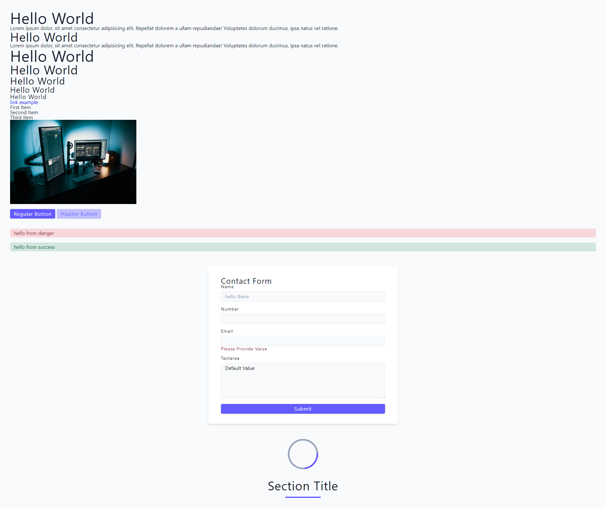
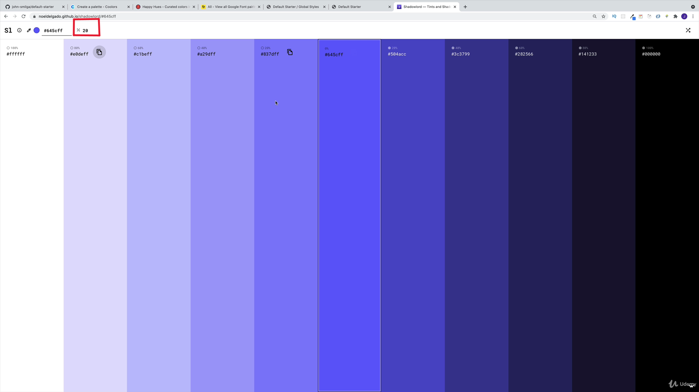
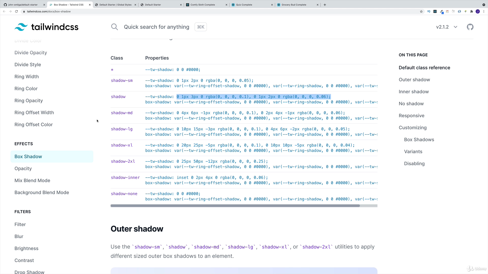

| index                                    | index                         |
| ---------------------------------------- | ----------------------------- |
| 384. [Intro](#384)                       | 394. [Happy Hues](#394)       |
| 385. [Resources](#385)                   | 395. [Rest of the Vars](#395) |
| 386. [Structure](#386)                   | 396. [Image](#396)            |
| 387. [Html](#387)                        | 397. [Buttons](#397)          |
| 388. [Normalize](#388)                   | 398. [Alerts](#398)           |
| 389. [Fonts](#389)                       | 399. [Form Setup](#399)       |
| 390. [Fonts - Overview and Tweaks](#390) | 400. [Form CSS](#400)         |
| 391. [Colors - General Setup](#391)      | 401. [Loading](#401)          |
| 392. [Primary Shades](#392)              | 402. [Title](#402)            |
| 393. [Gray Shades](#393)                 | 403. [Extra](#403)            |

### 384. Intro<a id="384"></a>

> **_Business Objective: Layout_**



<br>

### 385. Resources<a id="385"></a>

<br>

### 386. Structure<a id="386"></a>

- create index.html, main.css

In index.html

```html
<!DOCTYPE html>
<html lang="en">
  <head>
    <meta charset="UTF-8" />
    <meta http-equiv="X-UA-Compatible" content="IE=edge" />
    <meta name="viewport" content="width=device-width, initial-scale=1.0" />
    <title>Default Starter</title>
    <!-- main css -->
    <link rel="stylesheet" href="./main.css" />
  </head>
  <body>
    <h1>hello world</h1>
  </body>
</html>
```

---

In main.css

```css
body {
  /* top&bottom and left&right */
  padding: 2rem 5rem;
  /* for testing then remove it */
  background: red;
}
```

<br>

### 387. Html<a id="387"></a>

> **_Business Objective: Layout_**


In index.html

```html
<!DOCTYPE html>
<html lang="en">
  <head>
    <meta charset="UTF-8" />
    <meta http-equiv="X-UA-Compatible" content="IE=edge" />
    <meta name="viewport" content="width=device-width, initial-scale=1.0" />
    <title>Default Starter</title>
    <!-- main css -->
    <link rel="stylesheet" href="./main.css" />
  </head>
  <body>
    <h1>hello world</h1>
    <p>
      Lorem ipsum dolor, sit amet consectetur adipisicing elit. Repellat dolorem
      a ullam repudiandae! Voluptates dolorum ducimus, ipsa natus vel ratione.
    </p>

    <h2>hello world</h2>
    <p>
      Lorem ipsum dolor, sit amet consectetur adipisicing elit. Repellat dolorem
      a ullam repudiandae! Voluptates dolorum ducimus, ipsa natus vel ratione.
    </p>

    <h1>hello world</h1>
    <h2>hello world</h2>
    <h3>hello world</h3>
    <h4>hello world</h4>
    <h5>hello world</h5>

    <a href="#">link example</a>

    <ul>
      <li>First Item</li>
      <li>Second Item</li>
      <li>Third Item</li>
    </ul>
  </body>
</html>
```

---

In main.css

```css
body {
  /* top&bottom and left&right */
  padding: 2rem 5rem;
}
```

<br>

### 388. Normalize<a id="388"></a>

## Normalize

Small CSS file that provides cross-browser consistency in the default styling of HTML elements.

Alternative/Fancier way of doing this

```css
* {
  margin: 0;
  padding: 0;
  box-sizing: border-box;
}
```

- Go to [Docs ](https://necolas.github.io/normalize.css/)
- Select the latest version
- Create normalize.css
- Setup the link in the html

```html
<link rel="stylesheet" href="./normalize.css" />
```

---

> NOTE: Always add normalize css code before main.css or style.css

- create a new file normalize.css

In normalize.css, copy code from jhon notes

```css
/*! normalize.css v8.0.1 | MIT License | github.com/necolas/normalize.css */

/* Document
   ========================================================================== */

/**
 * 1. Correct the line height in all browsers.
 * 2. Prevent adjustments of font size after orientation changes in iOS.
 */

html {
  line-height: 1.15; /* 1 */
  -webkit-text-size-adjust: 100%; /* 2 */
}

/* Sections
   ========================================================================== */

/**
 * Remove the margin in all browsers.
 */

body {
  margin: 0;
}

/**
 * Render the `main` element consistently in IE.
 */

main {
  display: block;
}

/**
 * Correct the font size and margin on `h1` elements within `section` and
 * `article` contexts in Chrome, Firefox, and Safari.
 */

h1 {
  font-size: 2em;
  margin: 0.67em 0;
}

/* Grouping content
   ========================================================================== */

/**
 * 1. Add the correct box sizing in Firefox.
 * 2. Show the overflow in Edge and IE.
 */

hr {
  box-sizing: content-box; /* 1 */
  height: 0; /* 1 */
  overflow: visible; /* 2 */
}

/**
 * 1. Correct the inheritance and scaling of font size in all browsers.
 * 2. Correct the odd `em` font sizing in all browsers.
 */

pre {
  font-family: monospace, monospace; /* 1 */
  font-size: 1em; /* 2 */
}

/* Text-level semantics
   ========================================================================== */

/**
 * Remove the gray background on active links in IE 10.
 */

a {
  background-color: transparent;
}

/**
 * 1. Remove the bottom border in Chrome 57-
 * 2. Add the correct text decoration in Chrome, Edge, IE, Opera, and Safari.
 */

abbr[title] {
  border-bottom: none; /* 1 */
  text-decoration: underline; /* 2 */
  text-decoration: underline dotted; /* 2 */
}

/**
 * Add the correct font weight in Chrome, Edge, and Safari.
 */

b,
strong {
  font-weight: bolder;
}

/**
 * 1. Correct the inheritance and scaling of font size in all browsers.
 * 2. Correct the odd `em` font sizing in all browsers.
 */

code,
kbd,
samp {
  font-family: monospace, monospace; /* 1 */
  font-size: 1em; /* 2 */
}

/**
 * Add the correct font size in all browsers.
 */

small {
  font-size: 80%;
}

/**
 * Prevent `sub` and `sup` elements from affecting the line height in
 * all browsers.
 */

sub,
sup {
  font-size: 75%;
  line-height: 0;
  position: relative;
  vertical-align: baseline;
}

sub {
  bottom: -0.25em;
}

sup {
  top: -0.5em;
}

/* Embedded content
   ========================================================================== */

/**
 * Remove the border on images inside links in IE 10.
 */

img {
  border-style: none;
}

/* Forms
   ========================================================================== */

/**
 * 1. Change the font styles in all browsers.
 * 2. Remove the margin in Firefox and Safari.
 */

button,
input,
optgroup,
select,
textarea {
  font-family: inherit; /* 1 */
  font-size: 100%; /* 1 */
  line-height: 1.15; /* 1 */
  margin: 0; /* 2 */
}

/**
 * Show the overflow in IE.
 * 1. Show the overflow in Edge.
 */

button,
input {
  /* 1 */
  overflow: visible;
}

/**
 * Remove the inheritance of text transform in Edge, Firefox, and IE.
 * 1. Remove the inheritance of text transform in Firefox.
 */

button,
select {
  /* 1 */
  text-transform: none;
}

/**
 * Correct the inability to style clickable types in iOS and Safari.
 */

button,
[type="button"],
[type="reset"],
[type="submit"] {
  -webkit-appearance: button;
}

/**
 * Remove the inner border and padding in Firefox.
 */

button::-moz-focus-inner,
[type="button"]::-moz-focus-inner,
[type="reset"]::-moz-focus-inner,
[type="submit"]::-moz-focus-inner {
  border-style: none;
  padding: 0;
}

/**
 * Restore the focus styles unset by the previous rule.
 */

button:-moz-focusring,
[type="button"]:-moz-focusring,
[type="reset"]:-moz-focusring,
[type="submit"]:-moz-focusring {
  outline: 1px dotted ButtonText;
}

/**
 * Correct the padding in Firefox.
 */

fieldset {
  padding: 0.35em 0.75em 0.625em;
}

/**
 * 1. Correct the text wrapping in Edge and IE.
 * 2. Correct the color inheritance from `fieldset` elements in IE.
 * 3. Remove the padding so developers are not caught out when they zero out
 *    `fieldset` elements in all browsers.
 */

legend {
  box-sizing: border-box; /* 1 */
  color: inherit; /* 2 */
  display: table; /* 1 */
  max-width: 100%; /* 1 */
  padding: 0; /* 3 */
  white-space: normal; /* 1 */
}

/**
 * Add the correct vertical alignment in Chrome, Firefox, and Opera.
 */

progress {
  vertical-align: baseline;
}

/**
 * Remove the default vertical scrollbar in IE 10+.
 */

textarea {
  overflow: auto;
}

/**
 * 1. Add the correct box sizing in IE 10.
 * 2. Remove the padding in IE 10.
 */

[type="checkbox"],
[type="radio"] {
  box-sizing: border-box; /* 1 */
  padding: 0; /* 2 */
}

/**
 * Correct the cursor style of increment and decrement buttons in Chrome.
 */

[type="number"]::-webkit-inner-spin-button,
[type="number"]::-webkit-outer-spin-button {
  height: auto;
}

/**
 * 1. Correct the odd appearance in Chrome and Safari.
 * 2. Correct the outline style in Safari.
 */

[type="search"] {
  -webkit-appearance: textfield; /* 1 */
  outline-offset: -2px; /* 2 */
}

/**
 * Remove the inner padding in Chrome and Safari on macOS.
 */

[type="search"]::-webkit-search-decoration {
  -webkit-appearance: none;
}

/**
 * 1. Correct the inability to style clickable types in iOS and Safari.
 * 2. Change font properties to `inherit` in Safari.
 */

::-webkit-file-upload-button {
  -webkit-appearance: button; /* 1 */
  font: inherit; /* 2 */
}

/* Interactive
   ========================================================================== */

/*
 * Add the correct display in Edge, IE 10+, and Firefox.
 */

details {
  display: block;
}

/*
 * Add the correct display in all browsers.
 */

summary {
  display: list-item;
}

/* Misc
   ========================================================================== */

/**
 * Add the correct display in IE 10+.
 */

template {
  display: none;
}

/**
 * Add the correct display in IE 10.
 */

[hidden] {
  display: none;
}
```

---

In index.html, add normalize css before main.css

```html
<!DOCTYPE html>
<html lang="en">
  <head>
    <meta charset="UTF-8" />
    <meta http-equiv="X-UA-Compatible" content="IE=edge" />
    <meta name="viewport" content="width=device-width, initial-scale=1.0" />
    <title>Default Starter</title>
    <!-- 🟢 normalize -->
    <link rel="stylesheet" href="./normalize.css" />
    <!-- main css -->
    <link rel="stylesheet" href="./main.css" />
  </head>
  <body>
    <h1>hello world</h1>
    <p>
      Lorem ipsum dolor, sit amet consectetur adipisicing elit. Repellat dolorem
      a ullam repudiandae! Voluptates dolorum ducimus, ipsa natus vel ratione.
    </p>

    <h2>hello world</h2>
    <p>
      Lorem ipsum dolor, sit amet consectetur adipisicing elit. Repellat dolorem
      a ullam repudiandae! Voluptates dolorum ducimus, ipsa natus vel ratione.
    </p>

    <h1>hello world</h1>
    <h2>hello world</h2>
    <h3>hello world</h3>
    <h4>hello world</h4>
    <h5>hello world</h5>

    <a href="#">link example</a>

    <ul>
      <li>First Item</li>
      <li>Second Item</li>
      <li>Third Item</li>
    </ul>
  </body>
</html>
```

<br>

### 389. Fonts<a id="389"></a>

#### Select Fonts

- [fontpair](https://www.fontpair.co/)
- [pagecloud](https://www.pagecloud.com/blog/best-google-fonts-pairings)

#### Grab the CSS

- [typescale](https://type-scale.com/)

Make some adjustments

---

- go to [typescale](https://type-scale.com/) click "Grab the css", copy all and paste in main.css

In main.css

```css
@import url("https://fonts.googleapis.com/css?family=Poppins:400");

html {
  font-size: 100%;
} /*16px*/

body {
  background: white;
  font-family: "Poppins", sans-serif;
  font-weight: 400;
  line-height: 1.75;
  color: #000000;
}

p {
  margin-bottom: 1rem;
}

h1,
h2,
h3,
h4,
h5 {
  /* top left&right bottom */
  margin: 3rem 0 1.38rem;
  font-family: "Poppins", sans-serif;
  font-weight: 400;
  line-height: 1.3;
}

h1 {
  margin-top: 0;
  font-size: 3.052rem;
}

h2 {
  font-size: 2.441rem;
}

h3 {
  font-size: 1.953rem;
}

h4 {
  font-size: 1.563rem;
}

h5 {
  font-size: 1.25rem;
}

small,
.text_small {
  font-size: 0.8rem;
}
```

<br>

### 390. Fonts - Overview and Tweaks<a id="390"></a>

> **_Business Objective: Layout_**


In main.css

```css
/* 12. select all element  */
*,
::after,
::before {
  box-sizing: border-box;
}

@import url("https://fonts.googleapis.com/css?family=Poppins:400");

html {
  font-size: 100%;
} /*16px*/

:root {
  /* 1. heading fonts  */
  --headingFont: "Roboto", sans-serif;
  /* 3.body font */
  --bodyFont: "Nunito", sans-serif;
  /* 5. for form alert */
  --small-text: 0.875rem;
  --extra-small-text: 0.7em;
}

body {
  background: white;
  /* 4. using variable */
  font-family: var(--bodyFont);
  font-weight: 400;
  line-height: 1.75;
  color: #000000;
}

p {
  /* 7. paragraph bottom margin  */
  margin-bottom: 1.5rem;
  /* 8. limiting paragraph width for readability */
  max-width: 40em;
}

h1,
h2,
h3,
h4,
h5 {
  /* 9. removing heading top margin */
  margin: 0;
  /* 10. setting heading bottom margin */
  margin-bottom: 1.38rem;
  /* 2. using variable */
  font-family: var(--headingFont);
  font-weight: 400;
  line-height: 1.3;
  /* 11. capitalize first letter  */
  text-transform: capitalize;
}

h1 {
  margin-top: 0;
  font-size: 3.052rem;
}

h2 {
  font-size: 2.441rem;
}

h3 {
  font-size: 1.953rem;
}

h4 {
  font-size: 1.563rem;
}

h5 {
  font-size: 1.25rem;
}

small,
.text_small {
  /* 6 using variable */
  font-size: var(--small-text);
}

/* 13. remove underline */
a {
  text-decoration: none;
}

/* 14. remove bullet point */
ul {
  list-style-type: none;
  padding: 0;
}
```

<br>

### 391. Colors - General Setup<a id="391"></a>

#### Colors

In main.css

```css
:root {
  /* primary */
  /* grey */
  --black: #222;
  --white: #fff;
  --red-light: #f8d7da;
  --red-dark: #842029;
  --green-light: #d1e7dd;
  --green-dark: #0f5132;
}
```

In main.css, copy color from john notes

```css
*,
::after,
::before {
  box-sizing: border-box;
}

@import url("https://fonts.googleapis.com/css?family=Poppins:400");

html {
  font-size: 100%;
} /*16px*/

:root {
  /* 1. setup color */
  /* primary */
  /* grey */
  --black: #222;
  --white: #fff;
  --red-light: #f8d7da;
  --red-dark: #842029;
  --green-light: #d1e7dd;
  --green-dark: #0f5132;

  /* fonts */
  --headingFont: "Roboto", sans-serif;
  --bodyFont: "Nunito", sans-serif;
  --small-text: 0.875rem;
  --extra-small-text: 0.7em;

  /* rest of the vars */
}

body {
  background: white;
  font-family: var(--bodyFont);
  font-weight: 400;
  line-height: 1.75;
  color: #000000;
}

p {
  margin-bottom: 1.5rem;
  max-width: 40em;
}

h1,
h2,
h3,
h4,
h5 {
  margin: 0;
  margin-bottom: 1.38rem;
  font-family: var(--headingFont);
  font-weight: 400;
  line-height: 1.3;
  text-transform: capitalize;
}

h1 {
  margin-top: 0;
  font-size: 3.052rem;
}

h2 {
  font-size: 2.441rem;
}

h3 {
  font-size: 1.953rem;
}

h4 {
  font-size: 1.563rem;
}

h5 {
  font-size: 1.25rem;
}

small,
.text_small {
  font-size: var(--small-text);
}

a {
  text-decoration: none;
}

ul {
  list-style-type: none;
  padding: 0;
}
```

<br>

### 392. Primary Shades<a id="392"></a>

> **_Business Objective: Layout_**



---

- Go to site [coolors](https://coolors.co/) select any color which will act as primary color copy the hex value
- Go to the site [shadowlord](https://noeldelgado.github.io/shadowlord/#73fdad) and paste primary color to generate 10 shades set 20%

In main.css, set up primary color shade in following structure

```css
*,
::after,
::before {
  box-sizing: border-box;
}

@import url("https://fonts.googleapis.com/css?family=Poppins:400");

html {
  font-size: 100%;
} /*16px*/

:root {
  /* primary */
  /* 1. colors */
  --primary-100: #e2e0ff;
  --primary-200: #c1beff;
  --primary-300: #a29dff;
  --primary-400: #837dff;
  --primary-500: #645cff;
  --primary-600: #504acc;
  --primary-700: #3c3799;
  --primary-800: #282566;
  --primary-900: #141233;

  /* grey */
  --black: #222;
  --white: #fff;
  --red-light: #f8d7da;
  --red-dark: #842029;
  --green-light: #d1e7dd;
  --green-dark: #0f5132;

  /* fonts */
  --headingFont: "Roboto", sans-serif;
  --bodyFont: "Nunito", sans-serif;
  --small-text: 0.875rem;
  --extra-small-text: 0.7em;

  /* rest of the vars */
}

body {
  background: white;
  font-family: var(--bodyFont);
  font-weight: 400;
  line-height: 1.75;
  color: #000000;
}

p {
  margin-bottom: 1.5rem;
  max-width: 40em;
}

h1,
h2,
h3,
h4,
h5 {
  margin: 0;
  margin-bottom: 1.38rem;
  font-family: var(--headingFont);
  font-weight: 400;
  line-height: 1.3;
  text-transform: capitalize;
}

h1 {
  margin-top: 0;
  font-size: 3.052rem;
}

h2 {
  font-size: 2.441rem;
}

h3 {
  font-size: 1.953rem;
}

h4 {
  font-size: 1.563rem;
}

h5 {
  font-size: 1.25rem;
}

small,
.text_small {
  font-size: var(--small-text);
}

a {
  text-decoration: none;
}

ul {
  list-style-type: none;
  padding: 0;
}
```

<br>

### 393. Gray Shades<a id="393"></a>

Library/Faster Approach

- [bootstrap](https://getbootstrap.com/docs/5.0/customize/color/#color-sass-maps)
- [tailwind](https://tailwindcss.com/docs/customizing-colors#color-palette-reference)

##### Select Grey

- [tailwind](https://tailwindcss.com/docs/customizing-colors#color-palette-reference)

In main.css

```css
*,
::after,
::before {
  box-sizing: border-box;
}

@import url("https://fonts.googleapis.com/css?family=Poppins:400");

html {
  font-size: 100%;
} /*16px*/

:root {
  /* primary */
  /* colors */
  --primary-100: #e2e0ff;
  --primary-200: #c1beff;
  --primary-300: #a29dff;
  --primary-400: #837dff;
  --primary-500: #645cff;
  --primary-600: #504acc;
  --primary-700: #3c3799;
  --primary-800: #282566;
  --primary-900: #141233;

  /* 1. grey */
  --grey-50: #f8fafc;
  --grey-100: #f1f5f9;
  --grey-200: #e2e8f0;
  --grey-300: #cbd5e1;
  --grey-400: #94a3b8;
  --grey-500: #64748b;
  --grey-600: #475569;
  --grey-700: #334155;
  --grey-800: #1e293b;
  --grey-900: #0f172a;

  --black: #222;
  --white: #fff;
  --red-light: #f8d7da;
  --red-dark: #842029;
  --green-light: #d1e7dd;
  --green-dark: #0f5132;

  /* fonts */
  --headingFont: "Roboto", sans-serif;
  --bodyFont: "Nunito", sans-serif;
  --small-text: 0.875rem;
  --extra-small-text: 0.7em;

  /* rest of the vars: setup overall app theme*/
  /* 2 background color  */
  --backgroundColor: var(--grey-50);
  /* 4 text color */
  --textColor: var(--grey-900);
}

body {
  /* 3 */
  background: var(--backgroundColor);
  font-family: var(--bodyFont);
  font-weight: 400;
  line-height: 1.75;
  /* 5 */
  color: var(--textColor);
}

p {
  margin-bottom: 1.5rem;
  max-width: 40em;
}

h1,
h2,
h3,
h4,
h5 {
  margin: 0;
  margin-bottom: 1.38rem;
  font-family: var(--headingFont);
  font-weight: 400;
  line-height: 1.3;
  text-transform: capitalize;
}

h1 {
  margin-top: 0;
  font-size: 3.052rem;
}

h2 {
  font-size: 2.441rem;
}

h3 {
  font-size: 1.953rem;
}

h4 {
  font-size: 1.563rem;
}

h5 {
  font-size: 1.25rem;
}

small,
.text_small {
  font-size: var(--small-text);
}

a {
  text-decoration: none;
}

ul {
  list-style-type: none;
  padding: 0;
}
```

<br>

### 394. Happy Hues<a id="394"></a>

- Go to [happyheus](https://www.happyhues.co/) for smaller project this site give information on where to use which color
- when I'm working on project where I Don't need shades

<br>

### 395. Rest of the Vars<a id="395"></a>

In main.css, writing rest of the vars for App Theme

```css
*,
::after,
::before {
  box-sizing: border-box;
}

@import url("https://fonts.googleapis.com/css?family=Poppins:400");

html {
  font-size: 100%;
} /*16px*/

:root {
  /* primary */
  /* colors */
  --primary-100: #e2e0ff;
  --primary-200: #c1beff;
  --primary-300: #a29dff;
  --primary-400: #837dff;
  --primary-500: #645cff;
  --primary-600: #504acc;
  --primary-700: #3c3799;
  --primary-800: #282566;
  --primary-900: #141233;

  /*  grey */
  --grey-50: #f8fafc;
  --grey-100: #f1f5f9;
  --grey-200: #e2e8f0;
  --grey-300: #cbd5e1;
  --grey-400: #94a3b8;
  --grey-500: #64748b;
  --grey-600: #475569;
  --grey-700: #334155;
  --grey-800: #1e293b;
  --grey-900: #0f172a;

  --black: #222;
  --white: #fff;
  --red-light: #f8d7da;
  --red-dark: #842029;
  --green-light: #d1e7dd;
  --green-dark: #0f5132;

  /* fonts */
  --headingFont: "Roboto", sans-serif;
  --bodyFont: "Nunito", sans-serif;
  --small-text: 0.875rem;
  --extra-small-text: 0.7em;

  /* App THEME: rest of the vars */
  --backgroundColor: var(--grey-50);
  --textColor: var(--grey-900);
  /* 1. image   */
  --borderRadius: 0.25rem;
  /* 2.  */
  --letterSpacing: 1px;
  /* 3 hovering effect*/
  --transition: 0.3s ease-in-out all;
  /* 4 parent container max width */
  --max-width: 1120px;
  /* 5 form fixed width on big screen so it may look bigger*/
  --fixed-width: 600px;

  /* 6 box shadow from tail wind library*/
  --shadow-1: 0 1px 3px 0 rgba(0, 0, 0, 0.1), 0 1px 2px 0 rgba(0, 0, 0, 0.06);
  --shadow-2: 0 4px 6px -1px rgba(0, 0, 0, 0.1), 0 2px 4px -1px rgba(0, 0, 0, 0.06);
  --shadow-3: 0 10px 15px -3px rgba(0, 0, 0, 0.1), 0 4px 6px -2px rgba(0, 0, 0, 0.05);
  --shadow-4: 0 20px 25px -5px rgba(0, 0, 0, 0.1), 0 10px 10px -5px rgba(0, 0, 0, 0.04);
}

body {
  background: var(--backgroundColor);
  font-family: var(--bodyFont);
  font-weight: 400;
  line-height: 1.75;

  color: var(--textColor);
}

p {
  margin-bottom: 1.5rem;
  max-width: 40em;
}

h1,
h2,
h3,
h4,
h5 {
  margin: 0;
  margin-bottom: 1.38rem;
  font-family: var(--headingFont);
  font-weight: 400;
  line-height: 1.3;
  text-transform: capitalize;
}

h1 {
  margin-top: 0;
  font-size: 3.052rem;
}

h2 {
  font-size: 2.441rem;
}

h3 {
  font-size: 1.953rem;
}

h4 {
  font-size: 1.563rem;
}

h5 {
  font-size: 1.25rem;
}

small,
.text_small {
  font-size: var(--small-text);
}

a {
  text-decoration: none;
}

ul {
  list-style-type: none;
  padding: 0;
}
```

---

How to extract shadow from tailwind library and structure it ref step 6


<br>

### 396. Image<a id="396"></a>

- Download any image from google and place it in project

- In index.html, add image tag

```html
<!DOCTYPE html>
<html lang="en">
  <head>
    <meta charset="UTF-8" />
    <meta http-equiv="X-UA-Compatible" content="IE=edge" />
    <meta name="viewport" content="width=device-width, initial-scale=1.0" />
    <title>Default Starter</title>
    <!-- normalize -->
    <link rel="stylesheet" href="./normalize.css" />
    <!-- main css -->
    <link rel="stylesheet" href="./main.css" />
  </head>
  <body>
    <h1>hello world</h1>
    <p>
      Lorem ipsum dolor, sit amet consectetur adipisicing elit. Repellat dolorem
      a ullam repudiandae! Voluptates dolorum ducimus, ipsa natus vel ratione.
    </p>

    <h2>hello world</h2>
    <p>
      Lorem ipsum dolor, sit amet consectetur adipisicing elit. Repellat dolorem
      a ullam repudiandae! Voluptates dolorum ducimus, ipsa natus vel ratione.
    </p>

    <h1>hello world</h1>
    <h2>hello world</h2>
    <h3>hello world</h3>
    <h4>hello world</h4>
    <h5>hello world</h5>

    <a href="#">link example</a>

    <ul>
      <li>First Item</li>
      <li>Second Item</li>
      <li>Third Item</li>
    </ul>
    <!-- 1 -->
    <div class="container">
      
    </div>
  </body>
</html>
```

---

In main.css

```css
*,
::after,
::before {
  box-sizing: border-box;
}

@import url("https://fonts.googleapis.com/css?family=Poppins:400");

html {
  font-size: 100%;
} /*16px*/

:root {
  /* primary */
  /* colors */
  --primary-100: #e2e0ff;
  --primary-200: #c1beff;
  --primary-300: #a29dff;
  --primary-400: #837dff;
  --primary-500: #645cff;
  --primary-600: #504acc;
  --primary-700: #3c3799;
  --primary-800: #282566;
  --primary-900: #141233;

  /*  grey */
  --grey-50: #f8fafc;
  --grey-100: #f1f5f9;
  --grey-200: #e2e8f0;
  --grey-300: #cbd5e1;
  --grey-400: #94a3b8;
  --grey-500: #64748b;
  --grey-600: #475569;
  --grey-700: #334155;
  --grey-800: #1e293b;
  --grey-900: #0f172a;

  --black: #222;
  --white: #fff;
  --red-light: #f8d7da;
  --red-dark: #842029;
  --green-light: #d1e7dd;
  --green-dark: #0f5132;

  /* fonts */
  --headingFont: "Roboto", sans-serif;
  --bodyFont: "Nunito", sans-serif;
  --small-text: 0.875rem;
  --extra-small-text: 0.7em;

  /* App THEME: rest of the vars */
  --backgroundColor: var(--grey-50);
  --textColor: var(--grey-900);
  /* 1. image   */
  --borderRadius: 0.25rem;
  /* 2.  */
  --letterSpacing: 1px;
  /* 3 hovering effect*/
  --transition: 0.3s ease-in-out all;
  /* 4 parent container max width */
  --max-width: 1120px;
  /* 5 form fixed width on big screen so it may look bigger*/
  --fixed-width: 600px;

  /* 6 box shadow from tail wind library*/
  --shadow-1: 0 1px 3px 0 rgba(0, 0, 0, 0.1), 0 1px 2px 0 rgba(0, 0, 0, 0.06);
  --shadow-2: 0 4px 6px -1px rgba(0, 0, 0, 0.1), 0 2px 4px -1px rgba(0, 0, 0, 0.06);
  --shadow-3: 0 10px 15px -3px rgba(0, 0, 0, 0.1), 0 4px 6px -2px rgba(0, 0, 0, 0.05);
  --shadow-4: 0 20px 25px -5px rgba(0, 0, 0, 0.1), 0 10px 10px -5px rgba(0, 0, 0, 0.04);
}

body {
  background: var(--backgroundColor);
  font-family: var(--bodyFont);
  font-weight: 400;
  line-height: 1.75;

  color: var(--textColor);
}

p {
  margin-bottom: 1.5rem;
  max-width: 40em;
}

h1,
h2,
h3,
h4,
h5 {
  margin: 0;
  margin-bottom: 1.38rem;
  font-family: var(--headingFont);
  font-weight: 400;
  line-height: 1.3;
  text-transform: capitalize;
}

h1 {
  margin-top: 0;
  font-size: 3.052rem;
}

h2 {
  font-size: 2.441rem;
}

h3 {
  font-size: 1.953rem;
}

h4 {
  font-size: 1.563rem;
}

h5 {
  font-size: 1.25rem;
}

small,
.text_small {
  font-size: var(--small-text);
}

a {
  text-decoration: none;
}

ul {
  list-style-type: none;
  padding: 0;
}

.container {
  width: 50vw;
  border: 5px, solid var(--primary-500);
  border-radius: var(--borderRadius);
  max-width: var(--var-width);
}

/* 2  */
.img {
  /* the width will depend on parent */
  width: 100%;
  /* image by default are inline to override set it block level */
  display: block;
  /* to keep aspect ratio, don't put height prop it will distort image */
  object-fit: cover;
}
```

<br>

### 397. Buttons<a id="397"></a>

In index.html

```html
<!DOCTYPE html>
<html lang="en">
  <head>
    <meta charset="UTF-8" />
    <meta http-equiv="X-UA-Compatible" content="IE=edge" />
    <meta name="viewport" content="width=device-width, initial-scale=1.0" />
    <title>Default Starter</title>
    <!-- normalize -->
    <link rel="stylesheet" href="./normalize.css" />
    <!-- main css -->
    <link rel="stylesheet" href="./main.css" />
  </head>
  <body>
    <h1>hello world</h1>
    <p>
      Lorem ipsum dolor, sit amet consectetur adipisicing elit. Repellat dolorem
      a ullam repudiandae! Voluptates dolorum ducimus, ipsa natus vel ratione.
    </p>

    <h2>hello world</h2>
    <p>
      Lorem ipsum dolor, sit amet consectetur adipisicing elit. Repellat dolorem
      a ullam repudiandae! Voluptates dolorum ducimus, ipsa natus vel ratione.
    </p>

    <h1>hello world</h1>
    <h2>hello world</h2>
    <h3>hello world</h3>
    <h4>hello world</h4>
    <h5>hello world</h5>

    <a href="#">link example</a>

    <ul>
      <li>First Item</li>
      <li>Second Item</li>
      <li>Third Item</li>
    </ul>

    <div class="container">
      
    </div>

    <br />
    <!-- 1 -->
    <button class="btn" type="button">regular button</button>
    <button class="btn btn-hipster" type="button">hipster button</button>
    <br />
    <br />
    <br />
  </body>
</html>
```

---

In main.css

```css
*,
::after,
::before {
  box-sizing: border-box;
}

@import url("https://fonts.googleapis.com/css?family=Poppins:400");

html {
  font-size: 100%;
} /*16px*/

:root {
  /* primary */
  /* colors */
  --primary-100: #e2e0ff;
  --primary-200: #c1beff;
  --primary-300: #a29dff;
  --primary-400: #837dff;
  --primary-500: #645cff;
  --primary-600: #504acc;
  --primary-700: #3c3799;
  --primary-800: #282566;
  --primary-900: #141233;

  /*  grey */
  --grey-50: #f8fafc;
  --grey-100: #f1f5f9;
  --grey-200: #e2e8f0;
  --grey-300: #cbd5e1;
  --grey-400: #94a3b8;
  --grey-500: #64748b;
  --grey-600: #475569;
  --grey-700: #334155;
  --grey-800: #1e293b;
  --grey-900: #0f172a;

  --black: #222;
  --white: #fff;
  --red-light: #f8d7da;
  --red-dark: #842029;
  --green-light: #d1e7dd;
  --green-dark: #0f5132;

  /* fonts */
  --headingFont: "Roboto", sans-serif;
  --bodyFont: "Nunito", sans-serif;
  --small-text: 0.875rem;
  --extra-small-text: 0.7em;

  /* App THEME: rest of the vars */
  --backgroundColor: var(--grey-50);
  --textColor: var(--grey-900);
  /* 1. image   */
  --borderRadius: 0.25rem;
  /* 2.  */
  --letterSpacing: 1px;
  /* 3 hovering effect*/
  --transition: 0.3s ease-in-out all;
  /* 4 parent container max width */
  --max-width: 1120px;
  /* 5 form fixed width on big screen so it may look bigger*/
  --fixed-width: 600px;

  /* 6 box shadow from tail wind library*/
  --shadow-1: 0 1px 3px 0 rgba(0, 0, 0, 0.1), 0 1px 2px 0 rgba(0, 0, 0, 0.06);
  --shadow-2: 0 4px 6px -1px rgba(0, 0, 0, 0.1), 0 2px 4px -1px rgba(0, 0, 0, 0.06);
  --shadow-3: 0 10px 15px -3px rgba(0, 0, 0, 0.1), 0 4px 6px -2px rgba(0, 0, 0, 0.05);
  --shadow-4: 0 20px 25px -5px rgba(0, 0, 0, 0.1), 0 10px 10px -5px rgba(0, 0, 0, 0.04);
}

body {
  background: var(--backgroundColor);
  font-family: var(--bodyFont);
  font-weight: 400;
  line-height: 1.75;

  color: var(--textColor);
}

p {
  margin-bottom: 1.5rem;
  max-width: 40em;
}

h1,
h2,
h3,
h4,
h5 {
  margin: 0;
  margin-bottom: 1.38rem;
  font-family: var(--headingFont);
  font-weight: 400;
  line-height: 1.3;
  text-transform: capitalize;
}

h1 {
  margin-top: 0;
  font-size: 3.052rem;
}

h2 {
  font-size: 2.441rem;
}

h3 {
  font-size: 1.953rem;
}

h4 {
  font-size: 1.563rem;
}

h5 {
  font-size: 1.25rem;
}

small,
.text_small {
  font-size: var(--small-text);
}

a {
  text-decoration: none;
}

ul {
  list-style-type: none;
  padding: 0;
}

.container {
  width: 50vw;
  border: 5px, solid var(--primary-500);
  border-radius: var(--borderRadius);
  max-width: var(--var-width);
}

.img {
  /* the width will depend on parent */
  width: 100%;
  /* image by default are inline to override set it block level */
  display: block;
  /* to keep aspect ratio, don't put height prop it will distort image */
  object-fit: cover;
}

/* 2  */
.btn {
  cursor: pointer;
  color: var(--white);
  background: var(--primary-500);
  border: transparent;
  border-radius: var(--borderRadius);
  letter-spacing: var(--letterSpacing);
  padding: 0.375rem 0.75rem;
  box-shadow: var(--shadow-1);
  transition: var(--transition);
  text-transform: capitalize;
  display: inline-block;
}
.btn:hover {
  background: var(--primary-700);
  box-shadow: var(--shadow-3);
}

/* 3 */
.btn-hipster {
  color: var(--primary-500);
  background: var(--primary-200);
}
.btn-hipster:hover {
  color: var(--primary-200);
  background: var(--primary-700);
}

.btn-block {
  /* make button width same as form width */
  width: 100%;
}
```

<br>

### 398. Alerts<a id="398"></a>

In index.html, add alert

```html
<!DOCTYPE html>
<html lang="en">
  <head>
    <meta charset="UTF-8" />
    <meta http-equiv="X-UA-Compatible" content="IE=edge" />
    <meta name="viewport" content="width=device-width, initial-scale=1.0" />
    <title>Default Starter</title>
    <!-- normalize -->
    <link rel="stylesheet" href="./normalize.css" />
    <!-- main css -->
    <link rel="stylesheet" href="./main.css" />
  </head>
  <body>
    <h1>hello world</h1>
    <p>
      Lorem ipsum dolor, sit amet consectetur adipisicing elit. Repellat dolorem
      a ullam repudiandae! Voluptates dolorum ducimus, ipsa natus vel ratione.
    </p>

    <h2>hello world</h2>
    <p>
      Lorem ipsum dolor, sit amet consectetur adipisicing elit. Repellat dolorem
      a ullam repudiandae! Voluptates dolorum ducimus, ipsa natus vel ratione.
    </p>

    <h1>hello world</h1>
    <h2>hello world</h2>
    <h3>hello world</h3>
    <h4>hello world</h4>
    <h5>hello world</h5>

    <a href="#">link example</a>

    <ul>
      <li>First Item</li>
      <li>Second Item</li>
      <li>Third Item</li>
    </ul>

    <div class="container">
      
    </div>

    <br />

    <button class="btn" type="button">regular button</button>
    <button class="btn btn-hipster" type="button">hipster button</button>
    <br />
    <br />
    <br />

    <!-- 1 -->
    <div class="alert alert-danger">hello from danger</div>
    <div class="alert alert-success">hello from success</div>
  </body>
</html>
```

---

In main.css

```css
*,
::after,
::before {
  box-sizing: border-box;
}

@import url("https://fonts.googleapis.com/css?family=Poppins:400");

html {
  font-size: 100%;
} /*16px*/

:root {
  /* primary */
  /* colors */
  --primary-100: #e2e0ff;
  --primary-200: #c1beff;
  --primary-300: #a29dff;
  --primary-400: #837dff;
  --primary-500: #645cff;
  --primary-600: #504acc;
  --primary-700: #3c3799;
  --primary-800: #282566;
  --primary-900: #141233;

  /*  grey */
  --grey-50: #f8fafc;
  --grey-100: #f1f5f9;
  --grey-200: #e2e8f0;
  --grey-300: #cbd5e1;
  --grey-400: #94a3b8;
  --grey-500: #64748b;
  --grey-600: #475569;
  --grey-700: #334155;
  --grey-800: #1e293b;
  --grey-900: #0f172a;

  --black: #222;
  --white: #fff;
  --red-light: #f8d7da;
  --red-dark: #842029;
  --green-light: #d1e7dd;
  --green-dark: #0f5132;

  /* fonts */
  --headingFont: "Roboto", sans-serif;
  --bodyFont: "Nunito", sans-serif;
  --small-text: 0.875rem;
  --extra-small-text: 0.7em;

  /* App THEME: rest of the vars */
  --backgroundColor: var(--grey-50);
  --textColor: var(--grey-900);
  /* 1. image   */
  --borderRadius: 0.25rem;
  /* 2.  */
  --letterSpacing: 1px;
  /* 3 hovering effect*/
  --transition: 0.3s ease-in-out all;
  /* 4 parent container max width */
  --max-width: 1120px;
  /* 5 form fixed width on big screen so it may look bigger*/
  --fixed-width: 600px;

  /* 6 box shadow from tail wind library*/
  --shadow-1: 0 1px 3px 0 rgba(0, 0, 0, 0.1), 0 1px 2px 0 rgba(0, 0, 0, 0.06);
  --shadow-2: 0 4px 6px -1px rgba(0, 0, 0, 0.1), 0 2px 4px -1px rgba(0, 0, 0, 0.06);
  --shadow-3: 0 10px 15px -3px rgba(0, 0, 0, 0.1), 0 4px 6px -2px rgba(0, 0, 0, 0.05);
  --shadow-4: 0 20px 25px -5px rgba(0, 0, 0, 0.1), 0 10px 10px -5px rgba(0, 0, 0, 0.04);
}

body {
  background: var(--backgroundColor);
  font-family: var(--bodyFont);
  font-weight: 400;
  line-height: 1.75;

  color: var(--textColor);
}

p {
  margin-bottom: 1.5rem;
  max-width: 40em;
}

h1,
h2,
h3,
h4,
h5 {
  margin: 0;
  margin-bottom: 1.38rem;
  font-family: var(--headingFont);
  font-weight: 400;
  line-height: 1.3;
  text-transform: capitalize;
}

h1 {
  margin-top: 0;
  font-size: 3.052rem;
}

h2 {
  font-size: 2.441rem;
}

h3 {
  font-size: 1.953rem;
}

h4 {
  font-size: 1.563rem;
}

h5 {
  font-size: 1.25rem;
}

small,
.text_small {
  font-size: var(--small-text);
}

a {
  text-decoration: none;
}

ul {
  list-style-type: none;
  padding: 0;
}

.container {
  width: 50vw;
  border: 5px, solid var(--primary-500);
  border-radius: var(--borderRadius);
  max-width: var(--var-width);
}

.img {
  /* the width will depend on parent */
  width: 100%;
  /* image by default are inline to override set it block level */
  display: block;
  /* to keep aspect ratio, don't put height prop it will distort image */
  object-fit: cover;
}

.btn {
  cursor: pointer;
  color: var(--white);
  background: var(--primary-500);
  border: transparent;
  border-radius: var(--borderRadius);
  letter-spacing: var(--letterSpacing);
  padding: 0.375rem 0.75rem;
  box-shadow: var(--shadow-1);
  transition: var(--transition);
  text-transform: capitalize;
  display: inline-block;
}
.btn:hover {
  background: var(--primary-700);
  box-shadow: var(--shadow-3);
}

.btn-hipster {
  color: var(--primary-500);
  background: var(--primary-200);
}
.btn-hipster:hover {
  color: var(--primary-200);
  background: var(--primary-700);
}

.btn-block {
  /* make button width same as form width */
  width: 100%;
}

/* 2 alerts */
.alert {
  padding: 0.375rem 0.75rem;
  margin-bottom: 1rem;
  border-color: transparent;
  border-radius: var(--borderRadius);
}

/* 3 */
.alert-danger {
  color: var(--red-dark);
  background: var(--red-light);
}

/* 4 */
.alert-success {
  color: var(--green-dark);
  background: var(--green-light);
}
```

<br>

### 399. Form Setup<a id="399"></a>

In index.html, setup form

```html
<!DOCTYPE html>
<html lang="en">
  <head>
    <meta charset="UTF-8" />
    <meta http-equiv="X-UA-Compatible" content="IE=edge" />
    <meta name="viewport" content="width=device-width, initial-scale=1.0" />
    <title>Default Starter</title>
    <!-- normalize -->
    <link rel="stylesheet" href="./normalize.css" />
    <!-- main css -->
    <link rel="stylesheet" href="./main.css" />
  </head>
  <body>
    <h1>hello world</h1>
    <p>
      Lorem ipsum dolor, sit amet consectetur adipisicing elit. Repellat dolorem
      a ullam repudiandae! Voluptates dolorum ducimus, ipsa natus vel ratione.
    </p>

    <h2>hello world</h2>
    <p>
      Lorem ipsum dolor, sit amet consectetur adipisicing elit. Repellat dolorem
      a ullam repudiandae! Voluptates dolorum ducimus, ipsa natus vel ratione.
    </p>

    <h1>hello world</h1>
    <h2>hello world</h2>
    <h3>hello world</h3>
    <h4>hello world</h4>
    <h5>hello world</h5>

    <a href="#">link example</a>

    <ul>
      <li>First Item</li>
      <li>Second Item</li>
      <li>Third Item</li>
    </ul>

    <div class="container">
      
    </div>

    <br />

    <button class="btn" type="button">regular button</button>
    <button class="btn btn-hipster" type="button">hipster button</button>
    <br />
    <br />
    <br />

    <div class="alert alert-danger">hello from danger</div>
    <div class="alert alert-success">hello from success</div>

    <!-- 1 -->
    <form class="form">
      <h4>contact form</h4>

      <div class="form-row">
        <label for="name" class="form-label">Name</label>
        <input
          type="text"
          placeholder="hello there"
          id="name"
          class="form-input"
        />
      </div>

      <div class="form-row">
        <label for="number" class="form-label">Number</label>
        <input type="number" id="number" class="form-input" />
      </div>

      <div class="form-row">
        <label for="email" class="form-label">Email</label>
        <input type="email" id="email" class="form-input" />
        <small class="form-alert">please provide value</small>
      </div>

      <div class="form-row">
        <label for="textarea" class="form-label">Textarea</label>
        <textarea class="form-textarea">
Default Value
        </textarea>
      </div>

      <button type="submit" class="btn btn-block">submit</button>
    </form>
  </body>
</html>
```

<br>

### 400. Form CSS<a id="400"></a>

In main.css

```css
*,
::after,
::before {
  box-sizing: border-box;
}

@import url("https://fonts.googleapis.com/css?family=Poppins:400");

html {
  font-size: 100%;
} /*16px*/

:root {
  /* primary */
  /* colors */
  --primary-100: #e2e0ff;
  --primary-200: #c1beff;
  --primary-300: #a29dff;
  --primary-400: #837dff;
  --primary-500: #645cff;
  --primary-600: #504acc;
  --primary-700: #3c3799;
  --primary-800: #282566;
  --primary-900: #141233;

  /*  grey */
  --grey-50: #f8fafc;
  --grey-100: #f1f5f9;
  --grey-200: #e2e8f0;
  --grey-300: #cbd5e1;
  --grey-400: #94a3b8;
  --grey-500: #64748b;
  --grey-600: #475569;
  --grey-700: #334155;
  --grey-800: #1e293b;
  --grey-900: #0f172a;

  --black: #222;
  --white: #fff;
  --red-light: #f8d7da;
  --red-dark: #842029;
  --green-light: #d1e7dd;
  --green-dark: #0f5132;

  /* fonts */
  --headingFont: "Roboto", sans-serif;
  --bodyFont: "Nunito", sans-serif;
  --small-text: 0.875rem;
  --extra-small-text: 0.7em;

  /* App THEME: rest of the vars */
  --backgroundColor: var(--grey-50);
  --textColor: var(--grey-900);
  /* 1. image   */
  --borderRadius: 0.25rem;
  /* 2.  */
  --letterSpacing: 1px;
  /* 3 hovering effect*/
  --transition: 0.3s ease-in-out all;
  /* 4 parent container max width */
  --max-width: 1120px;
  /* 5 form fixed width on big screen so it may look bigger*/
  --fixed-width: 600px;

  /* 6 box shadow from tail wind library*/
  --shadow-1: 0 1px 3px 0 rgba(0, 0, 0, 0.1), 0 1px 2px 0 rgba(0, 0, 0, 0.06);
  --shadow-2: 0 4px 6px -1px rgba(0, 0, 0, 0.1), 0 2px 4px -1px rgba(0, 0, 0, 0.06);
  --shadow-3: 0 10px 15px -3px rgba(0, 0, 0, 0.1), 0 4px 6px -2px rgba(0, 0, 0, 0.05);
  --shadow-4: 0 20px 25px -5px rgba(0, 0, 0, 0.1), 0 10px 10px -5px rgba(0, 0, 0, 0.04);
}

body {
  background: var(--backgroundColor);
  font-family: var(--bodyFont);
  font-weight: 400;
  line-height: 1.75;

  color: var(--textColor);
}

p {
  margin-bottom: 1.5rem;
  max-width: 40em;
}

h1,
h2,
h3,
h4,
h5 {
  margin: 0;
  margin-bottom: 1.38rem;
  font-family: var(--headingFont);
  font-weight: 400;
  line-height: 1.3;
  text-transform: capitalize;
}

h1 {
  margin-top: 0;
  font-size: 3.052rem;
}

h2 {
  font-size: 2.441rem;
}

h3 {
  font-size: 1.953rem;
}

h4 {
  font-size: 1.563rem;
}

h5 {
  font-size: 1.25rem;
}

small,
.text_small {
  font-size: var(--small-text);
}

a {
  text-decoration: none;
}

ul {
  list-style-type: none;
  padding: 0;
}

.container {
  width: 50vw;
  border: 5px, solid var(--primary-500);
  border-radius: var(--borderRadius);
  max-width: var(--var-width);
}

.img {
  /* the width will depend on parent */
  width: 100%;
  /* image by default are inline to override set it block level */
  display: block;
  /* to keep aspect ratio, don't put height prop it will distort image */
  object-fit: cover;
}

.btn {
  cursor: pointer;
  color: var(--white);
  background: var(--primary-500);
  border: transparent;
  border-radius: var(--borderRadius);
  letter-spacing: var(--letterSpacing);
  padding: 0.375rem 0.75rem;
  box-shadow: var(--shadow-1);
  transition: var(--transition);
  text-transform: capitalize;
  display: inline-block;
}
.btn:hover {
  background: var(--primary-700);
  box-shadow: var(--shadow-3);
}

.btn-hipster {
  color: var(--primary-500);
  background: var(--primary-200);
}
.btn-hipster:hover {
  color: var(--primary-200);
  background: var(--primary-700);
}

.btn-block {
  /* make button width same as form width */
  width: 100%;
}

/*  alerts */
.alert {
  padding: 0.375rem 0.75rem;
  margin-bottom: 1rem;
  border-color: transparent;
  border-radius: var(--borderRadius);
}

.alert-danger {
  color: var(--red-dark);
  background: var(--red-light);
}

.alert-success {
  color: var(--green-dark);
  background: var(--green-light);
}

/* form */
.form {
  width: 90vw;
  max-width: var(--fixed-width);
  background: var(--white);
  border-radius: var(--borderRadius);
  box-shadow: var(--shadow-2);
  padding: 2rem 2.5rem;
  margin: 3rem auto;
}
.form-label {
  display: block;
  font-size: var(--small-text);
  margin-bottom: 0.5rem;
  text-transform: capitalize;
  letter-spacing: var(--letterSpacing);
}
.form-input,
.form-textarea {
  width: 100%;
  padding: 0.375rem 0.75rem;
  border-radius: var(--borderRadius);
  background: var(--backgroundColor);
  border: 1px solid var(--grey-200);
}

.form-row {
  margin-bottom: 1rem;
}

.form-textarea {
  height: 7rem;
}
::placeholder {
  font-family: inherit;
  color: var(--grey-400);
}
.form-alert {
  color: var(--red-dark);
  letter-spacing: var(--letterSpacing);
  text-transform: capitalize;
}
```

<br>

### 401. Loading<a id="401"></a>

In index.html

```html
<!DOCTYPE html>
<html lang="en">
  <head>
    <meta charset="UTF-8" />
    <meta http-equiv="X-UA-Compatible" content="IE=edge" />
    <meta name="viewport" content="width=device-width, initial-scale=1.0" />
    <title>Default Starter</title>
    <!-- normalize -->
    <link rel="stylesheet" href="./normalize.css" />
    <!-- main css -->
    <link rel="stylesheet" href="./main.css" />
  </head>
  <body>
    <h1>hello world</h1>
    <p>
      Lorem ipsum dolor, sit amet consectetur adipisicing elit. Repellat dolorem
      a ullam repudiandae! Voluptates dolorum ducimus, ipsa natus vel ratione.
    </p>

    <h2>hello world</h2>
    <p>
      Lorem ipsum dolor, sit amet consectetur adipisicing elit. Repellat dolorem
      a ullam repudiandae! Voluptates dolorum ducimus, ipsa natus vel ratione.
    </p>

    <h1>hello world</h1>
    <h2>hello world</h2>
    <h3>hello world</h3>
    <h4>hello world</h4>
    <h5>hello world</h5>

    <a href="#">link example</a>

    <ul>
      <li>First Item</li>
      <li>Second Item</li>
      <li>Third Item</li>
    </ul>

    <div class="container">
      
    </div>

    <br />

    <button class="btn" type="button">regular button</button>
    <button class="btn btn-hipster" type="button">hipster button</button>
    <br />
    <br />
    <br />

    <div class="alert alert-danger">hello from danger</div>
    <div class="alert alert-success">hello from success</div>

    <!-- 1 -->
    <form class="form">
      <h4>contact form</h4>

      <div class="form-row">
        <label for="name" class="form-label">Name</label>
        <input
          type="text"
          placeholder="hello there"
          id="name"
          class="form-input"
        />
      </div>

      <div class="form-row">
        <label for="number" class="form-label">Number</label>
        <input type="number" id="number" class="form-input" />
      </div>

      <div class="form-row">
        <label for="email" class="form-label">Email</label>
        <input type="email" id="email" class="form-input" />
        <small class="form-alert">please provide value</small>
      </div>

      <div class="form-row">
        <label for="textarea" class="form-label">Textarea</label>
        <textarea class="form-textarea">
Default Value
        </textarea>
      </div>

      <button type="submit" class="btn btn-block">submit</button>
    </form>
    <br />
    <!-- 1 -->
    <div class="loading"></div>
    <br />
  </body>
</html>
```

---

In main.css

```css
*,
::after,
::before {
  box-sizing: border-box;
}

@import url("https://fonts.googleapis.com/css?family=Poppins:400");

html {
  font-size: 100%;
} /*16px*/

:root {
  /* primary */
  /* colors */
  --primary-100: #e2e0ff;
  --primary-200: #c1beff;
  --primary-300: #a29dff;
  --primary-400: #837dff;
  --primary-500: #645cff;
  --primary-600: #504acc;
  --primary-700: #3c3799;
  --primary-800: #282566;
  --primary-900: #141233;

  /*  grey */
  --grey-50: #f8fafc;
  --grey-100: #f1f5f9;
  --grey-200: #e2e8f0;
  --grey-300: #cbd5e1;
  --grey-400: #94a3b8;
  --grey-500: #64748b;
  --grey-600: #475569;
  --grey-700: #334155;
  --grey-800: #1e293b;
  --grey-900: #0f172a;

  --black: #222;
  --white: #fff;
  --red-light: #f8d7da;
  --red-dark: #842029;
  --green-light: #d1e7dd;
  --green-dark: #0f5132;

  /* fonts */
  --headingFont: "Roboto", sans-serif;
  --bodyFont: "Nunito", sans-serif;
  --small-text: 0.875rem;
  --extra-small-text: 0.7em;

  /* App THEME: rest of the vars */
  --backgroundColor: var(--grey-50);
  --textColor: var(--grey-900);
  /* 1. image   */
  --borderRadius: 0.25rem;
  /* 2.  */
  --letterSpacing: 1px;
  /* 3 hovering effect*/
  --transition: 0.3s ease-in-out all;
  /* 4 parent container max width */
  --max-width: 1120px;
  /* 5 form fixed width on big screen so it may look bigger*/
  --fixed-width: 600px;

  /* 6 box shadow from tail wind library*/
  --shadow-1: 0 1px 3px 0 rgba(0, 0, 0, 0.1), 0 1px 2px 0 rgba(0, 0, 0, 0.06);
  --shadow-2: 0 4px 6px -1px rgba(0, 0, 0, 0.1), 0 2px 4px -1px rgba(0, 0, 0, 0.06);
  --shadow-3: 0 10px 15px -3px rgba(0, 0, 0, 0.1), 0 4px 6px -2px rgba(0, 0, 0, 0.05);
  --shadow-4: 0 20px 25px -5px rgba(0, 0, 0, 0.1), 0 10px 10px -5px rgba(0, 0, 0, 0.04);
}

body {
  background: var(--backgroundColor);
  font-family: var(--bodyFont);
  font-weight: 400;
  line-height: 1.75;

  color: var(--textColor);
}

p {
  margin-bottom: 1.5rem;
  max-width: 40em;
}

h1,
h2,
h3,
h4,
h5 {
  margin: 0;
  margin-bottom: 1.38rem;
  font-family: var(--headingFont);
  font-weight: 400;
  line-height: 1.3;
  text-transform: capitalize;
}

h1 {
  margin-top: 0;
  font-size: 3.052rem;
}

h2 {
  font-size: 2.441rem;
}

h3 {
  font-size: 1.953rem;
}

h4 {
  font-size: 1.563rem;
}

h5 {
  font-size: 1.25rem;
}

small,
.text_small {
  font-size: var(--small-text);
}

a {
  text-decoration: none;
}

ul {
  list-style-type: none;
  padding: 0;
}

.container {
  width: 50vw;
  border: 5px, solid var(--primary-500);
  border-radius: var(--borderRadius);
  max-width: var(--var-width);
}

.img {
  /* the width will depend on parent */
  width: 100%;
  /* image by default are inline to override set it block level */
  display: block;
  /* to keep aspect ratio, don't put height prop it will distort image */
  object-fit: cover;
}

.btn {
  cursor: pointer;
  color: var(--white);
  background: var(--primary-500);
  border: transparent;
  border-radius: var(--borderRadius);
  letter-spacing: var(--letterSpacing);
  padding: 0.375rem 0.75rem;
  box-shadow: var(--shadow-1);
  transition: var(--transition);
  text-transform: capitalize;
  display: inline-block;
}
.btn:hover {
  background: var(--primary-700);
  box-shadow: var(--shadow-3);
}

.btn-hipster {
  color: var(--primary-500);
  background: var(--primary-200);
}
.btn-hipster:hover {
  color: var(--primary-200);
  background: var(--primary-700);
}

.btn-block {
  /* make button width same as form width */
  width: 100%;
}

/*  alerts */
.alert {
  padding: 0.375rem 0.75rem;
  margin-bottom: 1rem;
  border-color: transparent;
  border-radius: var(--borderRadius);
}

.alert-danger {
  color: var(--red-dark);
  background: var(--red-light);
}

.alert-success {
  color: var(--green-dark);
  background: var(--green-light);
}

/* form */
.form {
  width: 90vw;
  max-width: var(--fixed-width);
  background: var(--white);
  border-radius: var(--borderRadius);
  box-shadow: var(--shadow-2);
  padding: 2rem 2.5rem;
  margin: 3rem auto;
}
.form-label {
  display: block;
  font-size: var(--small-text);
  margin-bottom: 0.5rem;
  text-transform: capitalize;
  letter-spacing: var(--letterSpacing);
}
.form-input,
.form-textarea {
  width: 100%;
  padding: 0.375rem 0.75rem;
  border-radius: var(--borderRadius);
  background: var(--backgroundColor);
  border: 1px solid var(--grey-200);
}

.form-row {
  margin-bottom: 1rem;
}

.form-textarea {
  height: 7rem;
}
::placeholder {
  font-family: inherit;
  color: var(--grey-400);
}
.form-alert {
  color: var(--red-dark);
  letter-spacing: var(--letterSpacing);
  text-transform: capitalize;
}

/* 2 alert spinner */

@keyframes spinner {
  to {
    transform: rotate(360deg);
  }
}

.loading {
  width: 6rem;
  height: 6rem;
  border: 5px solid var(--grey-400);
  border-radius: 50%;
  border-top-color: var(--primary-500);
  animation: spinner 0.6s linear infinite;
}
.loading {
  margin: 0 auto;
}
```

<br>

### 402. Title<a id="402"></a>

In index.html

```html
<!DOCTYPE html>
<html lang="en">
  <head>
    <meta charset="UTF-8" />
    <meta http-equiv="X-UA-Compatible" content="IE=edge" />
    <meta name="viewport" content="width=device-width, initial-scale=1.0" />
    <title>Default Starter</title>
    <!-- normalize -->
    <link rel="stylesheet" href="./normalize.css" />
    <!-- main css -->
    <link rel="stylesheet" href="./main.css" />
  </head>
  <body>
    <h1>hello world</h1>
    <p>
      Lorem ipsum dolor, sit amet consectetur adipisicing elit. Repellat dolorem
      a ullam repudiandae! Voluptates dolorum ducimus, ipsa natus vel ratione.
    </p>

    <h2>hello world</h2>
    <p>
      Lorem ipsum dolor, sit amet consectetur adipisicing elit. Repellat dolorem
      a ullam repudiandae! Voluptates dolorum ducimus, ipsa natus vel ratione.
    </p>

    <h1>hello world</h1>
    <h2>hello world</h2>
    <h3>hello world</h3>
    <h4>hello world</h4>
    <h5>hello world</h5>

    <a href="#">link example</a>

    <ul>
      <li>First Item</li>
      <li>Second Item</li>
      <li>Third Item</li>
    </ul>

    <div class="container">
      
    </div>

    <br />

    <button class="btn" type="button">regular button</button>
    <button class="btn btn-hipster" type="button">hipster button</button>
    <br />
    <br />
    <br />

    <div class="alert alert-danger">hello from danger</div>
    <div class="alert alert-success">hello from success</div>

    <!-- 1 -->
    <form class="form">
      <h4>contact form</h4>

      <div class="form-row">
        <label for="name" class="form-label">Name</label>
        <input
          type="text"
          placeholder="hello there"
          id="name"
          class="form-input"
        />
      </div>

      <div class="form-row">
        <label for="number" class="form-label">Number</label>
        <input type="number" id="number" class="form-input" />
      </div>

      <div class="form-row">
        <label for="email" class="form-label">Email</label>
        <input type="email" id="email" class="form-input" />
        <small class="form-alert">please provide value</small>
      </div>

      <div class="form-row">
        <label for="textarea" class="form-label">Textarea</label>
        <textarea class="form-textarea">
Default Value
        </textarea>
      </div>

      <button type="submit" class="btn btn-block">submit</button>
    </form>
    <br />
    <div class="loading"></div>
    <br />
    <br />
    <!-- 1 -->
    <div class="title">
      <h2>section title</h2>
      <div class="title-underline"></div>
    </div>
  </body>
</html>
```

---

In main.css

```css
*,
::after,
::before {
  box-sizing: border-box;
}

@import url("https://fonts.googleapis.com/css?family=Poppins:400");

html {
  font-size: 100%;
} /*16px*/

:root {
  /* primary */
  /* colors */
  --primary-100: #e2e0ff;
  --primary-200: #c1beff;
  --primary-300: #a29dff;
  --primary-400: #837dff;
  --primary-500: #645cff;
  --primary-600: #504acc;
  --primary-700: #3c3799;
  --primary-800: #282566;
  --primary-900: #141233;

  /*  grey */
  --grey-50: #f8fafc;
  --grey-100: #f1f5f9;
  --grey-200: #e2e8f0;
  --grey-300: #cbd5e1;
  --grey-400: #94a3b8;
  --grey-500: #64748b;
  --grey-600: #475569;
  --grey-700: #334155;
  --grey-800: #1e293b;
  --grey-900: #0f172a;

  --black: #222;
  --white: #fff;
  --red-light: #f8d7da;
  --red-dark: #842029;
  --green-light: #d1e7dd;
  --green-dark: #0f5132;

  /* fonts */
  --headingFont: "Roboto", sans-serif;
  --bodyFont: "Nunito", sans-serif;
  --small-text: 0.875rem;
  --extra-small-text: 0.7em;

  /* App THEME: rest of the vars */
  --backgroundColor: var(--grey-50);
  --textColor: var(--grey-900);
  /* 1. image   */
  --borderRadius: 0.25rem;
  /* 2.  */
  --letterSpacing: 1px;
  /* 3 hovering effect*/
  --transition: 0.3s ease-in-out all;
  /* 4 parent container max width */
  --max-width: 1120px;
  /* 5 form fixed width on big screen so it may look bigger*/
  --fixed-width: 600px;

  /* 6 box shadow from tail wind library*/
  --shadow-1: 0 1px 3px 0 rgba(0, 0, 0, 0.1), 0 1px 2px 0 rgba(0, 0, 0, 0.06);
  --shadow-2: 0 4px 6px -1px rgba(0, 0, 0, 0.1), 0 2px 4px -1px rgba(0, 0, 0, 0.06);
  --shadow-3: 0 10px 15px -3px rgba(0, 0, 0, 0.1), 0 4px 6px -2px rgba(0, 0, 0, 0.05);
  --shadow-4: 0 20px 25px -5px rgba(0, 0, 0, 0.1), 0 10px 10px -5px rgba(0, 0, 0, 0.04);
}

body {
  background: var(--backgroundColor);
  font-family: var(--bodyFont);
  font-weight: 400;
  line-height: 1.75;

  color: var(--textColor);
}

p {
  margin-bottom: 1.5rem;
  max-width: 40em;
}

h1,
h2,
h3,
h4,
h5 {
  margin: 0;
  margin-bottom: 1.38rem;
  font-family: var(--headingFont);
  font-weight: 400;
  line-height: 1.3;
  text-transform: capitalize;
  letter-spacing: var(--letterSpacing);
}

h1 {
  margin-top: 0;
  font-size: 3.052rem;
}

h2 {
  font-size: 2.441rem;
}

h3 {
  font-size: 1.953rem;
}

h4 {
  font-size: 1.563rem;
}

h5 {
  font-size: 1.25rem;
}

small,
.text_small {
  font-size: var(--small-text);
}

a {
  text-decoration: none;
}

ul {
  list-style-type: none;
  padding: 0;
}

.container {
  width: 50vw;
  border: 5px, solid var(--primary-500);
  border-radius: var(--borderRadius);
  max-width: var(--var-width);
}

.img {
  /* the width will depend on parent */
  width: 100%;
  /* image by default are inline to override set it block level */
  display: block;
  /* to keep aspect ratio, don't put height prop it will distort image */
  object-fit: cover;
}

.btn {
  cursor: pointer;
  color: var(--white);
  background: var(--primary-500);
  border: transparent;
  border-radius: var(--borderRadius);
  letter-spacing: var(--letterSpacing);
  padding: 0.375rem 0.75rem;
  box-shadow: var(--shadow-1);
  transition: var(--transition);
  text-transform: capitalize;
  display: inline-block;
}
.btn:hover {
  background: var(--primary-700);
  box-shadow: var(--shadow-3);
}

.btn-hipster {
  color: var(--primary-500);
  background: var(--primary-200);
}
.btn-hipster:hover {
  color: var(--primary-200);
  background: var(--primary-700);
}

.btn-block {
  /* make button width same as form width */
  width: 100%;
}

/*  alerts */
.alert {
  padding: 0.375rem 0.75rem;
  margin-bottom: 1rem;
  border-color: transparent;
  border-radius: var(--borderRadius);
}

.alert-danger {
  color: var(--red-dark);
  background: var(--red-light);
}

.alert-success {
  color: var(--green-dark);
  background: var(--green-light);
}

/* form */
.form {
  width: 90vw;
  max-width: var(--fixed-width);
  background: var(--white);
  border-radius: var(--borderRadius);
  box-shadow: var(--shadow-2);
  padding: 2rem 2.5rem;
  margin: 3rem auto;
}
.form-label {
  display: block;
  font-size: var(--small-text);
  margin-bottom: 0.5rem;
  text-transform: capitalize;
  letter-spacing: var(--letterSpacing);
}
.form-input,
.form-textarea {
  width: 100%;
  padding: 0.375rem 0.75rem;
  border-radius: var(--borderRadius);
  background: var(--backgroundColor);
  border: 1px solid var(--grey-200);
}

.form-row {
  margin-bottom: 1rem;
}

.form-textarea {
  height: 7rem;
}
::placeholder {
  font-family: inherit;
  color: var(--grey-400);
}
.form-alert {
  color: var(--red-dark);
  letter-spacing: var(--letterSpacing);
  text-transform: capitalize;
}

/* alert spinner */

@keyframes spinner {
  to {
    transform: rotate(360deg);
  }
}

.loading {
  width: 6rem;
  height: 6rem;
  border: 5px solid var(--grey-400);
  border-radius: 50%;
  border-top-color: var(--primary-500);
  animation: spinner 0.6s linear infinite;
}
.loading {
  margin: 0 auto;
}

/*  2 title */

.title {
  text-align: center;
}

.title-underline {
  background: var(--primary-500);
  width: 7rem;
  height: 0.25rem;
  /* put line i.e margine in botton below heading */
  margin: 0 auto;
  margin-top: -1rem;
}
```

<br>

### 384. Intro<a id="403"></a>

In index.html

```html
<!DOCTYPE html>
<html lang="en">
  <head>
    <meta charset="UTF-8" />
    <meta http-equiv="X-UA-Compatible" content="IE=edge" />
    <meta name="viewport" content="width=device-width, initial-scale=1.0" />
    <title>Default Starter</title>
    <!-- normalize -->
    <link rel="stylesheet" href="./normalize.css" />
    <!-- main css -->
    <link rel="stylesheet" href="./main.css" />
    <!-- 1 add style -->
    <style>
      body {
        padding: 2rem;
      }
      .img {
        width: 400px;
      }
    </style>
  </head>
  <body>
    <h1>hello world</h1>
    <p>
      Lorem ipsum dolor, sit amet consectetur adipisicing elit. Repellat dolorem
      a ullam repudiandae! Voluptates dolorum ducimus, ipsa natus vel ratione.
    </p>

    <h2>hello world</h2>
    <p>
      Lorem ipsum dolor, sit amet consectetur adipisicing elit. Repellat dolorem
      a ullam repudiandae! Voluptates dolorum ducimus, ipsa natus vel ratione.
    </p>

    <h1>hello world</h1>
    <h2>hello world</h2>
    <h3>hello world</h3>
    <h4>hello world</h4>
    <h5>hello world</h5>

    <a href="#">link example</a>

    <ul>
      <li>First Item</li>
      <li>Second Item</li>
      <li>Third Item</li>
    </ul>

    <div class="container">
      
    </div>

    <br />

    <button class="btn" type="button">regular button</button>
    <button class="btn btn-hipster" type="button">hipster button</button>
    <br />
    <br />
    <br />

    <div class="alert alert-danger">hello from danger</div>
    <div class="alert alert-success">hello from success</div>

    <!-- 1 -->
    <form class="form">
      <h4>contact form</h4>

      <div class="form-row">
        <label for="name" class="form-label">Name</label>
        <input
          type="text"
          placeholder="hello there"
          id="name"
          class="form-input"
        />
      </div>

      <div class="form-row">
        <label for="number" class="form-label">Number</label>
        <input type="number" id="number" class="form-input" />
      </div>

      <div class="form-row">
        <label for="email" class="form-label">Email</label>
        <input type="email" id="email" class="form-input" />
        <small class="form-alert">please provide value</small>
      </div>

      <div class="form-row">
        <label for="textarea" class="form-label">Textarea</label>
        <textarea class="form-textarea">
Default Value
        </textarea>
      </div>

      <button type="submit" class="btn btn-block">submit</button>
    </form>
    <br />
    <div class="loading"></div>
    <br />
    <br />
    <!-- 1 -->
    <div class="title">
      <h2>section title</h2>
      <div class="title-underline"></div>
    </div>
  </body>
</html>
```

---

In main.css

```css
*,
::after,
::before {
  box-sizing: border-box;
}

@import url("https://fonts.googleapis.com/css?family=Poppins:400");

html {
  font-size: 100%;
} /*16px*/

:root {
  /* primary */
  /* colors */
  --primary-100: #e2e0ff;
  --primary-200: #c1beff;
  --primary-300: #a29dff;
  --primary-400: #837dff;
  --primary-500: #645cff;
  --primary-600: #504acc;
  --primary-700: #3c3799;
  --primary-800: #282566;
  --primary-900: #141233;

  /*  grey */
  --grey-50: #f8fafc;
  --grey-100: #f1f5f9;
  --grey-200: #e2e8f0;
  --grey-300: #cbd5e1;
  --grey-400: #94a3b8;
  --grey-500: #64748b;
  --grey-600: #475569;
  --grey-700: #334155;
  --grey-800: #1e293b;
  --grey-900: #0f172a;

  --black: #222;
  --white: #fff;
  --red-light: #f8d7da;
  --red-dark: #842029;
  --green-light: #d1e7dd;
  --green-dark: #0f5132;

  /* fonts */
  --headingFont: "Roboto", sans-serif;
  --bodyFont: "Nunito", sans-serif;
  --small-text: 0.875rem;
  --extra-small-text: 0.7em;

  /* App THEME: rest of the vars */
  --backgroundColor: var(--grey-50);
  --textColor: var(--grey-900);
  /*  image   */
  --borderRadius: 0.25rem;
  /*   */
  --letterSpacing: 1px;
  /*  hovering effect*/
  --transition: 0.3s ease-in-out all;
  /*  parent container max width */
  --max-width: 1120px;
  /*  form fixed width on big screen so it may look bigger*/
  --fixed-width: 600px;

  /*  box shadow from tail wind library*/
  --shadow-1: 0 1px 3px 0 rgba(0, 0, 0, 0.1), 0 1px 2px 0 rgba(0, 0, 0, 0.06);
  --shadow-2: 0 4px 6px -1px rgba(0, 0, 0, 0.1), 0 2px 4px -1px rgba(0, 0, 0, 0.06);
  --shadow-3: 0 10px 15px -3px rgba(0, 0, 0, 0.1), 0 4px 6px -2px rgba(0, 0, 0, 0.05);
  --shadow-4: 0 20px 25px -5px rgba(0, 0, 0, 0.1), 0 10px 10px -5px rgba(0, 0, 0, 0.04);
}

body {
  background: var(--backgroundColor);
  font-family: var(--bodyFont);
  font-weight: 400;
  line-height: 1.75;

  color: var(--textColor);
}

p {
  margin-bottom: 1.5rem;
  max-width: 40em;
}

h1,
h2,
h3,
h4,
h5 {
  margin: 0;
  margin-bottom: 1.38rem;
  font-family: var(--headingFont);
  font-weight: 400;
  line-height: 1.3;
  text-transform: capitalize;
  letter-spacing: var(--letterSpacing);
}

h1 {
  margin-top: 0;
  font-size: 3.052rem;
}

h2 {
  font-size: 2.441rem;
}

h3 {
  font-size: 1.953rem;
}

h4 {
  font-size: 1.563rem;
}

h5 {
  font-size: 1.25rem;
}

small,
.text_small {
  font-size: var(--small-text);
}

a {
  text-decoration: none;
}

ul {
  list-style-type: none;
  padding: 0;
}

/* 2 remove container */
/* .container {
  width: 50vw;
  border: 5px, solid var(--primary-500);
  border-radius: var(--borderRadius);
  max-width: var(--var-width);
} */

.img {
  /* the width will depend on parent */
  width: 100%;
  /* image by default are inline to override set it block level */
  display: block;
  /* to keep aspect ratio, don't put height prop it will distort image */
  object-fit: cover;
}

.btn {
  cursor: pointer;
  color: var(--white);
  background: var(--primary-500);
  border: transparent;
  border-radius: var(--borderRadius);
  letter-spacing: var(--letterSpacing);
  padding: 0.375rem 0.75rem;
  box-shadow: var(--shadow-1);
  transition: var(--transition);
  text-transform: capitalize;
  display: inline-block;
}
.btn:hover {
  background: var(--primary-700);
  box-shadow: var(--shadow-3);
}

.btn-hipster {
  color: var(--primary-500);
  background: var(--primary-200);
}
.btn-hipster:hover {
  color: var(--primary-200);
  background: var(--primary-700);
}

.btn-block {
  /* make button width same as form width */
  width: 100%;
}

/*  alerts */
.alert {
  padding: 0.375rem 0.75rem;
  margin-bottom: 1rem;
  border-color: transparent;
  border-radius: var(--borderRadius);
}

.alert-danger {
  color: var(--red-dark);
  background: var(--red-light);
}

.alert-success {
  color: var(--green-dark);
  background: var(--green-light);
}

/* form */
.form {
  width: 90vw;
  max-width: var(--fixed-width);
  background: var(--white);
  border-radius: var(--borderRadius);
  box-shadow: var(--shadow-2);
  padding: 2rem 2.5rem;
  margin: 3rem auto;
}
.form-label {
  display: block;
  font-size: var(--small-text);
  margin-bottom: 0.5rem;
  text-transform: capitalize;
  letter-spacing: var(--letterSpacing);
}
.form-input,
.form-textarea {
  width: 100%;
  padding: 0.375rem 0.75rem;
  border-radius: var(--borderRadius);
  background: var(--backgroundColor);
  border: 1px solid var(--grey-200);
}

.form-row {
  margin-bottom: 1rem;
}

.form-textarea {
  height: 7rem;
}
::placeholder {
  font-family: inherit;
  color: var(--grey-400);
}
.form-alert {
  color: var(--red-dark);
  letter-spacing: var(--letterSpacing);
  text-transform: capitalize;
}

/* alert spinner */

@keyframes spinner {
  to {
    transform: rotate(360deg);
  }
}

.loading {
  width: 6rem;
  height: 6rem;
  border: 5px solid var(--grey-400);
  border-radius: 50%;
  border-top-color: var(--primary-500);
  animation: spinner 0.6s linear infinite;
}
.loading {
  margin: 0 auto;
}

/* title */

.title {
  text-align: center;
}

.title-underline {
  background: var(--primary-500);
  width: 7rem;
  height: 0.25rem;
  /* put line i.e margine in botton below heading */
  margin: 0 auto;
  margin-top: -1rem;
}
```

<br>
